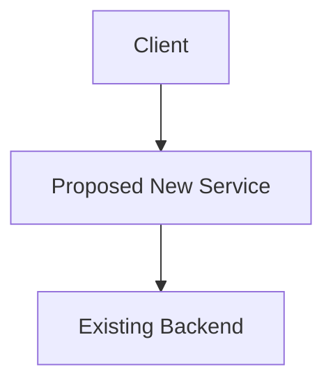

# [Spec Title]

*   **Status:** [Draft | Under Review | Accepted | Implemented | Deferred]
*   **Authors:** [List GitHub usernames, e.g., @alice, @bob]
*   **Created:** YYYY-MM-DD
*   **Last Updated:** YYYY-MM-DD
*   **Related Issues:** [Link to relevant GitHub issues, e.g., openeverest/openeverest#123]

---

## 1. Summary
A concise, one-paragraph overview of the entire proposal. Imagine this is the only section someone reads. What is the change and what is its primary benefit?

## 2. Motivation
*Why are we doing this? What problem are we solving?*
This is the "Working Backwards" starting point. Describe the problem from a user's or developer's perspective. Use customer narratives if helpful. What are the pain points? What is the current state, and why is it insufficient?

## 3. Goals & Non-Goals
Clearly define success and set boundaries.

**Goals:**
*   What must this proposal achieve? (e.g., "Reduce API latency by 20%")
*   What user needs must it fulfill?

**Non-Goals:**
*   What explicitly *will not* be addressed by this spec?
*   What is out of scope? This prevents scope creep.

## 4. Proposed Solution / Design
*How will we solve the problem?*
Describe the technical architecture, components, data models, APIs, or UI changes. Use diagrams (Mermaid.js is supported), pseudocode, or examples to illustrate.

## 5. Definition of Done

What does "completed" look like?
List the concrete, verifiable criteria that must be met for this spec to be considered fully Implemented. This is your checklist.

* Feature X is deployed to the staging environment.
* API documentation is updated in /docs.
* Integration tests with >90% coverage are passing.
* A user guide has been written.

## 6. Alternatives Considered

What other paths did we explore?
Discuss other designs, technologies, or approaches that were considered. Explain why the proposed solution was chosen over these alternatives. This demonstrates thorough thinking.

## 7. Open Questions

What do we still need to figure out?
List any unresolved issues, trade-offs, or decisions that need further discussion or research during the review phase.

## 8. References

Links to relevant documentation, research, or prior art.
