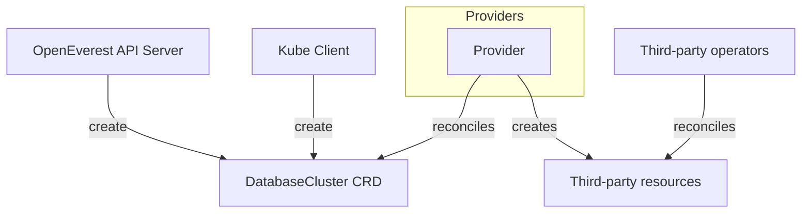
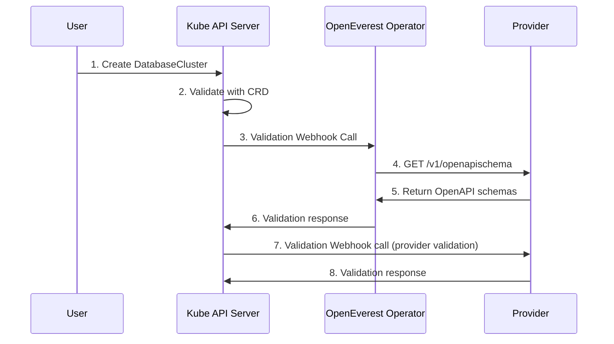

# Modular core for plugin architecture

*   **Status:** Draft
*   **Authors:** @spron-in
*   **Created:** 2025-12-11
*   **Last Updated:** 2025-12-11
*   **Related Issues:** openeverest/roadmap#1

---

## 1. Summary
As per vision described [here](https://vision.openeverest.io), we propose to transform the core of OpenEverest into a modular and extensible one. 
This will allow developers, the community, and users to easily add new features (such as database engines).

## 2. Motivation
OpenEverest currently relies on hardcoded, vendor-specific solutions for core functionalities. 
For instance, database management is exclusively handled by Percona Operators for MySQL, PostgreSQL, and MongoDB, 
and users are constrained to using Percona Monitoring and Management (PMM) for observability.

While community contributions are technically possible, integrating alternative technologies requires deep, 
specific knowledge of the OpenEverest core, Kubernetes architecture, Operator SDK, Golang, and the JS/React UI. 
This high barrier to entry translates into integration timelines of weeks or even months for adding a new database technology.

This tightly coupled architecture severely limits community engagement, stifles contributions, 
and undermines our fundamental claim of no-vendor lock-in.

## 3. Goals & Non-Goals
There are a few types of plugins that we can think of:

**Database and data technologies**

This includes adding new database technology or storage plugin.

**Integrations with databases for data management**

A few examples:
* Data management plugin in the UI (like built-in DBeaver)
* An AI copilot - it connects to DB endpoints to fetch the data, but does not really change the core.
* Showing observability metrics in the UI

**Goals:**

* Database and data technologies plugin system

The goal will be for a user to write a minimal amount of code, define UI artifacts through YAML manifest or similar and immediately see the plugin in the UI.

**Non-Goals:**

* Integrations with databases for data management

This will be a separate set of plugins. They don't really touch the core of the product and does not really change the backend side of the house.

## 4. Proposed Solution / Design

### Pluggable storage architecture

This design is driven by the need for extensibility and universality. While plugin developers need to still provide custom reconciliation logic, it is equally important to maintain a single, universal `DatabaseCluster` CRD that can represent the configuration of any database system.

Since configuration requirements differ across database vendors and topologies, plugin developers must be given a mechanism to dynamically extend the schema. This ensures the DatabaseCluster CRD can express operator-specific configurations while still remaining consistent.

**Provider**:
Cluster-scoped CRD. Describes available components, versions, images, and topologies.

**DatabaseCluster**:
Namespace-scoped CRD. References Provider and drives configuration of components and topologies at runtime.

#### Technical Details

##### 1. Provider

Represents the available building blocks (components) and valid topologies for a database system/operator.

```yaml
apiVersion: everest.percona.com/v2alpha1
kind: Provider
metadata:
  name: percona-server-mongodb-operator
spec:
  # Defines a list of component types for this provider.
  # Each component type has a list of versions and images. 
  componentTypes:
    mongod:
      versions:
        - version: 6.0.19-16
          image: percona/percona-server-mongodb:6.0.19-16-multi
        - version: 6.0.21-18
          image: percona/percona-server-mongodb:6.0.21-18
        - version: 7.0.18-11
          image: percona/percona-server-mongodb:7.0.18-11
        - version: 8.0.4-1
          image: percona/percona-server-mongodb:8.0.4-1-multi
        - version: 8.0.8-3
          image: percona/percona-server-mongodb:8.0.8-3
          default: true
    
    backup:
      versions:
        - version: 2.9.1
          image: percona/percona-server-mongodb-backup:2.9.1

    pmm:
      versions:
        - version: 2.44.1
          image: percona/pmm-server:2.44.1

  # Defines a list of components for this provider.
  # Each component has a type from componentTypes.
  # One or more components may specify the same component type.
  components:
    engine:
      type: mongod
    configServer:
      type: mongod
    proxy:
      type: mongod
    backupAgent:
      type: backup
    monitoring:
      type: pmm
      
  # Defines a list of topologies for this provider.
  # Each topology defines the components that are supported by that topology.
  topologies:
    standard:
      components:
        engine:
          defaults:
            replicas: 3
        backupAgent:
          optional: true
        monitoring:
          optional: true

    sharded:
      components:
        engine:
          defaults:
            replicas: 3
        proxy: {}
        configServer: {}
        backupAgent:
          optional: true
        monitoring: 
          optional: true
```

##### 2. DatabaseCluster

Represents an operational database cluster instance, referencing a Provider for structure and validation.
```yaml
apiVersion: everest.percona.com/v2alpha1
kind: DatabaseCluster
metadata:
  name: psmdb-cluster
  namespace: default
  # DatabaseCluster CRD design
spec:
  provider: psmdb-operator
  topology:
    type: sharded
    config: {}
  components:
    versions:
      mongod:
        version: 8.0.8-3
      backup:
        version: 2.9.1
      prometheus:
        version: x.y.z
  instances:
    engine: {}
    proxy: {}
    configServer: {}
    backupAgent: {}
    monitoring: {}
```

### Provider Go SDK

This section contains the proposal of the provider architecture and the design of a Go SDK aimed at standardising the development of these providers. In [Provider](#2-provider), we have seen the Provider custom resource. This CR is only a logical representation of a provider. A provider is the underlying component that implements the actual lifecycle management of the database system. The SDK provides the supporting libraries, scaffolding and guard rails for building providers that fit into the OpenEverest workflow.

Directly integrating each new database operator manually leads to code sprawl and slow onboarding of new database technologies. By introducing a Provider abstraction, OpenEverest enables clean separation between the core and pluggable database integrations. Building a provider that interfaces with third-party Kubernetes operators can be complex and repetitive. Each provider must handle resource management, lifecycle events, error propagation, and status updates in a Kubernetes-native manner, often reimplementing similar logic for different databases. The Provider Go SDK addresses this challenge by offering a reusable toolkit and opinionated patterns for building new providers. It encapsulates logic for reconciliation, error handling and lifecycle management. This improves the development experience and lowers the barrier to bringing new database technologies into OpenEverest.

#### Technical Details

A provider consists of a controller and a web server. The controller is implemented using controller-runtime library, and is dedicated for reconciling `DatabaseCluster` resources referencing its provider type (via . `spec.provider`). This controller interfaces with OpenEverest and the relevant resources of the underlying database operator. The webserver provides an HTTP endpoint that exposes the schema of the components, topologies and global configurations. It also provides an HTTP endpoint that serves as a validation webhook. Developers may program custom validation logic.



##### Controller builder

```go
// Initialize a new provider builder.
// We need to set the name of the provider. This will tell
// the controller to reconcile only those DatabaseClusters whose
// .spec.provider references the name set here.
providerBldr := provider.New().WithName("mydb")
ctrl := providerBldr.Controller()

// We can set the objects owned by the controller.
// The controller will then trigger reconciliation on
// those DatabaseClusters which own the changed objects.
ctrl.Owns(&v1.MyDB{})
ctrl.Owns(&corev1.Secret{})

// We can also set a custom watcher using a Map function.
ctrl.WithWatch(corev1.Pod, customPodHandler)
ctrl.WithWatch(&corev1.Pod{}, func(ctx context.Context, obj client.Object) []reconcile.Request {
	return nil
}, controller.WithWatchOptions{})

// We can set one or more reconciliation steps.
// The controller calls these steps in the order in which they are set.
ctrl.WithSyncStep(Prepare, func(ctx context.Context, c client.Client, dbc *v2alpha1.DatabaseCluster) error {
	// Custom setup logic
	return nil
})
ctrl.WithSyncStep(Ensure, func(ctx context.Context, c client.Client, dbc *v2alpha1.DatabaseCluster) error {
	// Create or update MyDB CRs
	return nil
})

// We can configure a status getter. This function computes
// the status of the DatabaseCluster.
ctrl.WithStatusGetter(func(ctx context.Context, c client.Client, dbc *v2alpha1.DatabaseCluster) (v2alpha1.DatabaseClusterStatus, error) {
	// Populate status
	return status, nil
})

// Finally, we may set a cleanup step that is called when the
// DatabaseCluster is deleted.
ctrl.WithCleanupStep(func(ctx context.Context, c client.Client, dbc *v2alpha1.DatabaseCluster) (bool, error) {
	// Delete MyDB CRs/resources
	return true, nil
})
```

##### Server builder

```go
srv := providerBldr.Server()

// Register object types for components and topologies
// The registered Go types are converted to OpenAPI v3 format
// and exposed over an HTTP endpoint.
srv.RegisterComponentSchema("mongod", &Mongod{})
srv.RegisterComponentSchema("mongos", &Mongos{})
srv.RegisterComponentSchema("pmm", &PMM{})

srv.RegisterTopologySchema("sharded", &ShardedCfg{})
srv.RegisterGlobalConfigSchema(&GlobalConfig{})

// Register validation functions.
srv.RegisterValidator("description", func(ctx context.Context, c client.Client, d
c *v2alpha1.DatabaseCluster) error {
	// Validate custom invariants
	return nil
})

srv.WithValidationWebhookURL("/validate")
```

The HTTP endpoint that returns the schema shall have the following structure:

```
{
  "global": {
    // ... openapi schema
  },
  "components": {
    "mongod": {
      // ... openapi schema
    },
    "mongos": {
      // ... openapi schema
    },
    "pmm": {
      // ... openapi schema
    }
  },
  "topologies": {
    "sharded": {
      // ... openapi schema
    }
  }
}
```

The sequence diagram below illustrates the flow for validating a DatabaseCluster
when it is created/updated:



### UI Form Generator

The UI Generator is a dynamic form and UI builder based on OpenAPI-like schema definitions. It is designed to render complex forms and validation logic for the Everest platform, using React and Zod for schema validation.

#### Key Features

- Dynamic Form Rendering: Generates forms based on schema definitions
- Validation: Supports both standard Zod validations and advanced CEL (Common Expression Language) expressions for cross-field logic
- Reactive Dependencies: Automatically revalidates fields when dependencies change

#### Validation

- Standard Zod rules are applied per field
- CEL expressions allow for advanced, cross-field validation logic. CEL allows you to write rules like `fieldA > fieldB`. Dependencies are tracked so that changes in one field can trigger revalidation of others.

#### UI Form Generator YAML Schema Examples

`uiType` - the main indicator of what component should be displayed. Should be located at the first nesting level of the component.

`description` - the ability to add your own text next to a field or group of fields.

```
allowUnsafeFlags: {
  uiType: 'Toggle',
  description: 'Allow unsafe configurations',
}
```

`validation` - allows to set standard Zod Rules such as (min, max, email, url, regex, startsWith, includes, etc.) and CEL (Common Expression Language) expressions for cross-field logic. Should be placed on the same level as a uiType.

Example of validation with Zod Rules

```
replicas: {
  validation: {
    min: 1,
    max: 99,
  },
  uiType: 'Number',
},
```
Example of CEL (Common Expression Language) expression

```
requests2: {
  uiType: 'Number',
  validation: {
    celExpr:
      'components.mongod.resources.limits.cpu >= 10 && components.mongod.resources.requests2 < 4',
  },
}
```

<br>

`params` - an object to configure the properties of a field in more detail: "placeholder, default-value, label, etc." In the basic version, this is a limited set of properties, but in the future it may be an inheritance of the properties of the original material-ui component (while it makes sense and does not overload schema).

```
replicas: {
  validation: {
    min: 1,
    max: 99,
  },
  uiType: 'Number',
  params: {
    label: 'Replicas',
    placeholder: '',
    default: '9999',
  },
},
```

`subParameters` - an object mapping field names to their own params.

```
limits: {
  uiType: 'Group',
  params: {
    label: 'Limits',
  },
  subParameters: {
    cpu: {
      uiType: 'Number',
      description: 'CPU Limits',
      params: {
        badge: 'Cores',
        label: 'CPU',
      },
    },
    memory: {
      uiType: 'Number',
      description: 'Memory Limits',
      params: {
        badge: 'Gi',
        label: 'Memory',
      },
    },
  }
}
```

## 5. Definition of Done

* Contributors can add new database engines and technologies within days.
* The path to add new plugin as well documented and semi-automated
* Existing database technologies (Percona Operators) are using the new plugin system
* * Upgrade path is described and well tested

## 6. Alternatives Considered

TBD

## 7. Open Questions

There are lots of questions regarding UI and everything else.

## 8. References

TBD
