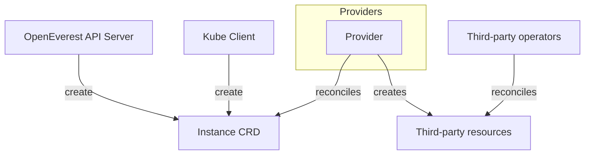
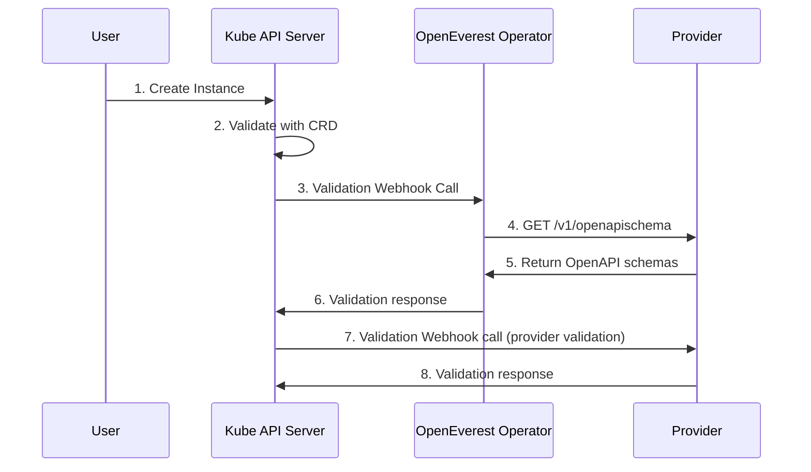

# Modular core for plugin architecture

*   **Status:** Draft
*   **Authors:** @spron-in @recharte @chilagrow @solovevayaroslavna
*   **Created:** 2025-12-11
*   **Last Updated:** 2026-04-15
*   **Related Issues:** openeverest/roadmap#1

---

## 1. Summary
As per vision described [here](https://vision.openeverest.io), we propose to transform the core of OpenEverest into a modular and extensible one. 
This will allow developers, the community, and users to easily add new features (such as database engines).

## 2. Motivation
OpenEverest currently relies on hardcoded, vendor-specific solutions for core functionalities. 
For instance, database management is exclusively handled by Percona Operators for MySQL, PostgreSQL, and MongoDB, 
and users are constrained to using Percona Monitoring and Management (PMM) for observability.

While community contributions are technically possible, integrating alternative technologies requires deep, 
specific knowledge of the OpenEverest core, Kubernetes architecture, Operator SDK, Golang, and the JS/React UI. 
This high barrier to entry translates into integration timelines of weeks or even months for adding a new database technology.

This tightly coupled architecture severely limits community engagement, stifles contributions, 
and undermines our fundamental claim of no-vendor lock-in.

## 3. Goals & Non-Goals
There are a few types of plugins that we can think of:

**Database and data technologies**

This includes adding new database technology or storage plugin.

**Integrations with databases for data management**

A few examples:
* Data management plugin in the UI (like built-in DBeaver)
* An AI copilot - it connects to DB endpoints to fetch the data, but does not really change the core.
* Showing observability metrics in the UI

**Goals:**

* Database and data technologies plugin system

The goal will be for a user to write a minimal amount of code, define UI artifacts through YAML manifest or similar and immediately see the plugin in the UI.

**Non-Goals:**

* Integrations with databases for data management

This will be a separate set of plugins. They don't really touch the core of the product and does not really change the backend side of the house.

## 4. Proposed Solution / Design

### Pluggable storage architecture

This design is driven by the need for extensibility and universality. While plugin developers need to still provide custom reconciliation logic, it is equally important to maintain a single, universal `Instance` CRD that can represent the configuration of any database system.

Since configuration requirements differ across database vendors and topologies, plugin developers must be given a mechanism to dynamically extend the schema. This ensures the Instance CRD can express operator-specific configurations while still remaining consistent.

**Provider**:
Cluster-scoped CRD. Describes available components, versions, images, and topologies.

**Instance**:
Namespace-scoped CRD. References Provider and drives configuration of components and topologies at runtime.

#### Technical Details

##### 1. Provider

Represents the available building blocks (components) and valid topologies for a database system/operator.

```yaml
apiVersion: core.openeverest.io/v1alpha1
kind: Provider
metadata:
  name: percona-server-mongodb
spec:
  # Defines a list of component types for this provider.
  # Each component type has a list of individual container versions and images.
  componentTypes:
    mongod:
      versions:
        - version: 6.0.19-16
          image: percona/percona-server-mongodb:6.0.19-16-multi
        - version: 6.0.21-18
          image: percona/percona-server-mongodb:6.0.21-18
        - version: 7.0.18-11
          image: percona/percona-server-mongodb:7.0.18-11
        - version: 8.0.4-1
          image: percona/percona-server-mongodb:8.0.4-1-multi
        - version: 8.0.8-3
          image: percona/percona-server-mongodb:8.0.8-3

    backup:
      versions:
        - version: 2.9.1
          image: percona/percona-server-mongodb-backup:2.9.1

    pmm:
      versions:
        - version: 2.44.1
          image: percona/pmm-server:2.44.1

  # Defines named components for this provider.
  # Each component maps to a type from componentTypes.
  # One or more components may share the same component type.
  components:
    engine:
      type: mongod
    configServer:
      type: mongod
    proxy:
      type: mongod
    backupAgent:
      type: backup
    monitoring:
      type: pmm

  # Defines curated version bundles: named sets of component versions that are
  # known to be mutually compatible. Instance.spec.version references a bundle
  # name. If omitted, the bundle marked default: true is used automatically.
  versions:
    - name: "8.0.8-3"
      default: true
      components:
        engine: "8.0.8-3"
        configServer: "8.0.8-3"
        proxy: "8.0.8-3"
        backupAgent: "2.9.1"
    - name: "7.0.18-11"
      components:
        engine: "7.0.18-11"
        configServer: "7.0.18-11"
        proxy: "7.0.18-11"
        backupAgent: "2.9.1"

  # Defines the topologies for this provider.
  # Each topology enumerates its components and marks optional ones.
  topologies:
    replicaset:
      components:
        engine: {}
        backupAgent:
          optional: true
        monitoring:
          optional: true

    sharded:
      components:
        engine: {}
        proxy: {}
        configServer: {}
        backupAgent:
          optional: true
        monitoring:
          optional: true
```

##### 2. Instance

Represents an operational database cluster instance, referencing a Provider for structure and validation.
```yaml
apiVersion: core.openeverest.io/v1alpha1
kind: Instance
metadata:
  name: psmdb-cluster
  namespace: default
spec:
  provider: percona-server-mongodb
  # version selects a named bundle from Provider.spec.versions.
  # Omit to use the provider's default bundle.
  version: "8.0.8-3"
  topology:
    type: sharded
    # config holds topology-specific configuration (schema defined by the provider).
    config: {}
  # global holds provider-level configuration (schema defined by the provider).
  global: {}
  components:
    engine:
      type: mongod
      replicas: 3
      storage:
        size: 50Gi
    proxy:
      type: mongod
      replicas: 3
    configServer:
      type: mongod
      replicas: 3
    backupAgent:
      type: backup
```

### Provider Go SDK

This section contains the proposal of the provider architecture and the design of a Go SDK aimed at standardising the development of these providers. In [Provider](#2-provider), we have seen the Provider custom resource. This CR is only a logical representation of a provider. A provider is the underlying component that implements the actual lifecycle management of the database system. The SDK provides the supporting libraries, scaffolding and guard rails for building providers that fit into the OpenEverest workflow.

Directly integrating each new database operator manually leads to code sprawl and slow onboarding of new database technologies. By introducing a Provider abstraction, OpenEverest enables clean separation between the core and pluggable database integrations. Building a provider that interfaces with third-party Kubernetes operators can be complex and repetitive. Each provider must handle resource management, lifecycle events, error propagation, and status updates in a Kubernetes-native manner, often reimplementing similar logic for different databases. The Provider Go SDK addresses this challenge by offering a reusable toolkit and opinionated patterns for building new providers. It encapsulates logic for reconciliation, error handling and lifecycle management. This improves the development experience and lowers the barrier to bringing new database technologies into OpenEverest.

#### Technical Details

A provider consists of a controller and a web server. The controller is implemented using the controller-runtime library, and is dedicated to reconciling `Instance` resources whose `spec.provider` references this provider's name. This controller interfaces with OpenEverest and the relevant resources of the underlying database operator. The web server provides an HTTP endpoint that serves as a validation webhook. Developers program custom validation logic via the `Validate()` method of `ProviderInterface`.


```mermaid
graph TB
  A[OpenEverest API Server]
  B[Kube Client]
  C[Instance CRD]

  subgraph Providers
    direction LR
      P[Provider]
  end

  A -->|create| C
  B -->|create| C
  P -->|reconciles| C
  P -->|creates| TR[Third-party resources]

  D[Third-party operators]
  D -->|reconciles| TR
```

##### Provider Go SDK

The provider SDK uses an interface-based design. Providers implement `ProviderInterface` and embed `BaseProvider` for defaults. The reconciler and HTTP server are composed at startup via `reconciler.New()`.

**`ProviderInterface`**

```go
type ProviderInterface interface {
    // Name returns the unique identifier matching the Provider CR name.
    Name() string

    // Types registers provider-specific CRD schemes.
    Types() func(*runtime.Scheme) error

    // Validate checks that the Instance spec is valid before a create/update
    // is accepted. Called by the validation webhook.
    Validate(c *controller.Context) error

    // Sync ensures all required resources exist and are correctly configured.
    // Called on every reconciliation cycle.
    Sync(c *controller.Context) error

    // Status computes the current observed state of the database.
    // Return one of the controller status helpers: Provisioning(), Initializing(),
    // Ready(), ReadyWithConnectionDetails(), Updating(), Failed(), etc.
    Status(c *controller.Context) (controller.Status, error)

    // Cleanup is called when the Instance has a deletion timestamp.
    // Returns true when cleanup is complete and the finalizer can be removed.
    Cleanup(c *controller.Context) error
}
```

**`BaseProvider`**

Embed `BaseProvider` to get default `Name()`, `Types()`, and `Watches()` implementations:

```go
type MyProvider struct {
    controller.BaseProvider
}

func NewMyProvider() *MyProvider {
    return &MyProvider{
        BaseProvider: controller.BaseProvider{
            ProviderName: "my-provider", // must match Provider CR name
            SchemeFuncs: []func(*runtime.Scheme) error{
                myoperatorv1.SchemeBuilder.AddToScheme,
            },
            WatchConfigs: []controller.WatchConfig{
                controller.WatchOwned(&myoperatorv1.MyDatabase{},
                    predicate.GenerationChangedPredicate{}),
            },
        },
    }
}

// Implement the interface
var _ controller.ProviderInterface = (*MyProvider)(nil)
```

**The `Context` handle**

Every interface method receives a `*controller.Context` which wraps the reconciled `Instance` and provides helpers:

```go
func (p *MyProvider) Sync(c *controller.Context) error {
    // Access instance metadata
    name := c.Name()
    ns   := c.Namespace()

    // Access spec
    topology := c.Instance().GetTopologyType()   // e.g. "sharded"
    components := c.ComponentsOfType("mongod")

    // Decode structured topology config
    var cfg MyTopologyConfig
    if err := c.DecodeTopologyConfig(&cfg); err != nil {
        return err
    }

    // Decode component custom spec
    engine := c.Instance().Spec.Components["engine"]
    var customSpec MyCustomSpec
    c.TryDecodeComponentCustomSpec(engine, &customSpec)

    // Create/update resources with automatic owner reference
    db := buildMyDB(name, ns, cfg)
    return c.Apply(db)
}
```

**Status helpers**

Providers return typed status values from `Status()`:

```go
func (p *MyProvider) Status(c *controller.Context) (controller.Status, error) {
    db := &myoperatorv1.MyDatabase{}
    if err := c.Get(db, c.Name()); err != nil {
        return controller.Status{}, err
    }

    switch db.Status.State {
    case "ready":
        return controller.ReadyWithConnectionDetails(controller.ConnectionDetails{
            Type:     "mongodb",
            Provider: "my-provider",
            Host:     db.Status.Host,
            Port:     "27017",
            Username: db.Status.User,
            Password: db.Status.Password,
            URI:      db.Status.URI,
        }), nil
    case "initializing":
        return controller.Initializing("waiting for cluster to form"), nil
    case "error":
        return controller.Failed(db.Status.Message), nil
    default:
        return controller.Provisioning("creating resources"), nil
    }
}
```

**Requeue control**

Return `controller.WaitFor()` from any method to requeue after a default interval, or `controller.WaitForDuration()` for a custom interval:

```go
func (p *MyProvider) Sync(c *controller.Context) error {
    if !prerequisiteReady() {
        return controller.WaitFor("waiting for prerequisite")
    }
    // ...
}
```

**Watch configuration**

Implement the optional `WatchProvider` interface to watch additional resources:

```go
func (p *MyProvider) Watches() []controller.WatchConfig {
    return []controller.WatchConfig{
        // Reconcile when owned MyDatabase objects change spec
        controller.WatchOwned(&myoperatorv1.MyDatabase{},
            predicate.GenerationChangedPredicate{}),

        // Reconcile the owning Instance when an external Secret changes
        controller.WatchExternal(&corev1.Secret{},
            handler.EnqueueRequestsFromMapFunc(func(ctx context.Context, obj client.Object) []reconcile.Request {
                // map secret → instance name
                return []reconcile.Request{{NamespacedName: types.NamespacedName{
                    Name:      obj.GetAnnotations()["instance-name"],
                    Namespace: obj.GetNamespace(),
                }}}
            })),
    }
}
```

**Entry point**

```go
func main() {
    ctx := ctrl.SetupSignalHandler()
    p := provider.NewMyProvider()

    r, err := reconciler.New(ctx, p,
        reconciler.WithServer(reconciler.ServerConfig{
            Port:           8082,
            ValidationPath: "/validate",
        }),
    )
    if err != nil {
        os.Exit(1)
    }
    if err := r.Start(ctx); err != nil {
        os.Exit(1)
    }
}
```

**Provider HTTP server**

The validation webhook server is started automatically when `reconciler.WithServer()` is configured. It exposes:

- `POST /validate` — Kubernetes admission webhook; calls the provider's `Validate()` method
- `GET /healthz` — liveness probe
- `GET /readyz` — readiness probe

The `Validate()` method receives the same `*controller.Context` as `Sync()`, giving it access to the full Instance spec and the Kubernetes client for fetching related resources:

```go
func (p *MyProvider) Validate(c *controller.Context) error {
    if c.Instance().Spec.Topology == nil {
        return fmt.Errorf("topology is required")
    }
    // Additional cross-field validation...
    return nil
}
```

The sequence diagram below illustrates the flow for validating an Instance when it is created/updated:


```mermaid
sequenceDiagram
    participant User
    participant KubeAPI as Kube API Server
    participant OpenEverest as OpenEverest Operator
    participant Provider

    User->>KubeAPI: 1. Create Instance
    KubeAPI->>KubeAPI: 2. Validate with CRD
    KubeAPI->>OpenEverest: 3. Validation Webhook Call
    OpenEverest->>Provider: 4. GET /v1/openapischema
    Provider->>OpenEverest: 5. Return OpenAPI schemas
    OpenEverest->>KubeAPI: 6. Validation response
    KubeAPI->>Provider: 7. Validation Webhook call (provider validation)
    Provider->>KubeAPI: 8. Validation response
```

### UI Form Generator

The UI Generator is a dynamic form and UI builder that renders the create/edit experience for each topology. Rather than coding forms in the frontend, providers define the layout and validation rules declaratively in YAML. The schema lives alongside the topology definition in `definition/topologies/<topology>/topology.yaml` under the `ui:` key.

#### Schema location

The per-topology file has two top-level keys — `config` (structural topology definition) and `ui` (rendering hints):

```yaml
# definition/topologies/replicaSet/topology.yaml
config:
  components:
    engine:
      defaults:
        replicas: 3
    backupAgent:
      optional: true

ui:
  sections:
    # ... form sections
  sectionsOrder:
    - sectionName
```

#### Sections

The form is organised into named sections. Each section renders as a labelled group in the UI:

```yaml
ui:
  sections:
    databaseVersion:
      label: "Database Version"
      description: "Provide the information about the database version you want to use."
      components:
        # ... fields in this section

    resources:
      label: "Resources"
      description: "Configure the resources your new database will have access to."
      components:
        # ...

  sectionsOrder:
    - databaseVersion
    - resources
```

#### Fields (`components`)

Each entry under `components` is a named field. The `path` key maps the field to an Instance CR spec path. Within a section, `componentsOrder` controls rendering order:

```yaml
components:
  numberOfNodes:
    path: "spec.components.engine.replicas"
    uiType: number
    fieldParams:
      label: "Number of nodes"
      defaultValue: 3
```

#### `uiType` values

| `uiType` | Description |
|----------|-------------|
| `number` | Numeric input |
| `text` | Single- or multi-line text input |
| `select` | Dropdown selection |
| `group` | Container that nests child `components`; use `groupType: line` for inline layout |

#### `fieldParams`

Configures the field's presentation properties:

| Property | Description |
|----------|-------------|
| `label` | Display label |
| `defaultValue` | Pre-populated value |
| `placeholder` | Input placeholder text |
| `step` | Numeric step increment |
| `badge` | Unit suffix shown next to the input (e.g. `Gi`, `Cores`) |
| `badgeToApi` | When true, the badge string is appended when writing the value to the API |
| `multiline` | (`text` only) Enable multi-line textarea |
| `minRows` / `maxRows` | (`text` only) Row constraints for the textarea |
| `options` | Static list of `{label, value}` objects for `select` |
| `optionsPath` | Path to a dynamic list of options sourced from the API |
| `optionsPathConfig` | Configures which subfields of `optionsPath` to use as `labelPath` and `valuePath` |

Example — dynamic version select sourced from the Provider:

```yaml
version:
  uiType: select
  path: spec.version
  fieldParams:
    label: "Database Version"
    optionsPath: spec.versions
    optionsPathConfig:
      labelPath: "name"
      valuePath: "name"
  validation:
    required: true
```

#### `validation`

Standard constraints and CEL cross-field expressions can be combined on the same field:

```yaml
numberOfNodes:
  path: "spec.components.engine.replicas"
  uiType: number
  fieldParams:
    label: "Number of nodes"
    defaultValue: 3
  validation:
    required: true
    min: 1
    int: true                       # must be a whole number
    celExpressions:
      - celExpr: "spec.components.engine.replicas % 2 == 1"
        message: "The number of nodes must be odd"
```

Supported standard rules: `required`, `min`, `max`, `int`, `email`, `url`, `regex`, `startsWith`, `includes`.

`celExpressions` is an array of objects — each with `celExpr` (a CEL expression that must evaluate to `true`) and `message` (the error shown when it fails). Expressions can reference any path in the Instance spec, enabling cross-field logic that re-evaluates whenever a dependency changes.

#### Groups

Use `uiType: group` to nest fields. Add `groupType: line` to render children side-by-side:

```yaml
resources:
  uiType: group
  groupType: line
  components:
    cpu:
      path: "spec.components.engine.resources.limits.cpu"
      uiType: number
      fieldParams:
        label: "CPU"
        defaultValue: 1
        step: 0.1
      validation:
        min: 0.6
        required: true
    memory:
      path: "spec.components.engine.resources.limits.memory"
      uiType: number
      fieldParams:
        label: "Memory"
        defaultValue: 4
        badge: "Gi"
        badgeToApi: true
      validation:
        min: 0.512
        required: true
```

#### Ordering

Use `sectionsOrder` (top-level under `ui`) and `componentsOrder` (inside a section or group) to control render order. Entries not listed are appended after the ordered ones:

```yaml
ui:
  sections:
    advanced:
      components:
        storageClass: { ... }
        configuration: { ... }
      componentsOrder:
        - storageClass
        - configuration
  sectionsOrder:
    - databaseVersion
    - resources
    - advanced
```

## 5. Definition of Done

* Contributors can add new database engines and technologies within days.
* The path to add new plugin as well documented and semi-automated
* Existing database technologies (Percona Operators) are using the new plugin system
* * Upgrade path is described and well tested

## 6. Alternatives Considered

TBD

## 7. Open Questions

There are lots of questions regarding UI and everything else.

## 8. References

TBD
