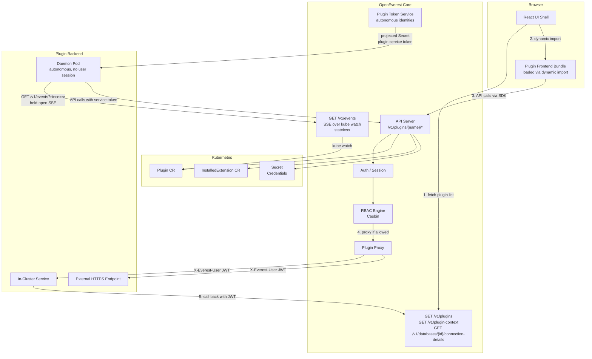

# Generic Plugins — Architecture Design

*   **Status:** Draft
*   **Authors:** @spron-in
*   **Created:** 2026-04-09
*   **Last Updated:** 2026-06-23
*   **Related Issues:**
*   **Related specs:** [001 — Modular core / Provider plugins](./001-plugins-architecture.md)

---

## 1. Summary

Spec [001](./001-plugins-architecture.md) introduced a plugin system for provisioning and lifecycle management of databases backed by Kubernetes operators. This document designs the complementary **generic plugin** layer — self-contained, installable extensions that consume OpenEverest's existing databases and data without managing them. Generic plugins can contribute UI pages, sidebar entries, database-detail panels, CLI subcommands, and backend API logic, all without rebuilding or redeploying the OpenEverest core.

## 2. Motivation

Database provisioning and lifecycle management (spec 001) is only one layer of what users need around their data. Once a database exists, a large number of valuable use cases remain unaddressed:

- A developer wants to **query and browse their data** from within the OpenEverest UI, without switching to a separate SQL client or DBeaver instance.
- A data engineer wants an **AI assistant** that can introspect the schema, suggest queries, and answer questions about the data.
- A platform team wants to **discover and import visibility** of databases they don't manage directly — e.g., AWS RDS instances, managed services on GCP, or self-hosted databases outside the cluster.
- A team wants to **migrate data** between two database clusters — potentially across providers, versions, or cloud regions.
- A security team wants a **compliance plugin** that audits access patterns, scans for exposed credentials, or enforces tagging policies.

None of these fit the spec 001 model. They are not about provisioning or managing database operators. They are about doing things with databases and data, consuming OpenEverest resources, and potentially bringing in data from outside. Yet they all share a natural home in OpenEverest: this is where the user's databases live.

Without an extension model for this class of capability, every such feature must be built into the OpenEverest core — an approach that does not scale, creates tight coupling, and shuts out community contributions.

**Headlamp** is a widely referenced example of how this can work in the Kubernetes UI space: plugins are self-contained packages that ship their own frontend code, register themselves in the UI at well-defined extension points, and can talk to the Kubernetes API, other plugins, or arbitrary backends.

## 3. Terminology

| Term | Meaning |
|---|---|
| **Host** | The OpenEverest core: API server, React web UI shell, and `everestctl`. |
| **Plugin** | A generic extension authored by anyone, distributed as an OCI artifact. |
| **Manifest** | The `Plugin` Kubernetes CR that describes a plugin. Always required. |
| **Backend** | An optional HTTP service that implements custom logic on behalf of the plugin. |
| **Frontend bundle** | An optional ESM JavaScript module loaded at runtime into the web UI shell. |
| **Extension point** | A named, typed slot in the host UI or CLI where a plugin registers a contribution. |
| **InstalledExtension** | A cluster-scoped CR that records an installed extension (a generic plugin or a spec 001 provider). Per-namespace plugin visibility is governed by Everest RBAC, not by fields on this CR. |
| **Infrastructure plugin** | A generic plugin that creates and manages its own Kubernetes resources (Deployments, Services, ConfigMaps) in response to lifecycle events. Its `ServiceAccount`, `Role`/`ClusterRole`, and `RoleBinding`/`ClusterRoleBinding` are shipped by the plugin bundle itself (Helm chart); the host does not generate plugin RBAC. |
| **Stateful plugin** | A generic plugin that declares custom resource schemas in its manifest. The host installs the CRDs, watches instances via a dynamic informer, and routes reconciliation events to the plugin backend over HTTP. The plugin does not run its own operator. |
| **Plugin CRD** | A `CustomResourceDefinition` declared by a stateful plugin under the `plugins.openeverest.io` API group. Installed, validated, and watched by the host; reconciled by the plugin backend via webhook-style HTTP callbacks. |

## 4. Goals & Non-Goals

**Goals:**

* Define what a generic plugin is and how it differs from a spec 001 Provider plugin.
* Design concrete manifest schema, CRDs, and lifecycle mechanics.
* Define the UI extension-point taxonomy and the frontend SDK surface.
* Define how plugin backends are hosted, reached, and authenticated.
* Integrate with the existing RBAC / auth model without introducing new auth concepts.
* Establish a clear security model for both frontend bundles and backend services.
* Provide a phased roadmap so v1 is deliverable quickly.

**Non-Goals:**

* Replacing or modifying the spec 001 Provider model.
* Defining a plugin marketplace or catalog UI.
* Tooling for plugin development (scaffolding, testing framework).
* Full CRD YAML schemas or SDK implementation code — those belong in follow-up issues.

## 5. Illustrative Use Cases

| Use Case | Backend? | Frontend? | External access needed? |
|---|---|---|---|
| SQL query browser (DBeaver-like) | Yes (query runner) | Yes (UI editor) | No — talks to in-cluster DBs |
| AI data copilot | Yes (LLM integration) | Yes (chat UI) | Yes — calls external LLM APIs |
| AWS RDS discovery | Yes (AWS API poller) | Yes (import/list UI) | Yes — calls AWS APIs |
| Data migration tool | Yes (migration job runner) | Yes (progress UI) | Possibly |
| Compliance / audit plugin | Yes (policy engine) | Yes (report UI) | Possibly |
| Read-only metrics dashboard | No | Yes (pulls from Prometheus) | Yes — calls monitoring APIs |
| CLI-only backup reporter | No | No (just `everestctl` commands) | No |

## 6. Plugin Anatomy

A plugin has three optional parts. The **manifest** is always required; the other two are present only when the plugin actually needs them.

```
plugin/
├── manifest.yaml        # Plugin CR, the single source of truth
├── main.js              # (optional) Frontend ESM bundle
└── server               # (optional) Backend binary / container image
```

### 6.1 Manifest

The manifest is a Kubernetes `Plugin` CR (cluster-scoped). It declares:

- Identity: name, version, vendor, description, icon.
- Frontend: URL or OCI/ConfigMap reference to the JS bundle.
- Backend: in-cluster `Service` reference or external HTTPS URL + credentials secret.
- Extension-point registrations (which slots in the UI/CLI the plugin fills).
- RBAC permissions the plugin requires against the OpenEverest API. Kubernetes RBAC (Roles, RoleBindings, ServiceAccount) is shipped by the plugin's Helm chart, not declared in the manifest.
- CLI contribution (optional).
- Compatibility range: which OpenEverest host versions this plugin supports.

### 6.2 Backend (optional)

Any HTTP service. The host never calls it directly from the browser — all traffic goes through the OpenEverest API proxy. Two hosting modes:

- **In-cluster**: a `Service` name + port in a declared namespace.
- **External**: an HTTPS URL with credentials stored in a `Secret` referenced by the plugin's installation (chart values / install-time arguments).

A backend can operate in one or more **operation modes** (see §10 for the full model):

- **Request handler** — responds to HTTP traffic proxied from the UI / `everestctl`. This is the default mode used by interactive plugins (SQL browser, AI copilot).
- **Daemon** — runs continuously in the background with no inbound user traffic. Used for metering, periodic syncs, scheduled reports, AWS RDS discovery pollers.
- **Event consumer** — holds an open subscription to the host's lifecycle event stream and reacts to resource changes (cluster created, deleted, backup completed, etc.). Used for audit, billing, external-system synchronisation. This is *pull-based*: the plugin opens the stream; the host does not push outbound HTTP to the plugin.

The modes are not mutually exclusive: a billing plugin typically combines all three — a daemon to roll up usage, a held-open event subscription to capture lifecycle, and a request-handler endpoint to serve the in-UI invoice page.

### 6.3 Frontend bundle (optional)

A single ESM JavaScript file. It exports a `register(api)` function that calls `api.registerExtension(point, component)` to fill extension points. The React shell dynamically imports it at startup after fetching the enabled-plugins list from `GET /v1/plugins`.

### 6.4 CLI contribution (optional)

A container image (can be the same image as the backend) that the plugin exposes as a CLI subcommand through `everestctl`.

## 7. CRD Sketches

### 7.1 `Plugin` (cluster-scoped)

```yaml
apiVersion: extensions.openeverest.io/v1alpha1
kind: Plugin
metadata:
  name: sql-explorer
spec:
  displayName: "SQL Explorer"
  description: "Query and browse your databases directly from the OpenEverest UI."
  version: "1.2.0"
  compatibleHostVersions: ">=2.0.0 <3.0.0"
  vendor: "Acme Corp"
  icon: "https://example.com/icon.png"   # or omit for default

  # Frontend contribution (optional).
  # Exactly one of 'bundleUrl', 'bundleConfigMapRef', or 'bundleOciRef' must be set.
  frontend:
    bundleOciRef: "ghcr.io/acmecorp/sql-explorer-ui:1.2.0"
    # SRI hash is mandatory when bundleUrl is used; recommended otherwise.
    bundleIntegrity: "sha384-<hash>"
    extensionPoints:
      - type: route
        name: sql-explorer
        path: /sql-explorer              # rendered at /plugins/sql-explorer
        label: "SQL Explorer"
        icon: "database"
      - type: sidebarItem
        label: "SQL Explorer"
        icon: "database"
        routeName: sql-explorer
      - type: clusterDetailTab
        label: "Query"
        component: ClusterQueryTab       # exported name in the bundle
        # Optional: limit to specific database engine types.
        # Valid values: "postgresql", "psmdb", "pxc".
        # Omit to show for all engine types.
        providers: ["postgresql"]

  # Backend contribution (optional).
  backend:
    # In-cluster mode:
    serviceRef:
      namespace: everest-plugins
      name: sql-explorer-svc
      port: 8080
    # External mode (use instead of serviceRef):
    # externalUrl: "https://sql-explorer.saas.example.com"
    # credentialsSecretRef: "sql-explorer-creds"

    # Operation modes. Omit any block the plugin doesn't need.
    # 'requestHandler' is implicit when 'serviceRef'/'externalUrl' is set
    # and 'daemon'/'eventSubscriptions' are absent.
    modes:
      requestHandler:
        # The HTTP path prefix on the backend that receives proxied calls
        # from /v1/plugins/{name}/*. Default "/".
        basePath: "/api"

      # Daemon mode — the host issues a long-lived, scoped service token to
      # the backend pod and expects it to run continuously.
      daemon:
        # Optional readiness probe path the host uses to consider the daemon
        # alive. Independent from k8s pod readiness — this is a host-level check.
        healthPath: "/healthz"

      # Event consumer — declares which event types the plugin intends to
      # consume from GET /v1/events. Purely informational: used for docs,
      # RBAC scoping, and as a hint to the host on whether to keep the
      # plugin's stream slot warm. The plugin is responsible for opening
      # and holding the SSE connection itself.
      eventConsumer:
        types:
          - database-cluster.created
          - database-cluster.ready
          - database-cluster.updated
          - database-cluster.deleted
          - backup.completed
        # Optional namespace filter. Omit to consume from all namespaces the
        # plugin's permissions allow.
        namespaces: ["team-alpha", "team-bravo"]

  # RBAC: what OpenEverest API resources this plugin needs to call.
  # Used both for the request-handler JWT (user-bound) and the daemon
  # service token (autonomous identity).
  permissions:
    - verb: read
      resource: database-clusters
    - verb: read
      resource: database-cluster-connection-details

  # CLI contribution (optional).
  cli:
    image: "ghcr.io/acmecorp/sql-explorer-cli:1.2.0"
    subcommand: "sql-explorer"
    description: "Interact with SQL Explorer from the terminal."
```

Kubernetes RBAC the plugin's `ServiceAccount` requires (e.g., `apps/deployments`,
`core/services`) is **not** declared in this CR. It is shipped as standard
`Role`/`ClusterRole` + `RoleBinding`/`ClusterRoleBinding` manifests inside the
plugin's Helm chart and applied at install time (see §10.7). Trust is anchored
at the plugin hub: signed/curated bundles get installed; everything else is
rejected at install time.

### 7.2 `InstalledExtension` (cluster-scoped)

A single cluster-scoped CR records the install state of an extension — either
a generic plugin or a spec 001 provider. It records install metadata only;
per-namespace plugin visibility and user access are governed by Everest RBAC
(see §11), not by fields on this CR.

The CR is created by `everestctl extension install` (never by the user
directly editing YAML). Cluster-admin owns it.

```yaml
apiVersion: extensions.openeverest.io/v1alpha1
kind: InstalledExtension
metadata:
  name: sql-explorer
spec:
  type: plugin                       # provider | plugin
  pluginName: sql-explorer           # references Plugin CR (for type=plugin)
  version: "1.2.0"

status:
  phase: Installed                   # Installed | Upgrading | Failed | Uninstalling
  conditions: []
```

## 8. UI Extension Points

Each extension point is a named, versioned slot in the React shell. The host exports the full taxonomy from `@everest/plugin-sdk` as TypeScript types so plugin authors get compile-time safety.

| Extension point | Where it appears | Props passed to component | Provider filter |
|---|---|---|---|
| `route` | Top-level React Router route at `/plugins/{name}/{path}` | `{ pluginName, params }` | — |
| `sidebarItem` | Main navigation sidebar | `{ navigate, currentPath }` | — |
| `clusterDetailTab` | Extra tab on a `DatabaseCluster` detail page | `{ cluster, namespace }` | ✓ |
| `clusterAction` | Context-menu action in the clusters table | `{ cluster, namespace, onClose }` | ✓ |
| `clusterCard` | Widget card on the cluster overview | `{ cluster, namespace }` | ✓ |
| `instanceCreateFormSection` | Collapsible section in the create-instance wizard | `{ formValues, onChange, namespace }` | ✓ |
| `instanceEditFormSection` | Collapsible section in the edit-instance page | `{ instance, formValues, onChange, namespace }` | ✓ |
| `globalDashboardWidget` | Card on the home / dashboard page | `{ namespaces }` | — |
| `settingsPanel` | Tab inside the Settings page | `{ currentUser }` | — |
| `themeOverride` | MUI theme override (logos, palette) | `{ defaultTheme }` — Phase 4 | — |

Extension points are **additive** — a plugin can register for multiple points. A host version that does not recognise a point silently skips it.

#### Provider filtering

Extension points that render in a database context (`clusterDetailTab`, `clusterAction`, `clusterCard`) support an optional `providers` filter. When declared, the host only renders the contribution for clusters whose `spec.engine.type` matches one of the listed values. Valid values are `"postgresql"`, `"psmdb"` (MongoDB), and `"pxc"` (MySQL).

The filter is expressed in two complementary places:

- **Plugin CR** (`spec.frontend.extensionPoints[].providers`) — documents the intent in the manifest; the value is forwarded by `GET /v1/plugins` to the frontend shell.
- **Bundle registration** (`registerExtension` call, `providers` field on the extension object) — the runtime gate; the host skips rendering the component if the current cluster's engine type is not in the list.

Omitting `providers` (or leaving it empty) means "show for all engine types". Existing plugins that do not set the field are unaffected.

#### Instance creation / edit form sections

The `instanceCreateFormSection` and `instanceEditFormSection` extension points let a plugin inject a collapsible configuration section into the instance creation wizard and the instance edit page respectively. This enables infrastructure plugins to let users opt in to plugin-managed features (e.g., "Enable ProxySQL") and configure them (exposure mode, resources, custom config) as part of the normal instance lifecycle.

**Data flow:**

1. The plugin registers a React component via `registerExtension({ type: 'instanceCreateFormSection', ... })`. The component receives `formValues` (current form state) and an `onChange(pluginConfig)` callback.
2. The user fills in the plugin section. The host collects the plugin config as an opaque JSON blob keyed by plugin name.
3. On form submission the host includes the plugin configs in a `POST` to the plugin backend: `POST /v1/plugins/{name}/instance-config` with `{ instance, namespace, config }`. The plugin backend stores the config (e.g., as a `ConfigMap` or in its own state) and acts on it — creating Deployments, Services, etc.
4. The host does **not** store the plugin config on the `Instance` CR. The plugin owns its own state. The host is only a messenger between the UI form and the plugin backend.

**Props:**

| Prop | Type | Description |
|---|---|---|
| `formValues` | `Record<string, unknown>` | Current form state (read-only snapshot). |
| `onChange` | `(config: Record<string, unknown>) => void` | Callback to update the plugin's config section. |
| `namespace` | `string` | Target namespace for the instance. |
| `instance` | `Instance \| undefined` | The existing instance (edit mode only; `undefined` during create). |

### 8.1 UI/UX consistency requirements

Plugins **must** use the host's existing design system and styling infrastructure.
The goal is that a user cannot visually distinguish plugin-contributed UI from
core UI — plugins feel native, not bolted on.

**Required:**

- **MUI components only.** Use `@mui/material` (provided by the host via import
  map) for all UI elements — buttons, tables, dialogs, forms, typography, icons.
  Do not import alternative component libraries (Ant Design, Chakra, etc.).
- **Host theme.** Use the host's MUI `ThemeProvider` context (automatically
  inherited). Do not override `createTheme()` or inject competing theme
  providers. Access theme tokens via `useTheme()` or the `sx` prop.
- **`sx` prop and `styled()` for styling.** Use MUI's `sx` prop or the `styled`
  utility (Emotion-based, shared with the host) for custom styles. Do not
  introduce separate CSS-in-JS runtimes (styled-components, Tailwind runtime,
  Stitches, etc.) — multiple runtimes cause specificity conflicts and increase
  bundle size.
- **No global CSS.** Do not inject `<style>` tags, import `.css` files that
  produce global selectors, or manipulate `document.styleSheets`. Global styles
  can break the host or other plugins. Scoped styles via `sx`/`styled` are the
  only permitted approach.
- **Design tokens over magic values.** Reference `theme.palette`, `theme.spacing`,
  `theme.typography`, and `theme.shape` rather than hard-coding pixel values,
  hex colours, or font families. This ensures plugins respect light/dark mode and
  future theme changes.
- **Layout patterns.** Use MUI layout primitives (`Box`, `Stack`, `Grid`,
  `Container`) for page structure. Follow the host's existing spacing rhythm
  (typically `theme.spacing(2)` / `theme.spacing(3)` between sections).
- **Icons.** Use `@mui/icons-material` (provided by the host). For custom icons
  not in the MUI set, use inline SVG wrapped in `SvgIcon`.

**Prohibited:**

- Importing Tailwind CSS, Bootstrap, or any global utility-class framework.
- Injecting a separate CSS reset or normalise stylesheet.
- Using `!important` overrides on host elements.
- Rendering outside the plugin's mounted container (e.g., appending to
  `document.body` directly). Use MUI `Portal` if an overlay is needed.
- Bundling custom fonts. Plugins inherit the host's font stack.

**Enforcement:**

- The `everestctl extension lint` command (P1 DX tooling) will statically analyse
  the bundle for prohibited imports and global CSS injection patterns.
- The `@everest/plugin-sdk/testing` mock host renders plugins inside a real
  `ThemeProvider` so visual regressions are caught in plugin unit tests.
- The Plugin SDK's TypeScript types guide authors toward the correct patterns
  at compile time (e.g., extension-point components receive `sx`-compatible
  props rather than `className`).

## 9. Frontend SDK & Loading Model

### 9.1 Loading strategy

**Decision: dynamic ESM module loading (Headlamp model), not iframes.**

Rationale:
- Tight UX integration — shared MUI theme, React context, router state.
- Iframes break deep-link navigation, inject a separate auth session, and cannot contribute sidebar entries or theme overrides in a seamless way.
- Import maps let the host provide singleton instances of `react`, `react-dom`, `@mui/material`, and `react-router` so plugin bundles stay small and the host retains control over versions.

At shell startup:

```
1. GET /v1/plugins  →  [{ name, bundleUrl, extensionPoints }, ...]
2. For each enabled plugin:
     const mod = await import(bundleUrl)   // dynamic ESM import
     mod.default(pluginApi)               // calls register(api)
3. Plugin calls api.registerExtension("clusterDetailTab", MyComponent)
4. Shell renders registered components at the declared extension points.
```

### 9.2 `@everest/plugin-sdk`

New package at `ui/packages/plugin-sdk`. Public surface:

```ts
// Registration — extension object shape determines the contribution type.
// Database-context extensions (clusterDetailTab, clusterAction, clusterCard)
// accept an optional 'providers' field to restrict rendering by engine type.
registerExtension(extension: Extension): void

// Example: PostgreSQL-only detail tab
api.registerExtension({
  type: 'clusterDetailTab',
  label: 'SQL Query',
  path: 'sql-query',
  component: SqlQueryTab,
  providers: ['postgresql'],   // omit to show for all engine types
});

// Hooks — bridge to the host's React context
useEverestApi(): EverestApiClient    // pre-authed HTTP client for /v1/...
useCurrentUser(): User
useCluster(id: string): DatabaseCluster | undefined
useNamespaces(): string[]
useRBAC(): { can: (verb: string, resource: string) => boolean }

// Re-exported singletons (resolved from host import map)
export { React, ReactDOM, MUI, ReactRouter }
```

### 9.3 Bundle requirements

Plugin authors produce a single ESM file with:

- Default export: `register(api: PluginApi): void`
- No bundled copies of `react`, `@mui/material`, or `react-router` — import them from the SDK re-exports so the import map resolves to the host's singleton.
- Target: `esnext` modules, no dynamic `require()`.

## 10. Backend Model

### 10.1 Proxy architecture

The OpenEverest API server exposes:

```
/v1/plugins/{pluginName}/*   →   proxied to plugin backend
```

The browser never calls a plugin backend directly. All requests are:

1. Authenticated by the host (session cookie / OIDC token validated).
2. RBAC-checked: the requesting user must have `use` on `plugin/{pluginName}`.
3. Forwarded to the backend with an `X-Everest-User` header containing a short-lived, signed JWT carrying `{ sub, namespaces, pluginName, exp }`.
4. Audit-logged by the host.

This gives the host complete visibility over plugin traffic and prevents plugins from acting outside the user's own RBAC scope.

### 10.2 Backend authentication to OpenEverest

When a plugin backend needs to call OpenEverest APIs on behalf of the user, it uses the `X-Everest-User` JWT as a bearer token. The host validates it and enforces the user's own permissions — the plugin cannot escalate privilege.

### 10.3 Hosting modes

| Mode | How it works |
|---|---|
| **In-cluster** | `serviceRef` names a Kubernetes `Service`. Host resolves DNS internally. No public ingress needed. |
| **External** | `externalUrl` is an HTTPS endpoint. Credentials (e.g. API key) from a `Secret` are passed as `Authorization` header. |

### 10.4 Daemon mode

A daemon backend has no user session driving it. It runs continuously and typically polls or reacts to events. To support this:

**Autonomous identity.** The host issues each daemon a long-lived **plugin service token** — a JWT bound to the plugin name (not to any user) and scoped to the permissions declared in `spec.permissions`. The token:

- Is mounted into the backend pod via a projected `Secret` named `<plugin-name>-token`, refreshed automatically before expiry (default TTL 24 h).
- Carries claims `{ sub: "plugin:<name>", permissions: [...], exp }`.
- Is accepted by the OpenEverest API as a bearer token. RBAC checks the declared permissions, not any user identity.
- Can read but **cannot write** to spec-001 resources, regardless of declared permissions (enforced by a hard-coded denylist — see §16 Q9).

**Why not just call the kube API directly?** A daemon could `watch` CRs natively from inside the cluster. We deliberately route everything through the OpenEverest API so:

- Plugins remain portable (work the same way against in-cluster and remote-SaaS OpenEverest deployments).
- The audit trail is centralised.
- The hard "no writes to spec-001 resources" guarantee can be enforced uniformly.

**Lifecycle.** When an `InstalledExtension` for a plugin that declares `backend.modes.daemon` reaches `Ready`, the host:

1. Generates the service token and writes it to the projected `Secret`.
2. Ensures the backend `Deployment` has at least one replica.
3. Polls `healthPath` to track liveness; surfaces status on the `InstalledExtension` as the `TokenIssued` / `BackendReachable` conditions.
4. On `InstalledExtension` deletion, scales to zero and revokes the token.

### 10.5 Event stream

The host exposes lifecycle events for resources it manages over a single **stateless streaming endpoint**. Plugins (and any other client) consume the stream by holding an open HTTP connection. There is no outbound push, no delivery queue, and no per-plugin server-side state.

This design is a thin wrapper over Kubernetes' native watch mechanism: OpenEverest's reconcilers already learn about state changes via kube watches on the underlying CRs. The event endpoint normalises those watch events into a stable, plugin-facing schema and streams them out. State lives in etcd, where it already does — not in OpenEverest.

**Endpoint.**

```
GET /v1/events?since=<resourceVersion>&types=<csv>&namespaces=<csv>
   Accept: text/event-stream
```

Delivered as Server-Sent Events (SSE). Each event carries the underlying Kubernetes `resourceVersion` as its cursor. The connection is held open by the client; the host streams events as they happen.

**Initial event taxonomy** (extensible — plugins ignore types they don't know):

| Event type | Triggered when |
|---|---|
| `database-cluster.created` | A `DatabaseCluster` resource is created. |
| `database-cluster.ready` | A cluster transitions to `ready` state. |
| `database-cluster.updated` | Spec changes on an existing cluster (resize, version upgrade). |
| `database-cluster.deleted` | A cluster is deleted (post-finalizer). |
| `database-cluster.failed` | A cluster transitions to a failed state. |
| `backup.started` | A backup job starts. |
| `backup.completed` | A backup job completes successfully. |
| `backup.failed` | A backup job fails. |
| `restore.started` / `restore.completed` / `restore.failed` | Same for restores. |
| `instance.created` / `instance.deleted` | spec-001 `Instance` lifecycle. |
| `user.login` | A user successfully authenticates (local or OIDC). |
| `user.login-failed` | An authentication attempt fails. |
| `user.logout` | A user session is invalidated. |
| `plugin.installed` | A `Plugin` CR is created. |
| `plugin.uninstalled` | A `Plugin` CR is deleted. |
| `plugin.enabled` | A plugin becomes ready (enabled via `Plugin` CR or `InstalledExtension` created). |
| `plugin.disabled` | A plugin becomes not-ready (disabled via `Plugin` CR or `InstalledExtension` deleted). |
| `namespace.added` | A namespace is registered with OpenEverest. |
| `namespace.removed` | A namespace is removed from OpenEverest. |
| `settings.updated` | Platform settings are modified. |

Events are sourced from two mechanisms:

1. **Kubernetes watches** — the event hub watches `DatabaseCluster`, `Backup`, `Restore`, `Instance`, `Plugin`, and `InstalledExtension` CRs. Changes are normalised into the event envelope and broadcast to subscribers.
2. **Direct publish** — API handlers that do not correspond to a watched CR (session create/delete, settings update) call `Hub.Publish()` directly to emit events into the same fan-out pipeline.

**Event envelope.**

```json
{
  "resourceVersion": "482719",
  "type": "database-cluster.deleted",
  "occurredAt": "2026-05-08T12:00:00Z",
  "namespace": "team-alpha",
  "resource": {
    "kind": "DatabaseCluster",
    "name": "orders-prod",
    "uid": "a1b2c3d4-...",
    "engine": "postgresql",
    "version": "15.5"
  },
  "prevState": { "phase": "ready" },
  "newState":  { "phase": "deleting" },
  "actor":     { "type": "user", "id": "alice@example.com" }
}
```

**Authentication.** The stream is authenticated like any other `/v1` endpoint — a daemon plugin uses its service token (§10.4); a user-facing tool uses the user's session token. The events the client receives are filtered by the token's permissions (the user's accessible namespaces, or the daemon token's declared scope).

**Why pull and not push?** A push model requires the host to track which events have been delivered to which plugin, manage retry queues, and persist state across restarts. By pulling, the plugin owns its cursor and the host stays stateless. This mirrors how Kubernetes itself exposes change streams and how every kube controller already handles restarts.

### 10.6 Catch-up & restart semantics

The stream uses `resourceVersion` as its cursor — the same mechanism Kubernetes watch already provides. Plugins follow the standard kube-watch restart pattern.

**Normal operation.** The plugin opens `GET /v1/events?since=<rv>` with the last `resourceVersion` it persisted, receives any events that occurred since, and then streams new events live. After processing each event the plugin persists the new cursor (typically to its own local storage — PVC, embedded KV, etc.).

**Stream drop.** If the connection drops (network, host restart, scale event), the plugin reconnects with its last cursor. As long as the cursor is still within the kube watch cache window (default 5 min, configurable on the kube API server), the stream resumes from exactly that point with no gap.

**Cold start or stale cursor.** If the plugin has no cursor yet, or its cursor is older than the watch cache, the plugin must:

1. Call `GET /v1/databases`, `/v1/backups`, etc. to snapshot current state.
2. Note the `resourceVersion` returned in the list response.
3. Open `GET /v1/events?since=<that rv>` to resume streaming.

This is exactly how the Kubernetes client-go informer handles the same problem; the SDK provides a helper that wraps the dance.

**Implications.**

- No event store or dead-letter queue in the host. No state to back up, no state to migrate during host upgrades.
- The plugin must stay connected (or reconnect quickly) to capture events. Plugins that don't tolerate stream gaps must persist their cursor before acknowledging work, and must implement the snapshot-then-watch fallback.
- A plugin that holds the connection but processes events slowly will back-pressure the stream; the host will drop the slowest connections under memory pressure (advertised via a configurable per-connection buffer size). This is acceptable: dropped clients reconnect with `since=` and catch up.

### 10.7 Infrastructure plugins — Kubernetes resource management

Some plugins need to create and manage their own Kubernetes resources in response to database-cluster lifecycle events. Examples include ProxySQL (SQL proxy deployed per cluster), connection poolers, or monitoring sidecars. These are called **infrastructure plugins**.

#### Plugins own their Kubernetes RBAC

Plugin Kubernetes RBAC is **shipped by the plugin, not generated by the host**. The plugin's bundle is a Helm chart; the chart's templates include the plugin's `ServiceAccount`, `Role`/`ClusterRole`, and `RoleBinding`/`ClusterRoleBinding`. `everestctl extension install` installs the chart, which applies these objects alongside the plugin's `Deployment`, `Service`, and any plugin-owned `ConfigMap`s.

The host does not:

- Declare a `spec.kubePermissions` field on the `Plugin` CR.
- Validate plugin RBAC against a denylist.
- Generate `Role`/`ClusterRole` objects.
- Reconcile or repair plugin RBAC.

Trust is anchored at the **plugin hub**: only signed, curated bundles are allowed to install. A plugin whose chart asks for unreasonable RBAC is rejected at hub-vetting time, not at runtime by the host. Unsigned or untrusted plugins are refused at install time (see the hub design — out of scope for this section).

Note: the daemon service-token denylist in §10.4 — which blocks plugin tokens from writing spec-001 resources via `/v1` — is a separate guarantee and remains in force. It governs API calls to OpenEverest, not direct Kubernetes API calls.

#### Example chart layout

```
proxysql-plugin/
├── Chart.yaml
├── values.yaml
└── templates/
    ├── plugin.yaml             # the Plugin CR
    ├── installed-extension.yaml # the InstalledExtension CR
    ├── serviceaccount.yaml
    ├── role.yaml               # (or clusterrole.yaml)
    ├── rolebinding.yaml        # (or clusterrolebinding.yaml)
    ├── deployment.yaml         # the plugin backend Deployment
    └── service.yaml            # the plugin backend Service
```

The chart author decides scope: a single `ClusterRole` + `ClusterRoleBinding` for a cluster-wide plugin, or a `Role` + `RoleBinding` per target namespace. The chart is the single source of truth.

#### Lifecycle integration — ProxySQL example

1. **Vetting.** The hub publishes a signed ProxySQL chart whose templates include a `ServiceAccount`, a `Role` granting `apps/deployments` and `core/services,configmaps` in the target namespaces, and the corresponding `RoleBinding`. The hub has reviewed the chart before allowing it to be installed.

2. **Installation.** Admin runs `everestctl extension install proxysql`. The CLI fetches the chart, renders it with the cluster-admin's values, and applies all rendered objects — including the `Plugin` CR, the `InstalledExtension` CR, and the plugin's RBAC. Per-namespace end-user access is governed by Everest RBAC (`plugin/proxysql` resource, §11.2).

3. **Cluster creation.** User creates a new PXC cluster. The ProxySQL plugin's `instanceCreateFormSection` renders an "Enable ProxySQL" toggle and configuration fields (exposure mode, resource limits, custom rules).

4. **Config handoff.** On submission the host POSTs the plugin config to `POST /v1/plugins/proxysql/instance-config` with the instance name, namespace, and config blob. The plugin backend stores this config (e.g., in a ConfigMap).

5. **Event-driven deployment.** The plugin daemon receives a `database-cluster.ready` event via SSE and creates a ProxySQL `Deployment`, `Service`, and `ConfigMap` in the target namespace using its bundle-shipped `ServiceAccount`.

6. **Detail tab.** The plugin registers a `clusterDetailTab` showing ProxySQL status, metrics, and a config editor. Changes submitted via the tab's UI are sent to the plugin backend, which updates the ProxySQL ConfigMap and triggers a rolling restart.

7. **Cluster deletion.** The plugin receives a `database-cluster.deleted` event and cleans up its resources. As a safety net, the plugin sets `ownerReferences` on all created resources pointing to the `DatabaseCluster` CR so Kubernetes GC catches anything missed.

#### Security boundaries

- The plugin runs in its own pod with its own `ServiceAccount`. It never shares the host's credentials.
- The plugin's RBAC reach is whatever its chart granted — Helm uninstall removes those objects on `everestctl extension uninstall`.
- The host does not proxy or relay Kubernetes API calls. The plugin talks directly to the Kubernetes API server using its own bound credentials.
- All plugin-created resources should carry standard labels (`app.kubernetes.io/managed-by: everest-plugin-<name>`) for auditability.

### 10.8 Stateful plugins — Plugin-declared Custom Resources

Some plugins need persistent, structured, namespace-scoped state that goes beyond what a ConfigMap or a plugin-managed database provides. Examples:

- **Presets** — named configuration templates that pre-fill `InstanceSpec` fields during instance creation.
- **Database user management** — CRs representing logical database users, reconciled by a plugin that provisions credentials in the target engines.
- **Migration configs** — declarative schema migration state for a schema-management plugin.

These plugins are called **stateful plugins**. They declare custom resource schemas in the `Plugin` manifest; the host installs, validates, and watches those CRDs; reconciliation events are forwarded to the plugin backend as HTTP callbacks. **No per-plugin operator is required.**

#### Why not a separate operator per plugin?

Forcing every stateful plugin to ship its own controller-runtime binary introduces:

- An additional pod + ServiceAccount + leader election per plugin.
- Race conditions between the plugin operator and the host controller when both react to Instance lifecycle events.
- High DX barrier — plugin authors must learn controller-runtime, build Go binaries, manage CRD versions, and handle upgrades.

The host-managed reconciliation model avoids all of this. The plugin author writes an HTTP handler; the host does the Kubernetes plumbing.

#### Declaring custom resources

A new `spec.customResources[]` field on the `Plugin` CR:

```yaml
apiVersion: extensions.openeverest.io/v1alpha1
kind: Plugin
metadata:
  name: presets
spec:
  displayName: "Presets"
  version: "1.0.0"
  # ... frontend, backend, permissions as usual ...

  # Custom resource declarations.
  customResources:
    - kind: Preset
      # API group is always <pluginName>.plugins.openeverest.io
      # (auto-derived; cannot be overridden)
      scope: Namespaced
      # OpenAPI v3 schema for spec validation (same format as CRD
      # structural schemas). The host generates the full CRD from this.
      schema:
        type: object
        properties:
          provider:
            type: string
          version:
            type: string
          topology:
            type: object
            x-kubernetes-preserve-unknown-fields: true
          components:
            type: object
            x-kubernetes-preserve-unknown-fields: true
          backup:
            type: object
            x-kubernetes-preserve-unknown-fields: true
      # Status subresource is always enabled.
      # Additional printer columns (optional).
      additionalPrinterColumns:
        - name: Provider
          jsonPath: .spec.provider
          type: string
        - name: Version
          jsonPath: .spec.version
          type: string
```

The generated CRD will have:
- Group: `presets.plugins.openeverest.io`
- Version: `v1alpha1` (auto-assigned; plugin controls via manifest version)
- Kind: `Preset`
- Scope: Namespaced (the plugin CR can be created in any namespace where the caller has Everest RBAC to `use` the plugin)

#### Host reconciliation model

When a `Plugin` with `customResources` is installed, the host:

1. **Generates the CRD** from the declared schema and applies it to the cluster. The CRD is owned by the `Plugin` CR (via `ownerReferences`) so it is garbage-collected on plugin uninstall.
2. **Starts a dynamic informer** (using `dynamic.Interface` + `cache.Informer`) watching instances of the declared Kind in namespaces where the plugin is installed.
3. **On CR create/update/delete**, the host calls the plugin backend:

   ```
   POST /v1/plugins/{pluginName}/reconcile
   Content-Type: application/json

   {
     "event": "create" | "update" | "delete",
     "object": { <full CR JSON> },
     "old": { <previous version, on update only> },
     "namespace": "team-alpha"
   }
   ```

4. **Backend responds** with status + optional requeue:

   ```json
   {
     "status": { "ready": true, "message": "Validated against provider schema" },
     "requeue": false,
     "requeueAfter": "0s"
   }
   ```

5. **Host writes** the status subresource onto the CR and requeues if requested.

If the backend is unreachable, the host retries with exponential backoff and sets a `Reconciling` condition on the CR.

#### Namespace scoping

Plugin CRs are permitted in any namespace where the caller has Everest RBAC to `use` the plugin (the `plugin/{name}` resource, §11.2). The host rejects (via a validating webhook or informer-level filter) any CR created by a user without that grant. There is no separate per-namespace enable list on the `InstalledExtension` — namespace scoping is a pure RBAC concern, consistent with how `BackupStorage`, `MonitoringConfig`, and other namespaced resources are gated.

#### Security & validation

| Concern | Mitigation |
|---|---|
| API group hijacking | Plugin CRDs must live under `<pluginName>.plugins.openeverest.io`. The host rejects any other group. |
| Schema size DoS | Maximum schema size: 64 KB (compressed). Enforced at admission. |
| Kind collision | Kind names are globally unique within `plugins.openeverest.io`. The host rejects duplicates at Plugin create time. |
| CRD manipulation | The plugin itself cannot modify or delete the CRD — only the host controller manages CRD lifecycle. Plugin charts that ship verbs on `apiextensions.k8s.io` are rejected at hub vetting. |
| Orphaned CRs on uninstall | On Plugin deletion, the host deletes the CRD. Kubernetes cascades deletion to all CRs. Admin receives a warning if CRs exist. |
| Reconcile endpoint abuse | The `/reconcile` call carries the host's internal service token, not user identity. The plugin backend verifies the token before acting. |

#### Interaction with other plugin capabilities

Stateful plugins typically combine custom resources with other capabilities:

- **Frontend bundle** — UI components to create/edit/list plugin CRs (e.g., a Preset editor, a database-user manager).
- **`instanceCreateFormSection`** — integrate plugin CRs into the Instance creation flow (e.g., "Select a Preset" dropdown).
- **Event consumer** — react to Instance lifecycle events to trigger reconciliation of related plugin CRs.
- **Request handler** — serve API endpoints that operate on plugin CRs (e.g., `POST /v1/plugins/presets/apply` to copy a Preset into a new Instance spec).

#### Example: Presets plugin

1. Admin installs the Presets plugin. The host creates the `Preset` CRD under `presets.plugins.openeverest.io`.
2. Admin grants the `use` verb on `plugin/presets` to the `team-alpha` role (or specific users) via Everest RBAC. Users in that namespace can now create `Preset` CRs there.
3. A user creates a `Preset` named `production-large` with topology, component sizing, and backup config for their PXC clusters.
4. The Presets backend receives the `/reconcile` call, validates the Preset content against the Provider schema (via `GET /v1/providers/{name}`), and returns status `{ ready: true }`.
5. During Instance creation, the Presets plugin's `instanceCreateFormSection` shows a "Select Preset" dropdown. On selection, it fetches the Preset CR via the OpenEverest API and pre-fills the form.
6. The host submits the filled form as a normal `Instance` create — the Preset is a one-time copy, not a live binding.

## 11. RBAC Integration

OpenEverest already uses a Casbin policy model (`pkg/rbac`). Generic plugins slot into it without new concepts.

### 11.1 Plugin install permission

Installing a plugin (creating a `Plugin` CR) requires the `create` verb on the new resource type `plugins` at cluster scope. Only `admin` has this by default.

### 11.2 Per-user plugin access

A new resource type `plugin/{name}` is added to the Casbin model. Admins grant the `use` verb to roles or individual users:

```
p, role:viewer, plugin/sql-explorer, use
```

The host checks this before proxying any request to the plugin backend and before rendering extension-point components for the user.

### 11.3 Defense in depth

Even if a plugin backend attempts to call OpenEverest APIs directly, it can only act under the user identity carried in the JWT, which is bound to that user's existing RBAC policy. A plugin cannot read resources the user cannot read, and cannot mutate resources the user cannot mutate.

For **daemon mode**, the autonomous plugin service token (§10.4) is bound to the declared `spec.permissions` and to the plugin name — it is not a user identity. It cannot be used to assume a user's privileges, and it is unconditionally denied write access to spec-001 resources. The token is rotated automatically and revoked on `InstalledExtension` deletion.

## 12. `everestctl` Integration

Go's `plugin` package is Linux-only and fragile across compiler versions. WASM toolchains are promising but immature. The pragmatic choice is **subcommand-via-shellout**.

### How it works

The plugin manifest declares a `cli.image` (OCI). When the user runs:

```sh
everestctl extension run sql-explorer -- query --db my-db "SELECT 1"
```

`everestctl`:
1. Pulls/caches the CLI image locally (or finds it in a local cache).
2. Execs the container, passing `--host`, `--token` (short-lived API token) and the user-supplied arguments via `stdin`/`stdout`.
3. Streams output back to the terminal.

Discovery & lifecycle:

```sh
everestctl extension list                          # installed extensions (plugins + providers)
everestctl extension info     <name>               # show install metadata and conditions
everestctl extension install  <oci-ref>
everestctl extension uninstall <name>
```

Per-namespace plugin access is granted via Everest RBAC (`plugin/{name}` resource, §11.2) — there is no separate `extension namespace add/remove` subcommand.

There is no `everestctl plugin` subcommand. Plugins and providers are both managed via `everestctl extension`; the `--type` filter on `list` distinguishes them when needed.

## 13. Lifecycle & Distribution

### 13.1 OCI artifact as the canonical unit

A plugin is distributed as a single OCI artifact containing:

```
layers/
  manifest.yaml            # Plugin CR
  main.js                  # Frontend bundle (if any)
  annotations:
    org.opencontainers.image.title: "sql-explorer"
    org.everest.plugin.schema-version: "v1"
```

Backend and CLI images are separate OCI images referenced by digest from `manifest.yaml`. This keeps the plugin artifact small and lets image layers be cached independently.

### 13.2 Versioning

- Plugins are versioned with SemVer.
- `spec.compatibleHostVersions` is a semver range (same syntax as npm).
- The host rejects installation of a plugin whose range does not include the running host version.
- Plugins are upgraded independently of the host: `everestctl extension upgrade <name>`.

### 13.3 Air-gapped environments

```sh
# Export on an internet-connected machine
everestctl extension export sql-explorer --output sql-explorer.tar

# Import on an air-gapped machine
everestctl extension install --from-tar sql-explorer.tar
```

The `--from-tar` flag pushes images into the in-cluster registry if one is configured (e.g., Harbor), then creates the `Plugin` CR.

## 14. Security Considerations

| Concern | Mitigation |
|---|---|
| Malicious frontend bundle | Bundles served through host proxy (not a CDN); SRI hash in manifest verified before serving; strict CSP allows only host origin. |
| XSS via plugin code | Plugin JS runs in the same origin — normal XSS mitigations apply (React escaping, CSP). Considered acceptable given admin-only install gate. |
| Credential exfiltration | Plugin backends never receive raw DB credentials; only short-lived, scoped JWTs. DB connection details brokered on-demand via `/v1/databases/{id}/connection-details`. |
| Privilege escalation | All plugin API calls re-checked against the acting user's own RBAC. Plugin cannot escalate beyond the user's permissions. |
| In-cluster lateral movement | Plugin backend runs in its own `ServiceAccount` with a minimal `Role` auto-generated from `spec.permissions`. `NetworkPolicy` restricts egress to declared endpoints only. |
| Supply chain | Manifest must include OCI image digests. Host verifies cosign signatures when `spec.signatureVerification: true` is set on the cluster. |
| Secrets in manifests | Credentials for external backends are stored exclusively in `Secret` resources, never in the `Plugin` CR itself. |
| Admin-only install | Creating a `Plugin` CR and the corresponding `InstalledExtension` requires cluster-admin RBAC. Per-namespace access for end users is granted via Everest RBAC (`plugin/{name}` resource, §11.2); regular users only get `use` on the specific plugin/namespace combinations the admin allows. |
| Daemon token theft | Plugin service token is mounted via a projected `Secret` (short-lived, auto-rotated, default TTL 24 h). Token is bound to plugin name + declared permissions, never a user identity, and revoked on `InstalledExtension` deletion. |
| Forged events | The event stream is delivered over the plugin's authenticated HTTPS connection to OpenEverest — there is no inbound push the plugin needs to validate. |
| Event-driven privilege escalation | Events are informational only — they do not authorise the plugin to perform any action. Any follow-up API call still goes through normal RBAC checks. |
| Slow event consumer / DoS on host | Per-connection bounded buffer; slow consumers are dropped and reconnect with `since=`. No unbounded queue grows in the host. |
| Infrastructure plugin kube access | Plugin Kubernetes RBAC is shipped by the plugin's Helm chart, not the host. The plugin runs in its own pod with its own `ServiceAccount` bound to the plugin's `Role`/`ClusterRole`. Trust is anchored at the plugin hub: only signed, curated bundles are admitted; the hub rejects bundles asking for unreasonable RBAC at vetting time. Plugin never shares the host's `ServiceAccount`. |
| Plugin creates orphaned resources | Plugin must handle `database-cluster.deleted` events to clean up. As a safety net, plugin-created resources should carry `ownerReferences` pointing to the `DatabaseCluster` CR for Kubernetes GC. |

## 15. Reference Architecture



## 16. Answering Prior Open Questions

> The earlier draft of this spec (§7) raised ten open questions. This section records the decisions.

1. **Can generic plugins ship their own Kubernetes CRDs?**
   Yes, with constraints. Plugins may declare custom resource schemas in their manifest under `spec.customResources[]`. The host generates, installs, and watches the resulting CRDs; reconciliation is handled by the plugin backend via HTTP callbacks (see §10.8). Plugins do **not** run their own operators. All plugin CRDs live under the `<pluginName>.plugins.openeverest.io` API group — plugins cannot declare CRDs in the `core.openeverest.io`, `extensions.openeverest.io`, or any other core API group. CRDs for spec 001 Providers remain host-exclusive.

2. **What is the minimal backend surface OpenEverest must expose?**
   The existing v1 API, plus four new additions:
   - `GET /v1/plugins` — plugin discovery (list enabled plugins + bundle URLs).
   - `GET /v1/plugin-context` — current user identity, accessible namespaces.
   - `GET /v1/databases/{id}/connection-details` — brokered, short-lived credentials.
   - `GET /v1/events?since=<resourceVersion>` — stateless SSE event stream over kube watch (§10.5).
   No outbound push from the host; no separate "plugin API" needed; everything else goes through `/v1`.

3. **How do plugins get DB credentials?**
   OpenEverest brokers them on demand via `GET /v1/databases/{id}/connection-details`, gated by the user's existing RBAC. Tokens are short-lived (15 min). Plugins never cache or store credentials.

4. **Single plugin model or distinct shapes?**
   Single model with optional parts. A plugin that sets only `frontend` is a UI-only extension. One that sets only `backend` (with no `frontend`) is a headless integration or CLI tool. A full plugin sets both. `everestctl` already handles all cases.

5. **Can a plugin interact with spec 001 resources (`DatabaseCluster`, `Instance`)?**
   Read-only, via the OpenEverest API only. Plugins may `GET` cluster and instance resources through `/v1/...`; they may not call the Kubernetes API directly and may not mutate spec 001 resources.

6. **Is dynamic JS module loading viable for OpenEverest's frontend?**
   Yes. ESM dynamic `import()` is supported by all modern browsers. Import maps handle shared dependency deduplication. The React shell already uses Vite; the ESM loader is a natural extension. (See §9 for details.)

7. **What does the `everestctl` extension surface look like?**
   Subcommand-via-shellout to a plugin-declared OCI image. `everestctl extension run <name> -- <args>` execs the container with a short-lived API token injected. (See §12 for details.)

8. **How are plugins versioned independently of the host?**
   SemVer on the plugin; `spec.compatibleHostVersions` semver range in the manifest; host enforces the range at install time. Plugins upgrade independently via `everestctl extension upgrade`.

9. **Are there categories of plugins we would explicitly disallow?**
   Yes: plugins may not write to `DatabaseCluster`, `Instance`, `Provider`, or any other spec 001 CRs. The RBAC policy for the auto-generated plugin `ServiceAccount` excludes `create`, `update`, `patch`, and `delete` verbs on those resource types unconditionally. The same denylist applies to the daemon plugin service token (§10.4) regardless of what the manifest declares.

10. **Air-gapped / regulated environments?**
    Supported via `everestctl extension export` / `--from-tar`. Images pushed to the in-cluster registry; no internet egress required after initial export.

## 17. Phased Roadmap

### Phase 1 — MVP

Deliver the minimal complete path for a plugin author to ship a UI page.

- `Plugin` and `InstalledExtension` CRDs (both cluster-scoped; install metadata only — no per-namespace enable list).
- `GET /v1/plugins` discovery endpoint.
- `GET /v1/installed-extensions` list endpoint.
- Dynamic ESM loader in the React shell.
- `@everest/plugin-sdk` stub: `registerExtension`, `useEverestApi`.
- Extension points: `route` and `sidebarItem` only.
- Simple backend proxy (`/v1/plugins/{name}/*`) with session auth.
- Admin-only `InstalledExtension` create gate in RBAC.
- `everestctl extension install / list / uninstall`.

### Phase 2 — Multi-tenant & access control

- `plugin/{name}` resource in Casbin model — per-user, per-namespace `use` grants are the sole control over which users can invoke which plugin in which namespace.
- Per-tenant config secrets: plugin authors who need per-namespace runtime config consume a `ConfigMap`/`Secret` named by convention (e.g., `<plugin>-config` in the target namespace) — no host-side wiring.
- In-cluster backend `serviceRef` discovery (DNS resolution, health check).
- Credentials broker: `GET /v1/databases/{id}/connection-details`.
- `GET /v1/plugin-context` endpoint.

### Phase 3 — Daemon mode & event stream

Unlocks the metering / billing / audit / external-sync class of plugins.

- Plugin token service — mint, mount, and rotate autonomous service tokens.
- Daemon mode: host-managed `Deployment` lifecycle, health tracking, status conditions on `InstalledExtension`.
- `GET /v1/events` SSE endpoint backed by a kube watch on the relevant CRs (`DatabaseCluster`, `Instance`, `Backup`, `Restore`).
- Event normaliser: maps kube watch events into the plugin-facing schema (§10.5).
- SDK helpers for the snapshot-then-watch restart pattern (§10.6).
- Hard denylist on writes to spec-001 resources from daemon tokens.
- **No event store, no delivery worker, no DLQ in the host.** State lives in etcd; cursor lives in the plugin.

### Phase 4 — Infrastructure plugins & form extension points

- Helm-based plugin install: `everestctl extension install` fetches the plugin chart and applies it, creating the `Plugin` CR, the plugin's `ServiceAccount`/`Role`/`RoleBinding` (or `ClusterRole`/`ClusterRoleBinding`), the backend `Deployment`/`Service`, and the matching `InstalledExtension`.
- Plugin hub integration hooks: chart digest pinning, signature checks at install time (the full trust model is a separate spec).
- `instanceCreateFormSection` and `instanceEditFormSection` extension points.
- `POST /v1/plugins/{name}/instance-config` endpoint for plugin config handoff.
- ProxySQL reference plugin as the canonical infrastructure plugin example.

### Phase 5 — Rich UI extension points & distribution

- Extension points: `clusterDetailTab`, `clusterAction`, `clusterCard`, `globalDashboardWidget`, `settingsPanel`.
- `everestctl extension run` shellout for CLI extensions.
- OCI artifact packaging: `everestctl extension export` / `--from-tar`.
- Bundle SRI verification + optional cosign signature check.
- Auto-generated `ServiceAccount` + `Role` + `NetworkPolicy` for backend pods.

### Phase 6 — Stateful plugins & plugin CRDs

Unlocks plugins that need persistent, structured, namespace-scoped state without running their own operator.

- `spec.customResources[]` declaration on the `Plugin` CR.
- Dynamic CRD generation + installation from declared schemas.
- Dynamic informer for plugin CRs (unstructured client, namespace-filtered).
- `POST /v1/plugins/{name}/reconcile` endpoint — host calls plugin backend on CR create/update/delete; backend returns status + requeue.
- Validating webhook (or informer filter) restricting plugin CRs to namespaces where the caller has the `use` verb on `plugin/{name}`.
- Kind uniqueness enforced across all plugins; `apiextensions.k8s.io` access rejected at hub vetting (plugins do not own their CRD lifecycle).
- Presets reference plugin as the canonical stateful-plugin example.
- SDK helpers: `usePluginResources(kind)` hook for the frontend, `PluginResourceClient` for the backend.

### Phase 7 — Polish & ecosystem

- `themeOverride` extension point (branding / logos).
- Plugin-to-plugin event bus (opt-in pub/sub via the SDK).
- External backend support (`externalUrl` + `credentialsSecretRef`) for daemon and event-consumer modes (the external backend opens a held SSE connection back to the host — no inbound push required).
- Marketplace / catalog UI (`Plugin` browser in the web UI).
- `everestctl extension upgrade` with version-range enforcement.

## 18. Implementation Cost & Plugin Author DX

This section captures the engineering reality of delivering this design in the existing OpenEverest codebase, and what's needed for plugin authors to actually enjoy building plugins.

### 18.1 Impact on the existing codebase

The host stack is already well-shaped for this work — Echo + oapi-codegen for the API, controller-runtime for CRDs, Casbin for RBAC, Vite + React Router v6 for the UI, Cobra for `everestctl`. Most of the plugin system slots in cleanly; only two areas require genuinely new infrastructure.

**Existing infrastructure that we reuse as-is:**

- **HTTP / middleware** ([internal/server/](internal/server/)) — Echo handler chain (`newHandlerChain(valH, rbacH, k8sH)`) is the natural place to drop in the plugin proxy and discovery handler.
- **Auth / JWT** ([pkg/session/](pkg/session/), [pkg/oidc/](pkg/oidc/)) — already mints and validates JWTs; the plugin token service can reuse the same signing key infrastructure.
- **CRDs / controllers** ([api/extensions/v1alpha1/](api/extensions/v1alpha1/), [internal/controller/](internal/controller/)) — kubebuilder-style; adding `Plugin` and `InstalledExtension` follows the same pattern as existing CRDs.
- **RBAC** ([pkg/rbac/](pkg/rbac/), [data/rbac/model.conf](data/rbac/model.conf)) — Casbin model already supports glob matching on the resource field. Adding `plugin/{name}` is a constants change plus a few policy lines, no model rewrite.
- **CLI** ([commands/](commands/)) — Cobra; `everestctl plugin ...` slots in alongside existing subcommand groups like [accounts/](commands/accounts/).
- **UI build** ([ui/apps/everest/](ui/apps/everest/)) — Vite is ESM-native, dynamic `import()` works out of the box.

**Genuinely new infrastructure that we have to build:**

1. **Event stream endpoint**. OpenEverest today has no plugin-facing change stream. The Phase-3 work is a `GET /v1/events` SSE handler that opens a kube watch on the relevant CRs (`DatabaseCluster`, `Instance`, `Backup`, `Restore`), normalises each watch event into the plugin-facing schema (§10.5), filters by the caller's RBAC and namespace scope, and writes the result as SSE frames. **No event bus, no delivery worker, no queue, no store** — state lives in etcd where it already does, and the cursor lives in the plugin. The reconcilers themselves don't need any modification because the kube watch sees the same status transitions they do.
2. **Dynamic UI route registration**. React Router v6 prefers compile-time route trees. The pragmatic approach is a single wildcard route `/plugins/:pluginName/*` that dispatches to a `<PluginHost>` component which mounts whichever extension component the plugin registered. Sidebar items are pulled from React state populated at startup. Some Vite plumbing for an import map is also needed so plugin bundles can `import 'react'` and resolve to the host singleton.
3. **Dynamic CRD management for stateful plugins** (Phase 6). The host must generate `CustomResourceDefinition` objects from plugin-declared schemas, install them, and watch instances via `dynamic.Interface` + custom informers. On CR mutations the host calls the plugin backend's `/reconcile` endpoint and writes back status. This is genuinely new infrastructure — `controller-runtime` does not natively support dynamic type registration, so a raw dynamic informer layer (similar to Crossplane's composite-resource watches) is needed. Estimated scope: ~1,500–2,500 LoC on top of the base plugin system.

**Estimated change scope** (rough, not a commitment):

| Area | New / modified files | Approx. LoC |
|---|---|---|
| `Plugin` + `InstalledExtension` CRDs ([api/extensions/v1alpha1/](api/extensions/v1alpha1/)) | new | 300–500 |
| Plugin reconciler ([internal/controller/](internal/controller/)) | new | 400–600 |
| Plugin proxy + discovery + token service ([internal/server/](internal/server/)) | new | 500–800 |
| `GET /v1/events` SSE handler + kube-watch normaliser (`internal/server/events.go`) | new | 250–400 |
| RBAC additions ([pkg/rbac/](pkg/rbac/)) | modified | 100–150 |
| `everestctl plugin ...` ([commands/](commands/)) | new | 400–600 |
| `@everest/plugin-sdk` ([ui/packages/](ui/packages/)) | new package | 400–600 |
| UI dynamic loader + `<PluginHost>` ([ui/apps/everest/](ui/apps/everest/)) | modified | 300–500 |
| Dynamic CRD manager + reconcile proxy (Phase 6) | new | 1,500–2,500 |
| Tests + fixtures | new | 800–1200 |
| **Total** | | **~4,950–7,850 LoC** |

Dropping the durable event-bus subsystem trims roughly 700–1,100 LoC and a significant chunk of operational complexity (no store to back up, no DLQ to monitor, no delivery state to migrate during host upgrades). The phased roadmap (§17) defers the most invasive remaining parts (daemon mode, dynamic UI loader) to Phase 3+ so a Phase-1 MVP can ship with route + sidebar extension points only and validate the architecture.

### 18.2 Highest-risk integration points

1. **Slow event consumers**. A plugin that holds the SSE connection but processes events slowly back-pressures the host's per-connection buffer. **Mitigation**: bounded buffer per connection (configurable, default ~1k events); drop the slowest connections; clients reconnect with `since=` and resume. No unbounded queue can grow on the host.
2. **Watch cache window**. Plugins disconnected longer than the kube watch cache (default 5 min) must do a snapshot-then-watch fallback to resume. **Mitigation**: ship the snapshot-then-watch helper as a first-class SDK function (§10.6); document the pattern as the standard restart flow.
3. **RBAC scoping for `plugin/{name}`**. The current Casbin model uses glob matching on the resource field. A naive `plugin/*` policy line would grant access to all plugins. **Mitigation**: use specific per-plugin policy lines, not wildcards, and reject wildcard plugin policies in the policy editor.
4. **Dynamic React Router**. Workable but easy to get wrong (history scope, error boundaries, nested routes). **Mitigation**: prototype the `<PluginHost>` wrapper early in Phase 1.
5. **API backward compatibility**. Once plugins ship, breaking response shapes (including the event envelope in §10.5) breaks plugins. **Mitigation**: lock the plugin-facing subset of `/v1` early (discovery, plugin-context, connection-details, events) and treat it as a stability boundary; version the event envelope explicitly.
6. **Dynamic informer lifecycle** (Phase 6). Plugin CRDs are installed at runtime; informers must be started/stopped as plugins are installed or removed. A stale informer watching a deleted CRD will error-loop. **Mitigation**: wrap dynamic informers in a manager that tracks CRD existence via a watch on `apiextensions.k8s.io/v1/customresourcedefinitions`; tear down informers when the CRD disappears. Crossplane solves this same problem with `engine.Start()/Stop()` per composite resource.
7. **Reconcile endpoint reliability** (Phase 6). If the plugin backend is down, CRs pile up in a pending state. **Mitigation**: exponential backoff with jitter; status condition `Reconciling=Unknown, reason=BackendUnreachable`; surface on `InstalledExtension` status. No silent data loss — CRs stay in etcd, the informer retries.

### 18.3 Plugin author developer experience

The architecture is only as valuable as the number of plugins built on it. If authoring a plugin requires reading 80 pages of docs, hand-writing a YAML CRD manifest, configuring an import map, and standing up a local OpenEverest cluster to test against — nobody will write plugins.

The DX investments below are **as important as the architecture itself** and should be tracked alongside the implementation roadmap.

**P0 — minimum required for any external plugin author to succeed:**

- **`everestctl plugin scaffold <name>`** — generates a working plugin in one command: `manifest.yaml`, a TypeScript frontend stub with the SDK wired up, an optional Go backend stub, a `Makefile`, and a sample `InstalledExtension`. This is the single highest-leverage DX item.
- **Plugin SDK with strong types** — every extension point's props are typed in `@everest/plugin-sdk`. Event payloads are typed. The `EverestApi` client is generated from the OpenAPI spec so the client and server types can never drift. Plugin authors never write `any`.
- **A "Hello World" reference plugin** in the [openeverest/plugin-examples](https://github.com/openeverest/plugin-examples) repo (to be created) covering a UI-only plugin, a daemon plugin, and an event-subscriber plugin. Each example is a working, tested codebase, not a snippet in docs.
- **A working dev-mode loop**: `everestctl plugin dev` runs the plugin's Vite dev server and patches the host's plugin discovery to point at `http://localhost:3001/main.js`. Hot-reload works in the browser without rebuilding/redeploying anything.

**P1 — significantly improves authoring quality:**

- **Manifest linter**: `everestctl plugin lint` validates the manifest against the CRD schema, checks that declared permissions exist in the OpenAPI spec, verifies SemVer ranges, and warns on unsigned bundles.
- **Mock SDK for unit tests**: `@everest/plugin-sdk/testing` exports `mockEverestApi()`, `mockUser()`, `renderInPluginHost()` so plugin components can be unit-tested in isolation without spinning up a cluster.
- **Backend SDK packages** (`@everest/plugin-backend-sdk` for Node, plus a Go module): wraps JWT verification, event signature verification, the service-token bootstrap, and the OpenEverest API client. Plugin backends shouldn't have to reimplement these.
- **Compatibility check at install time**: `everestctl plugin install` refuses to install plugins whose `compatibleHostVersions` excludes the running host, with a clear error message.

**P2 — ecosystem-grade polish:**

- **CI matrix template**: a reusable GitHub Actions workflow that runs a plugin's tests against multiple OpenEverest versions in kind clusters.
- **E2E test harness**: a Playwright fixture (`@everest/plugin-sdk/e2e`) that installs the plugin under test into a kind cluster and exposes the host UI for assertions.
- **Versioned event schema**: every event payload carries a `schemaVersion` field; the SDK exposes per-version typed accessors so plugins can adopt new event versions incrementally.

**Tooling cost estimate:**

| Item | Priority | Effort |
|---|---|---|
| `everestctl plugin scaffold` | P0 | 1–2 weeks |
| Plugin SDK + generated types + mock utils | P0 | 2–3 weeks |
| Reference plugins repo + docs | P0 | 1–2 weeks |
| `everestctl plugin dev` (hot-reload) | P0 | 2–3 weeks |
| Manifest linter | P1 | 1–2 weeks |
| Backend SDK (Node + Go) | P1 | 1–2 weeks |
| Install-time compatibility check | P1 | < 1 week |
| E2E test harness (Playwright fixture) | P2 | 2–3 weeks |
| CI matrix template | P2 | 1 week |
| Versioned event schema | P2 | 1 week |

Total DX investment: **roughly 4–6 person-weeks for P0, plus another 4–6 for P1, on top of the architecture work itself**. Treating DX as a first-class deliverable — rather than a "we'll write some docs later" item — is the single biggest predictor of plugin ecosystem adoption.

### 18.4 Recommended sequencing

1. Land Phase 1 + the P0 DX bundle together. A scaffolder, SDK, and one reference plugin shipping with the MVP make the difference between a feature nobody uses and a feature people start building on immediately.
2. Use the reference plugins as the canary for Phase 2 / Phase 3 changes — if the metering reference plugin breaks under a daemon-mode change, the spec is wrong, not the plugin.
3. Don't ship Phase 3 (daemon mode + events) without the corresponding SDK updates and a working metering reference plugin. The architecture and the reference implementation must land together.

## 19. Open Questions

1. **OCI media type**: custom `application/vnd.openeverest.plugin.v1` media type vs. reusing a Helm chart. Custom type is cleaner semantically; Helm is more familiar for GitOps workflows. Needs decision before Phase 4.

2. **Bundle hosting**: serve plugin bundles from a `ConfigMap` (size-limited to ~1 MB after compression) or store them in an in-cluster object store / PVC? For Phase 1 a `ConfigMap` suffices; Phase 4 distribution needs OCI artifact storage or an in-cluster registry.

3. **React shell router sandboxing**: expose the host React Router `<Outlet>` to plugins directly, or wrap plugin routes in a sandboxed sub-router with a restricted history scope? Direct exposure is simpler; sandboxing gives better isolation for plugin navigation errors.

4. **Plugin-to-plugin communication**: should plugins be allowed to call each other's backends via `/v1/plugins/{otherName}/*`? If yes, the requesting plugin must have `use` on the target plugin and carry a valid user session. Decision deferred to Phase 5.

5. **Bundle size / performance**: no size limit defined yet. Large bundles delay shell startup. Consider a lazy-load model where extension-point components are loaded only when the user navigates to the relevant page (route-level code splitting within the plugin bundle).

6. **Event retention window**: bounded by the kube watch cache window (default 5 minutes on the kube API server, configurable). Plugins that have been disconnected longer must do the snapshot-then-watch fallback (§10.6). No separate retention policy needed in OpenEverest — etcd is the source of truth and the watch cache covers the gap.

7. **Event delivery model**: pull-based SSE stream over kube watch (decided, §10.5). The earlier draft proposed a push-based bus with a server-side queue; that introduced unwanted state in the host (delivery log, retry queue, DLQ, durability across restarts). The pull model puts the cursor on the plugin side and keeps the host stateless. Open sub-question: do we ever need a push variant for SaaS / off-cluster consumers that cannot hold an inbound connection? If so, a small webhook bridge plugin ("event forwarder") could be built on top of the pull stream without bringing state into the core.

8. **Synchronous (pre-) hooks**: this design covers post-hoc, fire-and-forget events only. Should we also support **synchronous validating hooks** (e.g., "before creating a cluster, ask the policy plugin to approve")? That class of plugin sits closer to a Kubernetes admission webhook and may justify a separate spec; explicitly out of scope for v1. *Note:* the `instanceCreateFormSection` extension point (§8, §10.7) partially addresses the "user opts in at creation time" use case — it lets a plugin collect configuration during instance creation and act on it asynchronously, without requiring a synchronous pre-hook in the host.

9. **Daemon scaling**: does the host enforce single-replica daemons (simpler, no distributed-lock concerns) or allow plugin authors to declare a replica count? Multi-replica daemons need event delivery to be load-balanced across replicas in a partition-aware way — non-trivial. Single-replica is the recommended Phase 3 starting point.

10. **Plugin CRD schema evolution**: when a plugin upgrades and its declared schema changes, existing CRs may become invalid. Options: (a) require backward-compatible schema changes only (additive fields, no removals), (b) support multiple CRD versions with conversion (complex, mirrors kube-native CRD versioning), (c) plugin owns migration via a one-time reconcile pass on upgrade. Leaning toward (a) with (c) as an escape hatch. Needs decision before Phase 6.

11. **Dynamic informer lifecycle**: `controller-runtime` assumes static type registration at manager startup. Plugin CRDs require either restarting the manager (disruptive) or using raw `dynamic.Interface` + custom informers outside the manager. The latter is feasible (Crossplane, KubeVela use this pattern) but loses some controller-runtime ergonomics. Prototype needed in Phase 6.

12. **Presets: core CRD vs. plugin CRD**: Presets could be shipped as either a first-class core CRD (like Instance, Provider) or as the first stateful plugin exercising the Phase 6 mechanism. Core CRD ships faster and integrates tighter with Instance validation; plugin CRD validates the extensibility model. Decision: start with a core `Preset` CRD to unblock the feature quickly, then optionally migrate to a plugin once Phase 6 lands — or keep it core if the tight validation integration proves essential.

## 20. Definition of Done

> To be defined once Phase 1 implementation begins.

## 21. Alternatives Considered

> To be populated as the design discussion progresses.

## 22. References

* [001 — Plugins Architecture](./001-plugins-architecture.md)
* [Headlamp plugin system](https://headlamp.dev/docs/latest/development/plugins/building-and-deploying/)
