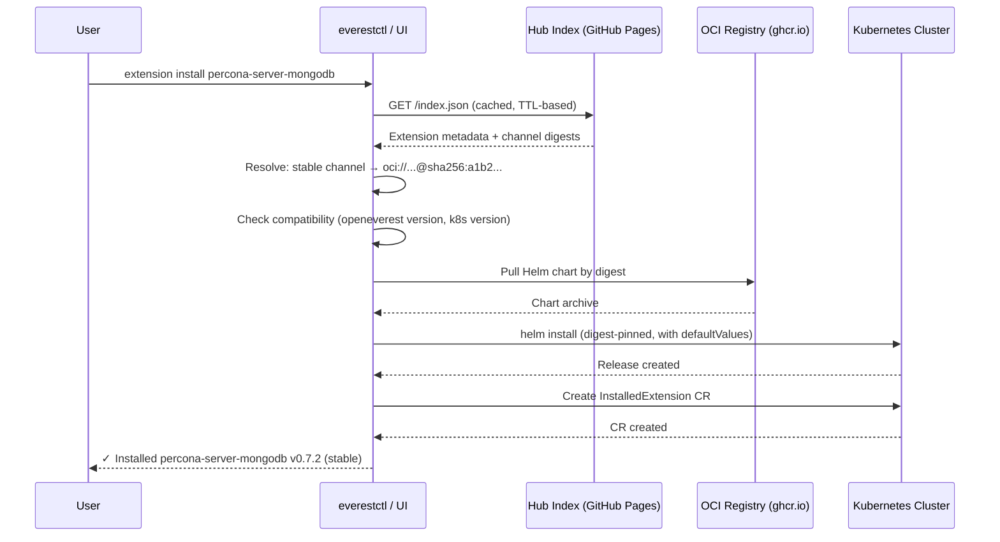
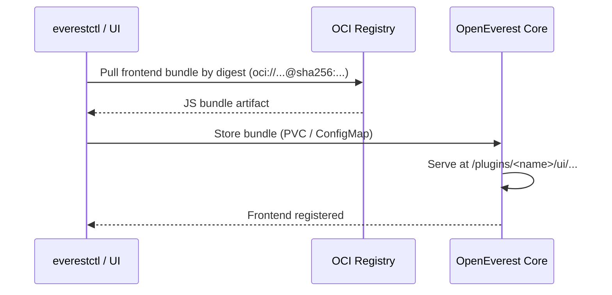
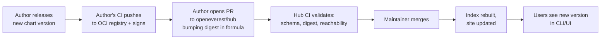

# OpenEverest Extension Hub

*   **Status:** Draft
*   **Authors:** @recharte
*   **Created:** 2026-05-18
*   **Last Updated:** 2026-05-19
*   **Related Issues:** openeverest/roadmap#1

---

## 1. Summary

The OpenEverest Extension Hub is a centralized discovery and distribution catalog for all installable extensions — Providers (spec 001) and generic plugins (spec 003). It uses a **formula/pointer model**: a central git repository (`openeverest/hub`) holds small YAML metadata files that reference OCI artifacts hosted in their authors' own registries. A CI-generated JSON index powers a browseable website, the `everestctl` CLI, and an in-product UI for one-click discovery and installation. Artifacts are pinned by OCI digest on named channels (`stable`/`edge`), giving authors independent release cadence while providing users with strong supply-chain integrity guarantees.

## 2. Motivation

OpenEverest v2 ships with zero providers or plugins preinstalled. The modular architecture introduced in spec 001 (Providers) and spec 003 (Generic Plugins) decouples the core platform from database engines and integrations. This creates an immediate need for users to **discover**, **evaluate**, and **install** extensions without requiring manual chart URL hunting or deep knowledge of the ecosystem.

Existing challenges:

- **No single discovery surface** — users must know the exact OCI reference or Helm repo of the extension they want to install.
- **High barrier to contribution** — without a standardized publishing workflow, extension authors must coordinate directly with the OpenEverest team to make their work visible.
- **No trust signal** — users cannot distinguish a community experiment from a production-ready, signed, actively-maintained extension.
- **No install automation** — installing a provider today requires manual `helm install` commands with correct namespace, values, and version selection.
- **Air-gap environments** — without digest-pinned references, offline mirroring of a known-good set of extensions is impractical.

Package managers like Homebrew, Krew (kubectl plugins), and Artifact Hub have demonstrated that a lightweight pointer model — where a central index references decentralized artifacts — scales to thousands of entries while keeping infrastructure costs minimal and preserving author autonomy.

## 3. Goals & Non-Goals

**Goals:**

* A single, unified discovery surface for all OpenEverest extensions (Providers and generic plugins).
* One-click / one-command install from both the `everestctl` CLI and the OpenEverest UI.
* Independent release cadence for each extension author — no coupling to OpenEverest core releases.
* A formula format that supports verification, signing, and federation as future extensions without schema-breaking changes.
* Air-gap-friendly distribution path — all artifacts referenced by OCI digest so they can be mirrored with standard tooling (`crane`, `skopeo`, `oras`).
* An open submission model that encourages community contributions while surfacing trust signals (verified-publisher badge).
* A browseable website for extension discovery.

**Non-Goals (v1):**

* Hosting artifacts (charts, images, JS bundles) — authors host their own in any OCI-compliant registry.
* Mandatory supply-chain enforcement (cosign/SBOM/SLSA) — the format carries the fields; enforcement is deferred.
* Federation / multi-catalog UI — the format supports it; only the official catalog is wired in v1.
* Full air-gap tooling (offline bundle generator, `everestctl mirror` command) — deferred to a follow-up spec.
* Marketplace monetization, ratings, reviews, or download telemetry.
* Plugin-to-plugin dependency resolution (extensions are installed independently).
* Defining the generic plugin runtime model (that is spec 003's domain).

## 4. Proposed Solution / Design

### 4.0 Phase 1: Developer Preview (Minimal Viable Hub)

Before building the full solution (§4.1–§4.12), a **developer preview** delivers the core value — discoverability and guided installation — with minimal moving parts. It is a valid foundation: every subsequent phase adds capabilities without replacing existing ones.

#### What Phase 1 includes

**Hub repo (`openeverest/hub`)** — a flat `extensions/` tree with simplified formula files. No JSON Schema enforcement, no healthcheck automation, no website, no cosign. A single 10-line GitHub Action regenerates `index.json` on every push to `main` and commits it to the repo (served via GitHub Pages raw CDN).

**Simplified formula** (a strict subset of the full schema in §4.3 — fully forward-compatible):

```yaml
# extensions/providers/percona-server-mongodb/formula.yaml
apiVersion: hub.openeverest.io/v1
kind: Extension
metadata:
  name: percona-server-mongodb
  type: provider
  displayName: "Percona Server for MongoDB"
  description: "Production-ready MongoDB clusters powered by the Percona Operator."
  categories: [database, mongodb]
  homepage: https://github.com/openeverest/provider-percona-server-mongodb
  sourceRepo: https://github.com/openeverest/provider-percona-server-mongodb
  license: Apache-2.0
  maintainers:
    - github: "openeverest"
spec:
  provider:
    providerName: percona-server-mongodb
    supportedEngines: [mongodb]
  compatibility:
    openeverest: ">=2.0.0"
  artifacts:
    chart:
      defaultChannel: stable
      channels:
        stable:
          ref: oci://ghcr.io/openeverest/charts/provider-percona-server-mongodb
          version: "0.7.2"
  install:
    helm:
      releaseName: provider-percona-server-mongodb
      namespace: openeverest-system
```

Note: `digest` is omitted in Phase 1. It becomes required when Phase 2 (CLI install) ships, since digest pinning is a prerequisite for `helm install` from the CLI.

**Two CLI commands** — no installer, no CRD, no UI, no Helm execution:

```
everestctl extension list              # Fetch index.json, print a table of available extensions
everestctl extension info <name>       # Print metadata + the exact helm install command to copy-paste
```

Example output of `everestctl extension info percona-server-mongodb`:

```
Name:        percona-server-mongodb
Type:        provider
Version:     0.7.2 (stable)
Compatible:  yes (requires OpenEverest >=2.0.0)
Homepage:    https://github.com/openeverest/provider-percona-server-mongodb

To install, run:
  helm install provider-percona-server-mongodb \
    oci://ghcr.io/openeverest/charts/provider-percona-server-mongodb \
    --version 0.7.2 \
    --namespace openeverest-system \
    --create-namespace
```

#### What Phase 1 explicitly excludes

- `helm install` executed by the CLI (Phase 2)
- OCI digest pinning (Phase 2)
- `InstalledExtension` CRD and reconciler (Phase 3)
- UI Extensions page (Phase 4)
- Verified-publisher badge, healthcheck automation (Phase 5)
- Frontend bundle distribution (Phase 6)
- JSON Schema CI validation of formulas (Phase 2 — added alongside digest requirement)
- Federation / multi-catalog support (Phase 5+)

#### Upgrade path

The Phase 1 formula is a **strict subset** of the full schema. Adding `digest`, `verification`, `frontend`, and other fields in later phases is non-breaking. The `apiVersion: hub.openeverest.io/v1` field ensures clients can detect schema version if a breaking change were ever needed.

| Phase | Adds | Formula changes |
|-------|------|-----------------|
| **1 — Developer preview** | Hub repo, simplified formula, static index, `list`/`info` CLI | Baseline |
| **2 — CLI install** | Digest pinning required, `install`/`upgrade`/`uninstall` CLI | `digest` becomes required in `channels` |
| **3 — Lifecycle** | `InstalledExtension` CRD + reconciler | No formula changes |
| **4 — UI** | Extensions browser page, in-product install | No formula changes |
| **5 — Trust** | Verified-publisher automation, healthchecks, federation hooks | `verification` block, `health` field in index |
| **6 — Generic plugins / frontend** | OCI frontend artifact, bundle serving | `frontend` artifact block |

---

### 4.1 Pattern Choice

The hub follows a **pointer/formula with OCI digests** pattern — a hybrid of the Homebrew and Krew models adapted for OCI-native distribution.

| Pattern | Pros | Cons | Why not chosen (if applicable) |
|---------|------|------|-------------------------------|
| **Formula → OCI digest (this spec)** | Lightweight repo; authors own release cadence; immutable digests; air-gap mirrorable; PR = audit trail | Slightly more complex format; authors must publish to OCI | — |
| **Artifact Hub only** | Zero infra | Loses OpenEverest-specific metadata, branding, and tight in-product install UX | No in-product integration; no control over UX |
| **OLM-style centralized catalog image** | Strongest integrity; single pull for all metadata | Heavy ops; monolithic image rebuilt on every change; doesn't fit generic plugins | Over-engineered for a young ecosystem |
| **Fully centralized (Docker Hub-style)** | Best UX; full control | Significant infra (storage, CDN, auth); hosting liability; author lock-in | Unsustainable hosting burden |
| **Chart-repo index reference (no digest)** | Zero PR overhead per release | Mutable: author can replace artifacts without notice; no integrity; runtime verification only | Insufficient supply-chain guarantees |
| **Just use Helm repos as-is** | No new concept | No discovery, no trust signals, no UI integration, no air-gap story | Doesn't solve the problem |

### 4.2 Repository Layout

```
openeverest/hub/
├── extensions/
│   ├── providers/
│   │   ├── percona-server-mongodb/
│   │   │   ├── formula.yaml
│   │   │   ├── README.md
│   │   │   └── logo.svg
│   │   └── percona-xtradb-cluster/
│   │       ├── formula.yaml
│   │       ├── README.md
│   │       └── logo.svg
│   └── plugins/
│       ├── sql-browser/
│       │   ├── formula.yaml
│       │   ├── README.md
│       │   └── logo.svg
│       └── ai-copilot/
│           ├── formula.yaml
│           ├── README.md
│           └── logo.svg
├── schemas/
│   └── formula-v1.json              # JSON Schema for CI validation
├── index/                            # Generated; committed for GitHub Pages
│   ├── index.json
│   └── index.json.sig               # Cosign signature on the index
├── site/                             # Static website source (Hugo/Next.js)
│   └── ...
├── docs/
│   ├── PUBLISHING.md                 # How to submit an extension
│   ├── VERIFIED-PUBLISHER.md         # Verified badge requirements
│   └── SUPPLY-CHAIN.md              # Best practices for signing
├── .github/
│   └── workflows/
│       ├── validate.yaml             # PR: schema, digest reachability, naming
│       ├── build-index.yaml          # main: regenerate index/, deploy site
│       └── healthcheck.yaml          # Scheduled: digest reachability, status
└── README.md
```

**Conventions:**
- Extension directory name = globally unique slug (lowercase, alphanumeric + hyphens).
- Each extension directory contains exactly one `formula.yaml`, one `README.md` (rendered on the website), and an optional `logo.svg`.
- The `index/` directory is auto-generated and should not be hand-edited.

### 4.3 Formula Schema

The formula is the core metadata unit. It is validated against `schemas/formula-v1.json` on every PR.

```yaml
# extensions/providers/percona-server-mongodb/formula.yaml
apiVersion: hub.openeverest.io/v1
kind: Extension

metadata:
  # Globally unique slug. Must match the directory name.
  name: percona-server-mongodb
  # Extension type discriminator.
  type: provider  # provider | plugin
  displayName: "Percona Server for MongoDB"
  description: |
    Production-ready MongoDB clusters powered by the Percona Operator.
    Supports replica sets and sharded topologies.
  categories:
    - database
    - mongodb
  keywords:
    - nosql
    - document-store
    - percona
  homepage: https://github.com/openeverest/provider-percona-server-mongodb
  sourceRepo: https://github.com/openeverest/provider-percona-server-mongodb
  license: Apache-2.0
  maintainers:
    - name: "OpenEverest Team"
      email: "maintainers@openeverest.io"
      github: "openeverest"
  # Relative path to logo file in this directory.
  icon: ./logo.svg
  # Annotations for arbitrary metadata (future use, UI hints, etc.)
  annotations: {}

spec:
  # --- Type-specific block (exactly one of `provider` or `plugin`) ---
  provider:
    # Must match the Provider CR .metadata.name deployed by this chart.
    providerName: percona-server-mongodb
    supportedEngines:
      - mongodb

  # plugin:
  #   contributes:
  #     ui: true
  #     cli: false
  #     backend: true
  #   extensionPoints:
  #     - database-detail-tab
  #     - navigation-sidebar

  # --- Compatibility constraints ---
  compatibility:
    # Semver range of compatible OpenEverest core versions.
    openeverest: ">=2.0.0 <3.0.0"
    # Minimum Kubernetes version.
    kubernetes: ">=1.27"

  # --- Artifact references ---
  artifacts:
    # Helm chart artifact (required for providers; optional for UI-only plugins).
    chart:
      defaultChannel: stable
      channels:
        stable:
          ref: oci://ghcr.io/openeverest/charts/provider-percona-server-mongodb
          version: "0.7.2"
          digest: "sha256:a1b2c3d4e5f6..."
        edge:
          ref: oci://ghcr.io/openeverest/charts/provider-percona-server-mongodb
          version: "0.8.0-rc1"
          digest: "sha256:f6e5d4c3b2a1..."

    # Frontend JS bundle (optional; for generic plugins with UI contribution).
    frontend:
      defaultChannel: stable
      channels:
        stable:
          ref: oci://ghcr.io/openeverest/plugins/sql-browser-ui
          version: "0.3.1"
          digest: "sha256:..."
          # Subresource integrity hash for browser verification.
          integrity: "sha512-..."

  # --- Supply-chain verification (optional in v1, format-ready) ---
  verification:
    cosign:
      issuer: https://token.actions.githubusercontent.com
      identityRegexp: "^https://github.com/openeverest/.*"
    sbom: "oci://ghcr.io/openeverest/sbom/provider-psmdb@sha256:..."
    slsaProvenance: "oci://ghcr.io/openeverest/provenance/provider-psmdb@sha256:..."

  # --- Install configuration ---
  install:
    helm:
      releaseName: provider-percona-server-mongodb
      namespace: openeverest-system
      # Optional: pointer to a published values.schema.json for UI form rendering.
      valuesSchema: "oci://ghcr.io/openeverest/charts/provider-percona-server-mongodb-values-schema@sha256:..."
      # Default Helm values applied on install (user can override).
      defaultValues: {}
```

**Field rules:**

| Field | Required | Notes |
|-------|----------|-------|
| `metadata.name` | Yes | Must match directory name; globally unique; `[a-z0-9][a-z0-9-]*` |
| `metadata.type` | Yes | `provider` or `plugin` |
| `metadata.displayName` | Yes | Human-readable, max 64 chars |
| `metadata.description` | Yes | Max 500 chars |
| `metadata.license` | Yes | Valid SPDX identifier |
| `metadata.maintainers` | Yes | At least one entry with `github` handle |
| `spec.provider` or `spec.plugin` | Yes | Exactly one, matching `metadata.type` |
| `spec.compatibility.openeverest` | Yes | Valid semver range |
| `spec.artifacts.chart` | Conditional | Required unless `metadata.type == plugin` AND `spec.plugin.contributes.ui == true` AND all other contributes are false |
| `spec.artifacts.frontend` | Conditional | Required when `spec.plugin.contributes.ui == true` |
| `spec.artifacts.*.channels.*.digest` | Yes | SHA-256 OCI manifest digest |
| `spec.verification` | No | Optional in v1 |
| `spec.install.helm.namespace` | Yes | Must be `openeverest-system` for providers |

### 4.4 Generated Index

On every merge to `main`, a GitHub Action regenerates `index/index.json`:

```json
{
  "apiVersion": "hub.openeverest.io/v1",
  "kind": "ExtensionIndex",
  "metadata": {
    "catalogId": "openeverest-official",
    "generatedAt": "2026-05-18T12:00:00Z",
    "schemaVersion": "v1",
    "totalExtensions": 42
  },
  "extensions": [
    {
      "name": "percona-server-mongodb",
      "type": "provider",
      "displayName": "Percona Server for MongoDB",
      "description": "...",
      "categories": ["database", "mongodb"],
      "keywords": ["nosql", "document-store", "percona"],
      "homepage": "https://...",
      "sourceRepo": "https://...",
      "license": "Apache-2.0",
      "icon": "https://hub.openeverest.io/extensions/providers/percona-server-mongodb/logo.svg",
      "verified": true,
      "health": "healthy",
      "compatibility": {
        "openeverest": ">=2.0.0 <3.0.0",
        "kubernetes": ">=1.27"
      },
      "channels": {
        "chart": {
          "default": "stable",
          "stable": { "version": "0.7.2", "digest": "sha256:a1b2..." },
          "edge": { "version": "0.8.0-rc1", "digest": "sha256:f6e5..." }
        }
      },
      "install": {
        "helm": {
          "releaseName": "provider-percona-server-mongodb",
          "namespace": "openeverest-system"
        }
      },
      "lastUpdated": "2026-05-10T08:30:00Z"
    }
  ]
}
```

Properties:
- **`catalogId`** — identifies this catalog for federation (multiple sources can coexist in the resolver).
- **`verified`** — computed from the verified-publisher policy (§4.6).
- **`health`** — one of `healthy`, `degraded`, `broken`; computed by the healthcheck workflow (§4.7).
- **Signed** — `index.json.sig` is a cosign keyless signature (Sigstore transparency log) so consumers can verify the index hasn't been tampered with.

The index is hosted via **GitHub Pages** at `https://hub.openeverest.io/index.json` (or equivalent custom domain).

### 4.5 Distribution & Runtime Install Flow



For **generic plugins with a frontend bundle**, an additional step occurs:



**Key behaviors:**

1. **Index caching** — `everestctl` and the OpenEverest API cache `index.json` with a configurable TTL (default: 1 hour). `everestctl extension update-index` forces a refresh.
2. **Compatibility gating** — the resolver refuses to install extensions whose `compatibility.openeverest` range doesn't match the running core version. The UI hides incompatible entries.
3. **Channel selection** — defaults to `defaultChannel`; user can override with `--channel edge`.
4. **Digest pinning** — the exact OCI manifest digest from the formula is used for the pull. No tag resolution occurs at install time. This guarantees the same bits reviewed in the PR are what gets installed.
5. **InstalledExtension CR** — records what's installed, from which channel, at which digest. Enables upgrade detection (channel head moved), drift detection, and uninstall.
6. **Air-gap escape hatch** — the catalog URL is configurable (`everestctl extension catalog add <url>`). OCI refs are mirrorable with standard tools. A future `everestctl extension mirror` command can automate this.

### 4.6 Trust Model

#### Open submissions

Anyone can submit an extension by opening a PR to `openeverest/hub`. The PR validation workflow enforces:

- `formula.yaml` passes JSON Schema validation.
- `metadata.name` matches directory name and is globally unique.
- `metadata.license` is a valid SPDX identifier.
- All OCI refs in `spec.artifacts` are reachable and the declared digests match.
- `README.md` exists and is non-empty.
- PR is DCO signed-off.

PRs are reviewed by hub maintainers (lightweight review: metadata accuracy, no malicious intent, README quality). There is no code review — the formula is a pointer, not code.

#### Verified-publisher badge

An extension is marked `verified: true` in the index when ALL of the following hold:

1. **Identity match** — the `metadata.maintainers[].github` org/user owns the OCI registry namespace in `spec.artifacts.*.channels.*.ref` (e.g., `ghcr.io/openeverest/*` → `openeverest` GitHub org membership).
2. **Cosign signature present** — at least one channel's artifact has a verifiable cosign signature matching the declared `spec.verification.cosign` identity.
3. **Active maintenance** — no `health: broken` status in the last 30 days (see §4.7).
4. **Source repo accessible** — `metadata.sourceRepo` resolves and is not archived.

Verification is **computed**, not manually granted. The healthcheck workflow (§4.7) re-evaluates criteria continuously. The badge is revoked automatically when criteria stop holding.

#### Federation readiness

The index format carries a `catalogId`. The CLI/UI can register multiple catalog URLs:

```bash
everestctl extension catalog add https://partner.example.com/hub/index.json
everestctl extension catalog list
everestctl extension catalog remove partner
```

In v1, only the official catalog is configured by default. The schema and resolver are ready for multiple catalogs without breaking changes.

### 4.7 Healthcheck & Lifecycle

A scheduled GitHub Action (daily) verifies for each listed extension:

| Check | Passes when |
|-------|-------------|
| OCI digest reachability | All channel refs pull successfully |
| Cosign signature validity | Signature still verifies (key not revoked) |
| Source repo liveness | `metadata.sourceRepo` returns HTTP 200, repo not archived |

Results are written to the index as `health`:

| Status | Meaning |
|--------|---------|
| `healthy` | All checks pass |
| `degraded` | Source repo archived OR cosign check fails, but OCI refs still pull |
| `broken` | OCI refs unreachable — extension cannot be installed |

**Deprecation flow:**
- After 7 consecutive days of `broken` status → automated PR moves the formula to an `extensions/_deprecated/` directory.
- Deprecated extensions remain in the index with `health: deprecated` and a `deprecatedAt` timestamp. They are hidden by default in the UI/CLI but can be shown with `--include-deprecated`.
- Formulas are never deleted from git history — preserves audit trail.

### 4.8 Supply-Chain Story (v1: Documented Best Practices)

The `spec.verification` block is present in the schema from day one. In v1, it is optional and not enforced at install time. A `docs/SUPPLY-CHAIN.md` guide documents:

1. **Sign with cosign keyless** from GitHub Actions OIDC (zero-key management burden for authors).
2. **Publish SBOM** as an OCI referrer (CycloneDX or SPDX).
3. **Emit SLSA provenance** via `slsa-github-generator`.
4. **Pin all container image digests** inside the Helm chart (not just tags).

A future spec can flip verification fields to required, enforce signature verification at install time, and reject unsigned artifacts. The format won't need to change.

### 4.9 CLI & UI Surface

#### CLI (`everestctl extension`)

```
everestctl extension search <query>              # Search by name, keyword, category
everestctl extension info <name>                 # Show metadata, channels, compatibility
everestctl extension install <name>              # Install from default channel
  --channel <channel>                            # Override channel
  --version <version>                            # Pin specific version within channel
  --values <file>                                # Custom Helm values
  --dry-run                                      # Show what would be installed
everestctl extension list                        # List installed extensions
everestctl extension upgrade <name>              # Upgrade to channel head
  --all                                          # Upgrade all installed
everestctl extension uninstall <name>            # Remove extension and cleanup
everestctl extension update-index                # Force index refresh

# Catalog management (federation hook)
everestctl extension catalog list                # Show configured catalog URLs
everestctl extension catalog add <url>           # Add a catalog source
everestctl extension catalog remove <name>       # Remove a catalog source
```

#### UI (Extensions page)

- **Browse** — grid/list view of available extensions with category filters, search, type tabs (Providers / Plugins).
- **Detail** — extension page showing description, README, channels, version history, verification status, compatibility.
- **Install** — one-click install with channel selector and optional values override (rendered from `valuesSchema` if available).
- **Installed** — list of installed extensions with current version, channel, available upgrades, health status.
- **Upgrade** — one-click upgrade to channel head with diff preview.

### 4.10 InstalledExtension CRD

Tracks cluster state of installed extensions:

```yaml
apiVersion: hub.openeverest.io/v1alpha1
kind: InstalledExtension
metadata:
  name: percona-server-mongodb
  namespace: openeverest-system
spec:
  # Reference back to hub metadata.
  extensionName: percona-server-mongodb
  type: provider
  catalogId: openeverest-official
  channel: stable
  version: "0.7.2"
  chartDigest: "sha256:a1b2c3d4e5f6..."
  frontendDigest: ""  # empty for providers without UI
  helm:
    releaseName: provider-percona-server-mongodb
    namespace: openeverest-system
    values: {}
status:
  phase: Installed  # Installed | Upgrading | Failed | Uninstalling
  installedAt: "2026-05-18T12:00:00Z"
  lastChecked: "2026-05-18T13:00:00Z"
  availableUpgrade:
    version: "0.8.0"
    digest: "sha256:..."
  conditions:
    - type: Ready
      status: "True"
      lastTransitionTime: "2026-05-18T12:01:00Z"
    - type: UpgradeAvailable
      status: "True"
      message: "0.8.0 available on stable channel"
```

A reconciler in OpenEverest core watches `InstalledExtension` resources to:
- Detect available upgrades (compare installed digest vs current channel head in cached index).
- Set conditions and surface them in the UI.
- Handle uninstall cleanup (Helm uninstall + frontend bundle removal).

### 4.11 Compatibility & Resolution Rules

1. **Semver gating** — `compatibility.openeverest` is checked against the running core version at install and upgrade time. Incompatible extensions are rejected with a clear error.
2. **Channel pinning** — install records the exact digest. The extension stays at that version until the user explicitly upgrades.
3. **Upgrade** — resolves current channel head from the index; if the digest differs from installed, the upgrade is available. Pulls and installs the new digest.
4. **Downgrade** — explicit `--version` flag allows installing an older version from the same channel (if the author still lists it, or user provides direct OCI ref). A warning is shown.
5. **Multiple channels** — a user can switch channels (`everestctl extension install <name> --channel edge`); this is treated as a fresh install of that channel's head.

### 4.12 Author Publishing Workflow



For high-velocity authors, a **GitHub Action template** is provided that automatically opens a PR to `openeverest/hub` when a new release is tagged in the source repo. This keeps the formula in sync without manual intervention.

## 5. Definition of Done

### Phase 1 — Developer Preview

* [ ] `openeverest/hub` repository exists with simplified formula files for at least one provider (`percona-server-mongodb`) and a `README.md` describing how to submit an extension.
* [ ] A GitHub Action regenerates `index.json` on every push to `main` and publishes it via GitHub Pages.
* [ ] `everestctl extension list` fetches `index.json` and prints a table of available extensions.
* [ ] `everestctl extension info <name>` prints metadata and the exact copy-paste `helm install` command.
* [ ] A developer can discover and manually install a provider end-to-end using only the two CLI commands above.

### Full Solution

* [ ] `openeverest/hub` repository exists with:
  * `schemas/formula-v1.json` (JSON Schema)
  * `extensions/providers/percona-server-mongodb/formula.yaml` (first entry)
  * PR validation workflow (schema + digest reachability + naming)
  * Index generation workflow (builds `index.json`, deploys to GitHub Pages)
  * Healthcheck workflow (scheduled daily)
* [ ] Browseable website deployed at `hub.openeverest.io` (or equivalent), rendering README, metadata, and logos for each extension.
* [ ] `everestctl extension search|info|install|list|upgrade|uninstall` commands implemented and documented.
* [ ] OpenEverest UI Extensions page implemented (browse, detail, install, installed list, upgrade).
* [ ] `InstalledExtension` CRD registered in cluster; reconciler running in OpenEverest core.
* [ ] Provider `percona-server-mongodb` published as the first formula and installable end-to-end via CLI and UI.
* [ ] At least one generic plugin with a frontend bundle published and installable end-to-end (validates the frontend-OCI path).
* [ ] `docs/PUBLISHING.md` written — step-by-step guide for extension authors.
* [ ] `docs/VERIFIED-PUBLISHER.md` written — criteria and process for earning the badge.
* [ ] `docs/SUPPLY-CHAIN.md` written — best practices for signing and attestation.
* [ ] GitHub Action template provided for automated formula PRs on release.

## 6. Alternatives Considered

| Alternative | Summary | Why not chosen |
|---|---|---|
| **Artifact Hub only** | Publish extensions to the existing CNCF Artifact Hub and link out from OpenEverest | No in-product integration; can't control UX; loses OpenEverest-specific metadata (topology info, compatibility ranges); no in-product install flow |
| **OLM-style centralized catalog image** | Bundle all extension metadata into a single container image, rebuild on every change | Over-engineered; monolithic rebuild on every PR; doesn't fit generic plugins; high operational burden for a young ecosystem |
| **Fully centralized hub (Docker Hub model)** | OpenEverest hosts all artifacts, provides a full registry | Significant infrastructure (storage, CDN, auth, availability); hosting liability; locks authors into our registry; doesn't scale without dedicated ops team |
| **Chart-repo index references (no digest pinning)** | Formula points at a Helm repo URL; versions resolve dynamically at install time | Mutable: author can replace `v1.2.3` with different bits without review; no integrity guarantee; verification becomes a runtime problem; breaks air-gap reproducibility |
| **External CDN for frontend bundles** | Plugin frontends served from third-party CDNs | Air-gap hostile; supply-chain weak (CDN can swap content); browser pulls from third-party origin (CSP/privacy concerns); link rot |
| **No hub — just documentation** | Document known extensions in a markdown file; users `helm install` manually | Doesn't scale; no programmatic discovery; no install automation; no trust signals; high user friction |

## 7. Open Questions

1. **InstalledExtension CRD API group** — should it live in `core.openeverest.io/v1alpha1` (consistent with Instance/Provider) or a new `hub.openeverest.io/v1alpha1` (cleaner separation, independent lifecycle)? Leaning toward `hub.openeverest.io/v1alpha1`.

2. **Frontend bundle storage** — PVC (durable, requires StorageClass), ConfigMap (size-limited to 1MiB, simple), in-memory cache (lost on restart), or stream-from-OCI-on-demand (stateless but cold-start on every pod restart)? Likely PVC with ConfigMap fallback for tiny bundles.

3. **GitOps story** — should `everestctl` emit an `extensions.lock` file that users commit to their infra repo for reproducible installs? Digest pinning already makes installs deterministic, but a lockfile would make the set of installed extensions declarative and diffable.

4. **Multi-tenancy / namespace scoping** — are extensions always cluster-wide, or can they be scoped per namespace? Providers are naturally cluster-scoped (they reconcile across namespaces). Generic plugins may want namespace isolation. Defer to spec 003 runtime model?

5. **CNCF governance intersection** — how does the verified-publisher process intersect with eventual CNCF governance for OpenEverest? Who are the hub maintainers? Is there a formal TSC approval for "official" extensions?

6. **Install telemetry** — should we count installs (opt-in) to surface popularity? Where does that data live? Privacy implications?

7. **Breaking changes between extension versions** — how does the hub signal backward-incompatible upgrades? Should `channels` carry a `breakingFrom` field? Should the UI require explicit confirmation?

8. **Extension dependencies** — what if a plugin requires a specific provider to be installed (e.g., an AI copilot that only works with MongoDB)? Should the formula declare `requires: [percona-server-mongodb]`? Deferred for v1 but format should reserve the field.

9. **Private extensions** — enterprises may want internal extensions not published to the public hub. The federation model (`catalog add`) supports this, but should we provide more guidance on running a private hub instance?

10. **Index size at scale** — with hundreds of extensions, `index.json` could grow large. Should we support paginated/filtered index endpoints, or is a single JSON file sufficient for the foreseeable future?

## 8. References

* [Spec 001 — Plugins Architecture (Providers)](./001-plugins-architecture.md)
* [Spec 003 — Generic Plugins (Extensions)](./003-generic-plugins.md)
* [Homebrew formulae](https://docs.brew.sh/Formula-Cookbook) — pointer model with centralized index
* [Krew plugin index](https://krew.sigs.k8s.io/docs/developer-guide/release/new-plugin/) — YAML manifests in a central git repo
* [Artifact Hub](https://artifacthub.io/) — CNCF metadata hub for Helm, OLM, Krew, etc.
* [OCI Distribution Spec](https://github.com/opencontainers/distribution-spec) — standard for artifact storage
* [Sigstore / cosign](https://docs.sigstore.dev/) — keyless signing and verification
* [SLSA framework](https://slsa.dev/) — supply-chain levels for software artifacts
* [Headlamp plugin system](https://headlamp.dev/docs/latest/development/plugins/) — runtime JS plugin loading
* [Helm OCI support](https://helm.sh/docs/topics/registries/) — `helm push`/`pull` with OCI registries
