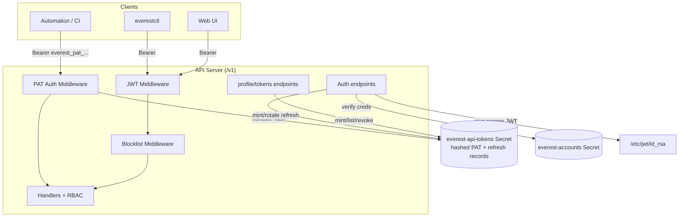
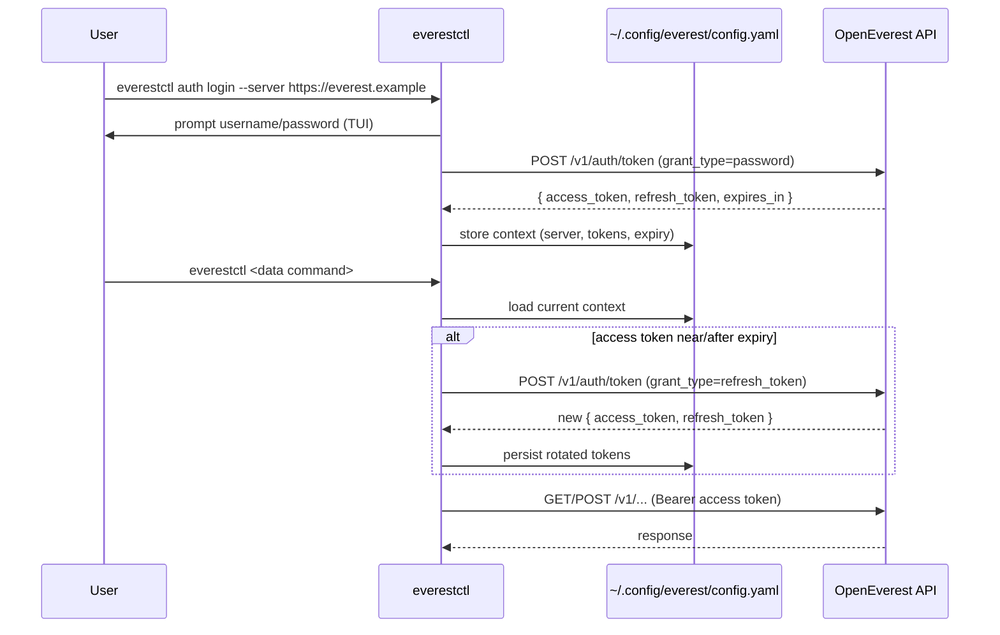

# Authentication System Redesign: Sessions, Refresh Tokens, and PATs

*   **Status:** Draft
*   **Authors:** @recharte
*   **Created:** 2026-06-09
*   **Last Updated:** 2026-06-09
*   **Related Issues:** _TBD_

---

## 1. Summary

OpenEverest's current authentication system has fundamental gaps that block three critical
use cases:

- **Automation** requires long-lived, named, revocable credentials — impossible with a
  24-hour self-contained JWT that cannot be individually revoked.
- **CLI authentication** doesn't exist — `everestctl` cannot authenticate to the API server,
  only to Kubernetes directly via kubeconfig.
- **Session security** is suboptimal — a single long-lived JWT is exposed to the entire
  browser session, with no way to refresh it without re-entering credentials.

This spec overhauls the token architecture end-to-end to address all three, with three main
components:

1. **Redesigned session model** — replace single 24h JWTs with short-lived (15 min) access
   JWTs + long-lived (30 day), rotatable refresh tokens. Applies to both UI and CLI.
2. **Personal Access Tokens (PATs)** — opaque, prefixed, revocable, long-lived API keys
   for automation, stored hashed in a server-side registry.
3. **New OAuth 2.0-inspired endpoints** — a single `/v1/auth/token` with `grant_type`
   discrimination (password, refresh_token) replaces the old `/v1/session`, with
   `/v1/auth/revoke` for logout and `/v1/profile/tokens` for PAT management.

The design keeps the architecture forward-compatible with future **service accounts**
(standalone non-human identities) without requiring a rewrite.

## 2. Motivation

### Current state

Currently, the only way to obtain an API token is:

```
POST /v1/session  { username, password }  ->  { token }   // RS256 JWT, iss="everest", 24h
```

Tokens are self-contained RS256 JWTs signed by Everest with a 24-hour expiry. Logout is
handled via an `everest-blocklist` Kubernetes Secret; password changes invalidate existing
tokens via a `passwordMtime` field. All authentication assumes interactive login with
username/password. There is no non-interactive credential system (no PATs, no service
accounts, no refresh tokens). The `everestctl` CLI does not use the HTTP API at all —
every command operates against Kubernetes directly using the caller's kubeconfig.

**Internal authentication details:**

- User accounts are stored in the `everest-accounts` Kubernetes Secret as YAML (`users.yaml`).
  Each account record contains: `enabled: bool`, `capabilities: []string`, `passwordMtime: RFC3339`, `passwordHash: string`.
- Passwords are hashed using PBKDF2-SHA256 (4096 iterations) with the Everest namespace UID as salt.
- On login, the API validates the password against the stored hash and checks `account.enabled == true` and `"login" in capabilities`.
- The issued JWT includes claims: `iss="everest"`, `sub="<username>:login"`, `jti=<random-uuid>`, `exp=now+24h`.
- Logout appends the token's `jti` and expiry to the `everest-blocklist` Secret; expired entries are pruned automatically.
- Subsequent requests validate the JWT signature, check blocklist membership, and verify `passwordMtime` to catch password changes.
- OIDC tokens (from external identity providers) are validated separately using the provider's JWKS endpoint; they are also checked against the same blocklist.
- Both internal and OIDC login paths share the same logout mechanism and blocklist.

### Problems

*   **Automation is impractical.** A user who wants to script against the API must embed a
    username/password and call `POST /v1/session` on every run, store a 24h JWT that they
    cannot revoke individually, and re-authenticate daily. There is no per-credential
    revocation, no listing, no "last used" visibility, and no way to scope or name a
    credential for a specific integration.
*   **The blocklist is the wrong tool for long-lived tokens.** Revoking a self-contained
    JWT requires adding it to the `everest-blocklist` Secret until it expires. For
    long-lived or non-expiring tokens, the blocklist would grow without bound.
*   **The CLI cannot authenticate to the API.** We plan to expand `everestctl` with
    capabilities such as provisioning database instances. These operations should go
    through the API server (so they honor RBAC, audit, validation, and work against a
    remote cluster without direct Kubernetes access), but the CLI has no login flow, no
    local credential storage, and no API client wiring.
*   **UI session security is weak.** A single 24h JWT lives in the browser for the entire
    session. If XSS steals it, the attacker has 24 hours of access. Worse, there's no way
    to refresh the token without re-entering the password, so users either accept a long
    window or re-login multiple times per day — a usability trap leading to weak passwords.

### Desired outcomes

*   A user can log in to the web UI, and their session automatically refreshes in the
    background with a short-lived access token, reducing XSS attack surface from 24 hours
    to 15 minutes.
*   A user can run `everestctl auth login`, then run authenticated commands without
    re-entering credentials, with the session silently refreshed in the background.
*   A user (or CI pipeline) can create a named, revocable PAT and use it as a bearer token
    against the API, exactly like GitHub/GitLab/Stripe-style API keys.
*   Administrators and users can list and revoke individual tokens.
*   Both internal and external OIDC login paths use the same token validation and refresh
    logic in the codebase.

## 3. Goals & Non-Goals

**Goals:**

*   **Redesign the session token model** — replace single 24h JWTs with a short-lived
    access JWT + long-lived refresh token pair, enabling secure background re-authentication
    and better protection against XSS in the browser.
*   **Introduce Personal Access Tokens (PATs)** — opaque, prefixed, revocable, long-lived
    API keys (`everest_pat_<random>`) validated against a server-side registry with instant
    revocation, listing, and last-used tracking. Solves the automation use case.
*   **Unify token issuance endpoints** — replace `/v1/session` with `/v1/auth/token` +
    `/v1/auth/revoke` + `/v1/profile/tokens`, following OAuth 2.0 conventions (`grant_type`
    discrimination) so the endpoint design is extensible to service accounts and other
    future grant types without introducing new endpoint shapes.
*   **Enable CLI authentication** — add `everestctl auth login` / `logout` and
    `everestctl config` commands for multi-context credential storage
    (`~/.config/everest/config.yaml`) and automatic token refresh.
*   **Unify UI and CLI session flows** — both now use the same `/v1/auth/token` endpoints
    with the same refresh-token-backed session model, simplifying authentication logic.
*   **Make all token TTLs configurable** with sensible defaults (`SessionAccessTTL=15min`,
    `SessionRefreshTTL=30days`, `PATDefaultTTL=90days`).
*   Keep the design forward-compatible with **service accounts** (future non-human identity
    type) without requiring a rewrite of the registry or RBAC.
*   Preserve backward compatibility: existing internal and OIDC JWT validation paths keep
    working.

**Non-Goals:**

*   **Service accounts** (standalone non-human identities decoupled from a user). The
    design must not preclude them, but they are a later phase.
*   **OIDC browser-based SSO login from the CLI** (Authorization Code + PKCE in
    `everestctl`). Internal username/password login is in scope now; OIDC CLI login is a
    later phase. (OIDC token *validation* against the API is unchanged and remains
    supported.)
*   **Per-token RBAC scoping / least-privilege tokens.** PATs initially inherit the full
    permissions of their owning user. Scoping is a later enhancement.
*   **Migrating existing admin/install/namespace CLI commands** off Kubernetes-direct
    access. Those remain Kubernetes-native; only new data-plane commands use the API.
*   Changing the RBAC (Casbin) policy model or the account password-hashing scheme.

## 4. Proposed Solution / Design

### 4.1 Overview



The request pipeline gains a **PAT authentication middleware** in front of the existing
JWT middleware. If the bearer credential carries the `everest_pat_` prefix, it is
validated against the registry; otherwise it falls through to the existing JWT path
unchanged.

### 4.2 Token taxonomy

| Token | Format | Lifetime | Storage | Revocation | Primary use |
|-------|--------|----------|---------|------------|-------------|
| **Access JWT** | Self-contained RS256 JWT, `iss="everest"` | Short (default ~15 min) | None (stateless) | Expiry + blocklist | Interactive CLI/UI requests |
| **Refresh token** | Opaque, prefixed `everest_rt_<rand>` | Long (default ~30 days) | Hashed in registry | Delete record (instant) | Renew access JWTs |
| **PAT** | Opaque, prefixed `everest_pat_<rand>` | Configurable; optional non-expiring; defaults to an expiry | Hashed in registry | Delete record (instant) | Automation / API keys |

**Rationale for the split:** self-contained JWTs are ideal for short interactive sessions
(no per-request lookup) but poor for long-lived revocable credentials (the blocklist grows
unbounded). Opaque registry-backed tokens are the industry norm for API keys (GitHub
`ghp_…`, GitLab, Stripe) because they support instant revocation, listing, and metadata.

### 4.3 Token registry

A new package `pkg/apitoken/` manages the registry, mirroring the existing
`pkg/kubernetes/accounts.go` patterns.

*   **Backing store:** a new Kubernetes Secret `everest-api-tokens` in the Everest system
    namespace, with one key per token record (ID as key, serialized record as value). This
    allows concurrent writes to different records safely and is consistent with the existing
    `everest-blocklist` Secret pattern.

*   **Token generation:** prefix + 256 bits of CSPRNG randomness, base62-encoded. The
    plaintext is returned to the caller exactly once and never persisted.
*   **At-rest representation:** only a **SHA-256 hash** of the token is stored. (A fast
    hash is acceptable because the secret is high-entropy random, not a low-entropy
    password — same rationale as GitHub/Stripe API keys.)

**Record schema:**

```go
type Record struct {
    ID           string    // stable identifier (also embedded for O(1) lookup; see below)
    Name         string    // human label, unique per owner
    OwnerSubject string    // e.g. "alice" (the account), independent of token type
    Type         TokenType // "pat" | "refresh"
    Hash         string    // hex(SHA-256(plaintext))
    CreatedAt    time.Time
    ExpiresAt    *time.Time // nil => never expires (PAT only)
    LastUsedAt   *time.Time // best-effort, updated asynchronously
}
```

**Service methods:**

```go
Mint(owner string, t TokenType, name string, ttl *time.Duration) (plaintext string, rec Record, err error)
Validate(plaintext string) (Record, error)   // hash, look up, check expiry
List(owner string) ([]Record, error)         // metadata only; never returns hashes
Revoke(id string) error
Touch(id string)                              // best-effort LastUsedAt update
PruneExpired(ctx context.Context) error       // periodic cleanup
```

**Lookup performance:** to avoid scanning every record per request, the opaque token
encodes its record ID alongside the secret, e.g. `everest_pat_<id>_<secret>`. The server
parses the ID, fetches that single record, then constant-time-compares the SHA-256 hash of
the full presented token. Unknown/expired/hash-mismatch all yield a uniform `401`.

**Storage capacity & limits:**

Both **PATs** and **refresh tokens** are stored in this Secret (`Type: "pat" | "refresh"`).
They have different accumulation patterns:

- **Refresh tokens** are bounded by active login sessions — one record per active session,
  deleted and replaced on every token refresh (rotation). At steady state a deployment with
  100 users each running 2 sessions holds ~200 refresh records. They do not accumulate.
- **PATs** are created deliberately and live until revoked or expired (90-day default).
  A user might create 2–5 PATs for different integrations. At 100 users that's ~200–500 PAT
  records. Non-expiring PATs are the only real accumulation risk.

Kubernetes Secrets have a hard size limit of 1 MB applied to the total sum of all value
bytes (raw, before base64 encoding). Under Option B, each Secret key holds one serialized
record. Estimating storage per record:

```
key:   "pat_550e8400e29b41d4a716446655440000"          # ~36 bytes
value: name=ci-deployment owner=alice type=pat          # serialized record
       hash=e3b0c44298fc1c149afbf4c8996fb92427ae...    # 64 bytes
       createdAt=2026-06-09T15:30:00Z                   # ~25 bytes each
       expiresAt=2026-09-07T15:30:00Z
       lastUsedAt=2026-06-09T15:25:00Z
```

A typical record (key + value) is **~350–400 bytes** (key ~36 bytes, name ~30 bytes avg,
owner ~10 bytes, type ~5 bytes, hash 64 bytes, three timestamps ~75 bytes, serialization
overhead ~130 bytes).

**Capacity at realistic scale:**

| Scenario | Refresh tokens | PATs | Total records | Est. size |
|----------|---------------|------|---------------|-----------|
| 50 users, 2 sessions each | 100 | 250 | 350 | ~140 KB |
| 200 users, 2 sessions each | 400 | 1,000 | 1,400 | ~560 KB |
| 500 users, 2 sessions each | 1,000 | 2,500 | 3,500 | ~1.4 MB ⚠️ |

**Viability window:** the registry is viable for deployments up to ~200 active users with
typical PAT usage (~5 per user). Beyond that, the 1 MB ceiling is reachable. Recommended
mitigations:

- Automatic pruning of expired records on every write (`PruneExpired`).
- Operator warning logged at 70% capacity (~700 records).
- Admin tooling to list/revoke stale tokens.
- Discourage non-expiring PATs in documentation.
- Clear migration path to CRD-backed storage in a later phase (see Open Questions).

### 4.4 Subject scheme (service-account-ready)

Subjects encode an identity and the credential class that produced the request:

| Credential | Subject | Notes |
|------------|---------|-------|
| Interactive login (access JWT) | `alice:login` | unchanged from today |
| PAT | `alice:pat` | same underlying user identity as `alice:login` |
| _(future)_ Service account | `svc:ci-bot` | distinct identity namespace |

RBAC subject resolution (`pkg/rbac/`) must map `alice:login` and `alice:pat` to the **same
user `alice`** so a PAT inherits exactly the owner's permissions. The `svc:` prefix is
reserved for the future service-account phase and flows through the same middleware,
registry, and policy plumbing — making service accounts an additive change rather than a
rewrite.

### 4.5 PAT authentication middleware

Inserted in [`internal/server/everest.go`](https://github.com/openeverest/openeverest)
ahead of the existing `jwtMiddleWare`:

```
for each /v1/* request (excluding security:[] paths):
    cred = bearer token from Authorization header
    if cred has prefix "everest_pat_":
        rec = registry.Validate(cred)          // 401 if missing/expired/mismatch
        require owner account enabled + has "apiKey" capability   // else 403
        set UserCtxKey claims { sub: "<owner>:pat", iss: "everest" }
        registry.Touch(rec.ID)                  // async, best-effort
        next()
    else:
        next()   // fall through to existing JWT + blocklist middleware
```

PAT requests **bypass the blocklist middleware** (revocation is handled by deleting the
registry record, which is checked on every request via `Validate`).

### 4.6 Auth endpoints (token issuance & revocation)

Token issuance follows the OAuth 2.0 token endpoint convention (RFC 6749): a single URL
with a `grant_type` discriminator. This keeps all credential exchanges in one place, makes
the intent of each request self-documenting, and reserves the path for additive future
grant types — notably `client_credentials` for service accounts — without introducing new
endpoint shapes.

The request body uses **JSON** rather than the `application/x-www-form-urlencoded` encoding
mandated by RFC 6749, consistent with the rest of the API.

**Login** (`grant_type=password`):

```http
POST /v1/auth/token
{ "grant_type": "password", "username": "alice", "password": "s3cr3t" }
```
```json
{
  "access_token": "<short-lived access JWT>",
  "refresh_token": "everest_rt_...",
  "token_type": "Bearer",
  "expires_in": 900
}
```

**Refresh** (`grant_type=refresh_token`):

```http
POST /v1/auth/token
{ "grant_type": "refresh_token", "refresh_token": "everest_rt_..." }
```
```json
{
  "access_token": "...",
  "refresh_token": "...",
  "token_type": "Bearer",
  "expires_in": 900
}
```

The refresh token is **rotated on use** — the presented record is revoked and a new one
minted, bounding the blast radius of a leaked refresh token.

**Logout / revocation** (`POST /v1/auth/revoke`, inspired by RFC 7009):

```http
POST /v1/auth/revoke
{ "token": "everest_rt_..." }
```

Revokes the supplied refresh token (registry delete) and adds the caller's current access
JWT `jti` to the blocklist until it expires. Revocation is an *action*, not resource
deletion, so `POST` is the correct verb.

> **Note on `grant_type=password`:** This grant was deprecated and removed in OAuth 2.1
> because it historically enabled a problematic pattern: a user delegates their password to
> a *third-party app* (e.g. "sign in with Google via some random startup"), and that app
> stores the credential indefinitely. It's a social engineering risk and unnecessary — OAuth's
> purpose is to *eliminate* the need for third-party apps to handle raw passwords.
>
> However, `everestctl` is **not** a third-party app. It is the first-party client owned and
> shipped by the OpenEverest project. The threat model is entirely different:
>
> - The user's password is never stored; it is typed once, sent over TLS directly to the
>   trusted server, and discarded after token issuance.
> - The user controls and trusts the CLI binary (it's open-source, auditable, not a malicious
>   third party).
> - The token obtained is short-lived, single-use, and rotatable via refresh.
> - If the user suspects the CLI is compromised, they can immediately change their password
>   (which invalidates all outstanding tokens via `passwordMtime`).
>
> This is the exact scenario RFC 6749 itself acknowledges as safe ("resource owner and
> authorization server are under the same administrative domain"). The `client_credentials`
> grant, which is fully retained in OAuth 2.1, is reserved for service accounts in a later
> phase and requires no end-user credential handling.

The `everest-blocklist` only ever holds short-lived access-JWT `jti`s, so it stays small
and self-pruning — solving the unbounded-growth problem for long-lived credentials.

### 4.7 PAT management API

New OpenAPI-first endpoints in `api/openapi/http-api.yaml` (regenerated via `make gen`):

| Method | Path | Description |
|--------|------|-------------|
| `POST` | `/v1/profile/tokens` | Create a PAT. Body `{ name, expiresIn? }`. Returns `{ id, name, token, expiresAt }` — `token` shown once. |
| `GET` | `/v1/profile/tokens` | List the caller's PATs (metadata only: id, name, createdAt, expiresAt, lastUsedAt). |
| `DELETE` | `/v1/profile/tokens/{id}` | Revoke a PAT the caller owns. |

Scoping tokens under `/v1/profile/` communicates that these are resources belonging to the
authenticated caller. The pattern extends cleanly to an admin view in a later phase:
`GET /v1/users/{username}/tokens` and `DELETE /v1/users/{username}/tokens/{id}`.

Creating a PAT requires the caller's account to hold the `apiKey` capability
(`AccountCapabilityAPIKey`, which already exists as a placeholder in
[`pkg/accounts/types.go`](https://github.com/openeverest/openeverest)). The
`everestctl accounts` commands are extended to grant/revoke this capability.

### 4.8 Configurable TTLs

New server configuration values (flags/env), replacing the hardcoded `jwtDefaultExpiry`:

| Setting | Default | Meaning |
|---------|---------|---------|
| `SessionAccessTTL` | 15 min | Access JWT lifetime |
| `SessionRefreshTTL` | 30 days | Refresh token lifetime |
| `PATDefaultTTL` | 90 days | Default PAT expiry when caller omits `expiresIn` |

PATs may be created non-expiring (`expiresIn: 0` / explicit opt-in), but the default is a
bounded lifetime to encourage rotation.

### 4.9 Web UI session flow

The UI's session handling is simplified and unified with the CLI:

*   **Before:** UI logs in via `POST /v1/session { username, password }`, receives a single
    24h JWT, stores it in localStorage, and must re-authenticate daily.
*   **After:** UI logs in via `POST /v1/auth/token { grant_type: password, username, password }`,
    receives an access JWT + refresh token, stores the access token in memory (with optional
    secure httpOnly cookie for the refresh token), and transparently refreshes the access
    token when needed.

The mechanics are identical to OIDC provider tokens, so the codebase has a single code path
for both internal and external IdP logins — both use the JWT validation middleware, both
support refresh tokens, both handle `401 → refresh → retry` transparently.

*   **Transparent refresh:** When the UI receives a `401` or detects the access token is
    near expiry, it calls `POST /v1/auth/token { grant_type: refresh_token, refresh_token: ... }`
    to obtain a new pair (the refresh token is also rotated). The new tokens are persisted
    and the request is retried.
*   **Logout:** `POST /v1/auth/revoke { token: refresh_token }` revokes the refresh token
    and clears the browser-side session. The access JWT is also added to the blocklist.

This model improves security posture: the access token in the browser is short-lived, so if
XSS steals it, the window of exposure is ~15 minutes rather than 24 hours. The refresh token
can be stored in a secure httpOnly cookie (separate from the access token), limiting XSS
access to one but not the other.

### 4.10 everestctl auth & config



*   **Local config** (`pkg/cli/config/`): a multi-context configuration file at
    `~/.config/everest/config.yaml` (mode `0600`), modeled on kubeconfig with a structure
    like:

    ```yaml
    apiVersion: v1
    kind: Config
    currentContext: prod
    contexts:
      - name: prod
        context:
          server: https://everest.prod.example
          accessToken: eyJ...
          refreshToken: everest_rt_...
          expiresAt: 2026-06-09T15:30:00Z
      - name: staging
        context:
          server: https://everest.staging.example
          accessToken: eyJ...
          refreshToken: everest_rt_...
          expiresAt: 2026-06-09T16:45:00Z
    ```

    Supports multiple Everest servers/profiles. The `currentContext` field determines which
    context is active by default; individual commands can override via `--context <name>`.
*   **API client wrapper** (`pkg/cli/api/`): wraps the generated client in
    [`client/`](https://github.com/openeverest/openeverest), injects
    `Authorization: Bearer`, and transparently refreshes the access token (on `401` or when
    near expiry), persisting rotated tokens back to the config.
*   **Auth commands:**
    - `everestctl auth login [--server <url>]` — interactive login with TUI prompts.
    - `everestctl auth logout` — logout and revoke the session tokens.
    - `everestctl auth token create [--name <name>] [--expires-in <duration>]` — create a
      named, optionally expiring PAT.
    - `everestctl auth token list` — list the caller's PATs (metadata only).
    - `everestctl auth token revoke <id>` — revoke a PAT immediately.
*   **Config/context commands:**
    - `everestctl config use-context <name>` — switch active context (server/profile).
    - `everestctl config current-context` — show the active context name.
    - `everestctl config get-contexts` — list all configured contexts with their servers.
    - `everestctl config view [--raw]` — display the config file (or raw YAML if `--raw`).
*   Interactive prompts reuse the existing bubbletea TUI components in `pkg/cli/tui/`.
*   **Hybrid architecture:** new data-plane commands (e.g. future instance provisioning) use
    the API client wrapper; existing `install` / `upgrade` / `accounts` / `namespaces`
    commands remain Kubernetes-direct.

**Design notes:**

The auth commands are namespaced under `everestctl auth` rather than at the root level to
allow for future extensibility (e.g. `everestctl auth status` for session inspection) and
to align with industry precedent (gcloud's `gcloud auth login`, GitHub CLI's `gh auth login`).
The `config` group is separate to clearly distinguish credential storage and context
management from authentication operations, following the kubectl pattern (`kubectl config`).

Context (and the resulting token/server selection) is passed to every command via the
implicit current context; `everestctl --context <name> <command>` can override the current
context for a single invocation. This allows ad-hoc operations against multiple Everest
servers without switching the default context.

### 4.11 Web UI

A token-management view in the UI lets users create (show-once), list, and revoke PATs via
the same `/v1/profile/tokens` endpoints. TypeScript types are regenerated by `make gen`.

## 5. Validation

This specification is considered implemented when:

- **PAT authentication works end-to-end:** A user can create a PAT, use it as a bearer token
  against any API endpoint, and have it correctly identified and validated by the PAT
  middleware (not the JWT middleware). Revoked PATs are rejected with `401`. Expired PATs
  are rejected with `401`. Disabled owner accounts result in `403`.

- **Token refresh is transparent:** A CLI or UI client receives a short-lived access token
  and a refresh token; when the access token approaches expiry, the client can exchange the
  refresh token for new tokens without user intervention. Refresh tokens are rotated on
  use. The server correctly handles concurrent refresh requests (no race conditions).

- **Subject scoping is correct:** Requests authenticated via `:login` (interactive JWT) and
  `:pat` (Personal Access Token) are scoped to the same user identity for RBAC purposes.
  Future `:svc` subjects (service accounts) are unaffected by existing policy.

- **Logout revokes both token types:** Calling `POST /v1/auth/revoke` with an access JWT
  immediately blocks that JWT in the blocklist. Calling it with a refresh token immediately
  invalidates the corresponding registry record. PATs are revoked immediately via registry
  deletion. All revocations are visible within seconds.

- **Multi-context CLI works:** `everestctl config use-context` switches the active context.
  `everestctl auth login` stores credentials locally and uses them for subsequent commands.
  `everestctl --context <name>` overrides the active context for a single invocation. Config
  is stored in `~/.config/everest/config.yaml` with mode `0600`.

- **PAT management is user-accessible:** Users can list their own PATs via the CLI
  (`everestctl auth token list`), web UI token management page, and programmatically via
  `GET /v1/profile/tokens`. They can revoke individual PATs immediately via all three
  interfaces. Metadata (ID, name, created, last-used, expires) is visible; the secret is
  only shown once at creation.

- **TTLs are configurable:** The API server can be configured with different default TTLs
  for session access tokens, session refresh tokens, and PATs, without rebuilding or
  recompiling. Internal/OIDC token paths respect these settings.

- **Both authentication paths coexist:** Internal (username/password) and OIDC logins both
  produce tokens that work with the new token infrastructure (access JWT + refresh token for
  interactive sessions, or PAT for automation). The validation code path is shared between
  both; they are not separate implementations.

## 6. Alternatives Considered

*   **Personal Access Tokens vs. Service Accounts (now).** Service accounts (standalone
    non-human identities) better decouple long-lived automation from individual humans, but
    require a new identity type, RBAC changes, and a separate lifecycle. PATs reuse the
    existing account store and RBAC, ship faster, and — with the `:pat`/`svc:` subject
    scheme and a generic registry — leave service accounts as an additive Phase 2. **Chosen:
    PATs first, service-account-ready.**

*   **Uniform self-contained JWTs for everything (no registry).** Simpler validation (no
    lookup), but revocation of long-lived tokens requires an ever-growing blocklist, and
    listing/last-used/naming are impossible. **Rejected** for automation credentials.

*   **Uniform opaque tokens for everything (registry lookup on every request).** Gives
    instant revocation everywhere but adds a registry read to every interactive request and
    discards the benefit of the existing stateless JWT path. **Rejected** in favor of the
    hybrid: stateless short-lived JWTs for sessions, opaque registry tokens for long-lived
    credentials.

*   **No refresh tokens (just longer-lived session JWTs).** Simpler, but either forces
    frequent re-login (short TTL) or weakens security/revocability (long TTL). Refresh
    tokens give a good UX with a short access-token window. **Rejected** for the interactive
    flow.

*   **CLI talks directly to Kubernetes for data commands.** Consistent with today's CLI, but
    bypasses API-layer RBAC, validation, and audit, and requires direct cluster access.
    **Rejected** for data-plane operations; retained for admin/install commands (hybrid).

*   **OS keychain for CLI credential storage.** More secure at rest, but platform-specific
    and heavier. A `0600` config file matches the kubeconfig precedent users already trust.
    **Deferred** as a possible later enhancement.

*   **Token registry storage layout: single-key YAML vs. one key per record.** Two approaches
    to backing the token registry in a Kubernetes Secret:
    - **Single key (`tokens.yaml`):** all records serialized as one YAML document under a
      single Secret key, identical to the `users.yaml` pattern in `everest-accounts`. Simpler
      to reason about, but every write requires a read-modify-write of the full blob with
      `resourceVersion`-based optimistic locking. Under high concurrency (many concurrent
      logins, refreshes, PAT creations), this causes frequent conflicts and API errors.
    - **One key per record:** each key is the token ID, value is the serialized record.
      More granular — reads and deletes touch only the affected record. Still bounded by the
      1 MB total Secret size. Concurrent writes to different records are safe natively.

    **Chosen: one key per record.** The registry is written on every login, refresh, and PAT
    creation, and pruned periodically. A monolithic single-key approach would experience
    frequent read-modify-write conflicts under this workload pattern. One-key-per-record also
    aligns with the existing `everest-blocklist` Secret, which appends one jti per key,
    establishing consistency across the authentication system.

## 7. Open Questions

*   **Refresh token rotation policy.** The proposal assumes **rotation-on-use** (revoke old,
    mint new on each refresh). Should we additionally implement reuse detection (if a
    revoked refresh token is presented, revoke the whole chain)?
*   **PAT constraints.** Assume unique token *name* per owner and a soft per-user cap. What
    should the cap be, and should admins be able to override it?
*   **Admin visibility.** Should administrators be able to list/revoke *other* users' PATs
    (e.g. for offboarding), and through which surface (CLI/API/UI)?
*   **Rate limiting for PATs.** Should PAT-authenticated requests share the existing per-IP
    global rate limiter, or get a separate per-token budget?
*   **`expiresIn` semantics.** Confirm `0`/omitted handling: omitted → `PATDefaultTTL`,
    explicit `0` → non-expiring (opt-in).

## 8. References

*   Existing codebase: `pkg/session/manager.go`, `internal/server/session.go`,
    `pkg/accounts/types.go`, `internal/server/everest.go` (middleware wiring).
*   `pkg/session/manager.go` — JWT minting/validation, blocklist, `passwordMtime`.
*   `internal/server/session.go` — `CreateSession` / `DeleteSession`.
*   `internal/server/everest.go` — middleware wiring (`jwtMiddleWare`, `newJWTKeyFunc`,
    `newSkipperFunc`).
*   `pkg/accounts/types.go` — `Account`, capabilities (incl. `apiKey` placeholder).
*   `pkg/kubernetes/accounts.go` — Secret-backed store pattern (PBKDF2 hashing).
*   `pkg/plugintoken/service.go` — passwordless, custom-TTL token minting pattern.
*   RFC 6749 — OAuth 2.0 Authorization Framework (`grant_type` token endpoint conventions,
    `password` and `refresh_token` grants).
*   RFC 7009 — OAuth 2.0 Token Revocation (`POST /revoke` pattern).
*   Prior art: GitHub Personal Access Tokens, GitLab PATs, Stripe API keys (opaque,
    prefixed, hashed-at-rest); OAuth 2.0 refresh tokens (RFC 6749); GCP service accounts.
