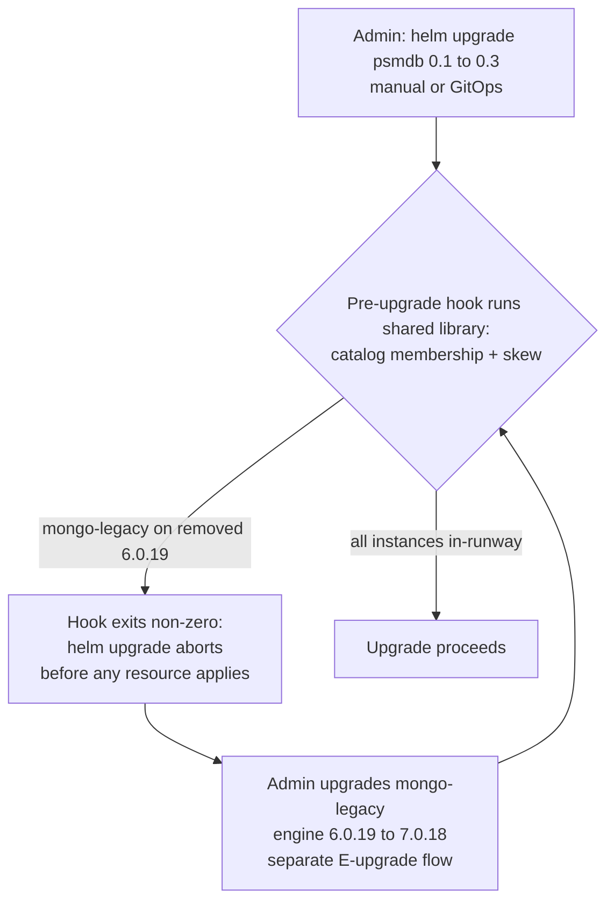
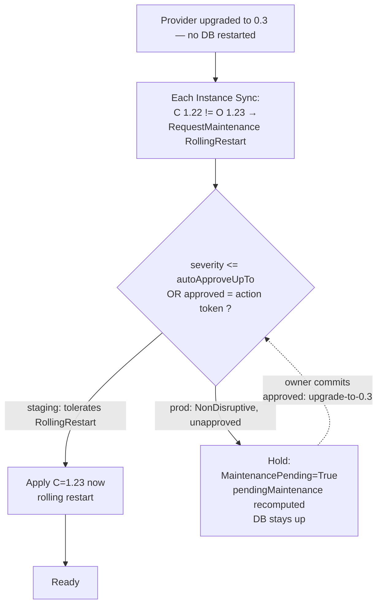

# Provider Upgrades: Safe, GitOps-Native Upgrade Guardrails

- **Status:** Draft
- **Authors:** @recharte
- **Created:** 2026-06-22
- **Last Updated:** 2026-06-22
- **Related Issues:** —

---

## 1. Summary

Upgrading a provider in OpenEverest is a single user action (`helm upgrade`)
that atomically swaps four things: the provider controller image, the bundled
database operator (a Helm subchart), the `Provider` CR (and thus its version
catalog), and the CRDs/RBAC. To the user a provider is one deployable unit —
they install it and upgrade it, nothing more — and we intend to keep that
simplicity.

The atomic swap creates four risks — two we must catch **before** the upgrade
applies (Part 1, §6), and two that arise **after** it lands (Part 2, §7):

- **R1 — Incompatibility.** The new operator no longer supports an engine version
  a running `Instance` uses.
- **R2 — Illegal operator jump.** The swap moves the bundled operator further than
  it allows in one step (many operators refuse to skip versions).
- **R3 — Surprise disruption.** Converging a cluster onto the new operator needs a
  disruptive action (a rolling restart or worse).
- **R4 — Stranded deferral.** A disruptive action held too long falls outside the
  operator's compatibility window, eventually leaving the cluster unmanageable.

This spec proposes a **layered** system rather than a single gate:

1. **Version skew makes most upgrades intrinsically safe.** Providers commit to
   supporting their engine versions across a deprecation runway, and the catalog
   carries `deprecated` / `removedInVersion` flags. An in-runway version is never
   stranded by an operator swap; R1 degrades from an abrupt wall to a warning
   with a runway, and only a *truly removed* version is hard-blocked.

2. **Compatibility enforcement happens at the only place it safely can: a
   Helm pre-upgrade hook.** A single preflight library answers *"would this
   upgrade strand a running Instance?"* and runs inside a Helm pre-upgrade hook
   that aborts the upgrade *before any resource is applied*. This is the sole
   enforcement surface: by design **no core component (API server or controller)
   triggers or performs a provider upgrade** — that would need cluster-admin and
   registry/internet access we deliberately keep out of core — so the upgrade is
   always the user's own external `helm upgrade` or GitOps change. No OLM, and no
   admission webhook (a webhook cannot guarantee it runs before the operator
   Deployment is swapped in the same release — see §6.3).

3. **Disruption is split and held, CNPG-style.** The *helm upgrade* itself is
   external and manual, but the *post-upgrade convergence* it implies is carried
   out by the provider controller's normal reconciliation of resources it already
   owns. When the new operator needs convergence work, the runtime auto-applies
   the non-disruptive part and holds the disruptive part behind a declarative,
   GitOps-native per-Instance approval (`spec.maintenance`). A provider upgrade
   therefore *never* automatically causes downtime, and the user needs zero
   understanding of operator internals to be safe, because the safe default holds
   everything that restarts.

No new top-level CRD is introduced. Approval is a committed change to
`Instance.spec`, governed solely by Instance edit permission. Generalizing this
into a multi-action maintenance framework (multiple action types, fleet policy,
a dedicated action CRD) is a possible **future direction** (see §12), not
designed here.

The four risks map to mechanisms and to the sections that design them as follows:

| Risk | What can go wrong | Primary mechanism | Designed in |
|------|-------------------|-------------------|-------------|
| **R1** | Target operator can no longer manage a running engine version | Version skew + deprecation runway; hard-block only when truly removed | §6.1 |
| **R2** | Provider jump skips the operator's allowed version range | Declarative `minUpgradableFrom` floor | §6.2 |
| **R3** | Convergence needs a disruptive restart | Split: auto-apply non-disruptive, hold disruptive behind `spec.maintenance` | §7.1 |
| **R4** | A deferred restart falls outside the operator's skew window | Bounded-deferral check feeds the next upgrade's preflight | §7.6 |

---

## 2. The version taxonomy (essential grounding)

Almost every confusion in this problem space comes from conflating three
different "versions." They have different owners, lifetimes, and disruption
profiles. Using PSMDB as the running example:

| Sym | Name | Defined in | Who moves it | User-visible? | DB impact when it moves |
|-----|------|------------|--------------|---------------|--------------------------|
| **P** | **Provider** version | Provider chart (`appVersion`, e.g. `0.1`) | Platform admin via `helm upgrade` | Yes — it *is* the thing being upgraded | None directly — it is the **trigger** |
| **O** | **Operator** version | Bundled operator subchart (e.g. PSMDB operator `1.22.0`) | Moves **with P** | No | Operator Deployment rollout — **control-plane only**, not the database |
| **E** | **Engine** version | The catalog; chosen per-Instance (`spec.version` / `spec.components[].version`) | The **user, deliberately** | Yes | Engine upgrade — a **separate, existing flow**, *not* governed by this spec |

One more thing matters but is deliberately **not** a universal axis: after the
operator moves, the provider may need a follow-up *disruptive* change to the
engine CR to fully **converge** it onto the new operator. This **convergence
step** is the only thing that restarts the database; its mechanism is
**operator-specific** and stays hidden from users. (PSMDB's, used throughout: the
provider sets a hidden `crVersion` on the engine CR, which the operator tolerates
lagging itself by a bounded amount.) The framework never models it directly.

Three relationships shape the design:

- **Convergence is deferrable but bounded (R3, R4).** The operator tolerates an
  un-converged CR only within a finite **skew window** (PSMDB: the last three
  minor versions), so the database keeps running after the swap and the
  convergence can be **held** until approved (§7). Defer it across too many
  upgrades and it falls outside the window — so the next upgrade forces it (§7.6).
- **The operator may forbid skipping versions (R2).** PSMDB upgrades one minor
  at a time, so a provider jump that moves O too far in one step is illegal (§6.2).
- **P is the trigger; E stays independent.** A provider upgrade moves P (and O)
  but must not silently move E — the platform freezes the resolved bundle in
  `Instance.status.version`, so changing the catalog's default never triggers a
  surprise engine upgrade.

> **Design rule:** the user-facing surface is expressed in terms of *observable
> database impact* ("brief restart"), never O or any operator-internal
> convergence mechanism (PSMDB's `crVersion` is just one example). The framework
> stays ignorant of all of them.

---

## 3. Motivation

In the legacy (v1) architecture OpenEverest used OLM, which *stages* a new
operator and requires explicit `InstallPlan` approval before it *applies* — a
natural pre-apply checkpoint. With the Provider/Instance architecture each
provider is installed via Helm, where `helm upgrade` **is** the apply: there is
no native checkpoint between "a new version exists" and "the new operator is
running," and no obvious place to ask "is this safe?" before the operator is
swapped.

Two constraints shape the design. First, the compatibility check must run
**before any resource is applied** (§6). Second, where a post-upgrade action
needs user approval, that approval must be a **declarative edit to
`Instance.spec`** — which a GitOps user makes as a git commit and a GUI/API user
makes through the normal Instance-edit flow — not an imperative `kubectl patch`
on a controller-generated side-channel object that GitOps tools neither own nor
reconcile (the OLM `InstallPlan` anti-pattern we explicitly reject, §7).

---

## 4. Goals & Non-Goals

**Goals:**

- Keep a provider one deployable/upgradable unit; hide the controller / operator
  / catalog axes.
- Block an upgrade that would strand a running Instance, but hard-block only a
  *truly removed* engine version — skew turns the rest into warnings — and
  surface those warnings proactively on Instance status.
- Never trigger or perform an upgrade from a core component; enforce safety from a
  Helm pre-upgrade hook on both the manual `helm upgrade` and GitOps paths.
- Never let a disruptive post-upgrade action run without explicit, declarative
  (GitOps-native, no special RBAC verb) approval; apply non-disruptive
  convergence automatically.
- Provide v1 escape hatches: backoff/circuit-breaker, clear-stuck, apply-now.

**Non-Goals:**

- The engine-version (E) upgrade workflow — an existing, separate flow. This spec
  only ensures a provider upgrade does not silently move E, and gates on E
  compatibility.
- A generic maintenance framework (multiple action types, fleet
  `MaintenancePolicy`, a dedicated action CRD). A possible future direction (§12).
- Fleet/blast-radius orchestration (canary, max-concurrent-disruption); v1 is
  per-Instance (§13).
- Replacing Helm, automatic rollback of a failed `helm upgrade`, or re-introducing
  OLM.
- Finalizing the **force-override** representation — the blocking gate is designed,
  the override's home is deferred (§6.4, §13).

---

## 5. Design principles

1. **One unit to users, several axes internally.** We do not split the chart or
   expose a catalog object (the CNPG `ImageCatalog` model); "one thing you install
   and upgrade" is a primary product benefit. The controller / operator / catalog
   axes stay hidden.

2. **Atomicity makes version skew mandatory.** The bundled operator is swapped
   with the provider, so the user cannot keep an old operator around to serve a
   stranded Instance. Supporting older engine versions across a deprecation runway
   is therefore the *only* guarantee that an upgrade strands nothing — and it
   shrinks the hard-block surface to the rare removed case (§6.1).

3. **R1 is a runway, not a wall.** A deprecated-but-present version warns with a
   remediation runway; only a removed version hard-blocks (§6.1).

4. **Disruption is split, not merely flagged.** Following CloudNativePG's
   supervised update, the runtime auto-applies the non-disruptive part of
   convergence and pauses before the disruptive part, which proceeds only on
   explicit authorization — "never surprise downtime" with no side-channel object
   (§7).

5. **Authorization names a meaningful token, not a counter.** The provider
   surfaces a self-documenting approval token per held action; the user echoes it
   into `spec.maintenance.approved` (e.g. `upgrade-to-0.3`). It identifies the
   *action occurrence*, not the provider version, so it is cause-agnostic and
   re-arms automatically (§7.5).

6. **Ephemeral notice, durable approval.** The pending list lives in `status` and
   is recomputed every reconcile (never stale); the approval is a single durable
   value in `spec` (git-trackable). This split avoids both Instance bloat and
   staleness.

7. **Core never executes upgrades.** No API-server or controller component
   triggers or runs an upgrade — that needs cluster-admin and registry/internet
   access we keep out of core. The controller only performs post-upgrade
   convergence on resources it already owns (§7); the only block on an unsafe
   upgrade is the Helm pre-upgrade hook (§6).

---

## 6. Part 1 — Before the upgrade: compatibility & upgrade-path checks

Before any of the release's resources are applied, two questions decide whether
the upgrade is safe:

- **Compatibility (R1):** does the target operator still support the engine
  version every running `Instance` uses?
- **Upgrade path (R2):** is the operator jump itself legal — or does it skip
  versions the operator refuses to skip?

Both are answered by one preflight library run inside the chart's Helm
pre-upgrade hook, which aborts the upgrade if either fails (§6.3). This part also
covers how a looming block is surfaced proactively (§6.5), how to override one
(§6.4), and the API/runtime that backs it all (§6.6).

### 6.1 The compatibility check: catalog membership (R1)

The "provider `0.1 → 0.3` drops mongod `6.0`" case reduces to one
provider-agnostic question:

> For each running `Instance`, is its **effective** engine version still present
> (and not `removedInVersion`-past) in the **target** provider's
> `spec.componentTypes[type].versions[]`?

The effective version is resolved exactly as the reconciler resolves it today —
per-component `spec.components[].version`, else the frozen bundle
(`spec.version` → `status.version` → target default). This needs **zero
provider-specific code** for the common case (the library is in §6.6).

**Version skew turns this from a wall into a runway.** Catalog entries carry two
optional flags (`deprecated` / `removedInVersion`, see §6.6). The provider
author's contract:

- When an engine version is going away, first mark it `deprecated: true` (still
  shipped, still supported by the bundled operator) and set `removedInVersion`
  to the provider version that will drop it. This is the **runway**.
- Keep the bundled operator able to manage every non-removed version (within its
  compatibility/skew window, plus image availability for the engine version).
- Only once a version is past its runway is it absent / `removedInVersion ≤
  target`, which the preflight reports as a blocking error.

So a `deprecated`-but-present version yields a **warning** with a remediation
runway ("upgrade this DB to a supported version before provider `X`"); only a
**removed** version is a hard block.

### 6.2 The upgrade-path floor (R2)

Catalog membership asks whether the *target* can manage a running engine version.
A second, orthogonal question is whether the *jump itself* is legal: many bundled
operators refuse to skip versions. PSMDB, for example, upgrades **one minor at a
time** (`1.22 → 1.23 → 1.24`); a direct `1.22 → 1.24` swap is unsupported and can
leave clusters unmanageable. Because a provider is one unit, a user who bumps the
chart from `0.1` straight to a release whose bundled operator is several minors
ahead would trigger exactly that illegal jump.

We protect against this **declaratively**, with no operator-specific code in the
framework. The provider publishes two values on the `Provider` CR (see §6.6):

- `spec.providerVersion` (**P**) — the provider version, populated from the chart
  `appVersion`.
- `spec.minUpgradableFrom` — the lowest provider version from which a one-step
  upgrade *to* this version is allowed. The author sets it so each permitted step
  moves the bundled operator within its own legal range.

The pre-upgrade hook reads the currently-installed `Provider` CR (current **P**)
and the target **P** + `minUpgradableFrom` carried by the new chart; it **blocks**
(non-zero exit, the upgrade aborts) when the current **P** is below the target's
`minUpgradableFrom`, naming the intermediate provider version(s) to step through.
Rules a version floor cannot capture go in the optional `UpgradeProvider.CheckUpgrade`
hook (§6.6).

### 6.3 Where the checks run: the Helm pre-upgrade hook

The checks are implemented once as a library (§6.6) and run, in v1, in exactly
one place — a **Helm pre-upgrade hook**: a Job, shipped by the chart and running
the new provider image, that runs the library against the target catalog (which
the image carries) and the live Instances *before any of the release's resources
are applied*. A blocking issue exits non-zero and aborts the whole upgrade.

In v1 every upgrade reaches the cluster through Helm — a manual `helm upgrade` or
a GitOps tool reconciling the chart from git — and both run the chart's
pre-upgrade hook, so one gate covers every path:

| Upgrade path | How it runs | Caught by |
|---|---|---|
| Manual `helm upgrade` | user runs Helm with their own credentials | **pre-upgrade hook** |
| GitOps (ArgoCD/Flux) | tool reconciles the Helm release from git | **pre-upgrade hook** (PreSync) |

Three properties make this robust:

- **A pre-upgrade hook is a true pre-apply gate; a webhook is not.** `helm
  upgrade` applies the operator Deployment, CRDs, and `Provider` CR together with
  no guaranteed ordering, so a `ValidatingWebhook` on `Provider` updates cannot
  be relied on to fire *before* the operator Deployment has already rolled. A
  pre-upgrade hook instead runs *before any resource in the release is applied*;
  a non-zero exit aborts the whole upgrade.
- **It needs no provider code, no standing component, and no internet.** It runs
  the new provider image (already pulled for the release; it carries the target
  catalog, **P**, and `minUpgradableFrom`), reads the installed `Provider` CR for
  the current **P**, and lists Instances — all in-cluster, with only ephemeral
  read-only RBAC shipped by the chart. Being a one-shot Job, it can't tear the
  gate down mid-upgrade.
- **The hard-block surface is tiny and a block is clean.** Skew means the hook
  only blocks the rare truly-removed case; the common upgrade passes and produces
  a pending action handled by Part 2 (§7). A block aborts before anything applies,
  so there is no partial release to clean up.

Trade-offs: the hook is the single enforcement surface, and Helm hooks behave
differently across GitOps tools (ArgoCD re-runs them every sync as `PreSync`;
Flux runs them unless `disableHooks`; a failed hook leaves the release `failed` —
recovery is a runbook item, §13). Raw `kubectl apply` of provider internals is
unsupported (a provider is one Helm unit) and is the one uncovered path. Earlier
passive warning comes from the status condition in §6.5.

### 6.4 Force-override (gate designed here, mechanism deferred)

Operators sometimes must proceed past a hard block knowingly (e.g. they will
upgrade the database immediately after). v1 designs the **blocking gate**; the
exact representation of the override is **deferred** (see §13, Open Question 1).
The two candidates on the table:

- a declarative `force` value in the chart's values (committed to git, visible
  in the PR diff; the hook reads it and skips the block), or
- a per-Instance acknowledgment annotation (user-owned, surgical, more tedious
  for a fleet).

Whichever is chosen, the override must be **committed/visible** (not a silent
flag) and **one-shot** (it authorizes this upgrade, not all future ones).

### 6.5 Proactive warning on Instance status (discovery without a GUI)

The pre-upgrade hook reports a problem only when an upgrade is *attempted*. With
no GUI or API preview in v1, a user would otherwise discover a blocking
incompatibility only by trying the upgrade and watching the hook abort it. To
give earlier, passive warning, the provider controller — which already reconciles
every Instance and reads the installed `Provider` catalog — sets a **read-only**
condition on an Instance whose effective engine version is flagged `deprecated`,
carrying the `removedInVersion` from the catalog:

```yaml
status:
  conditions:
    - type: EngineVersionDeprecated
      status: "True"
      reason: ScheduledForRemoval
      message: "mongod 6.0.19 is deprecated and is removed in provider 0.3; upgrade this database to a supported version before that provider upgrade."
```

This needs no new permissions and no internet, and never blocks or mutates
anything. It lets a database owner remediate on their own schedule, *before* an
admin attempts the provider upgrade the hook would otherwise block. The same
`deprecated` / `removedInVersion` flags (§6.1) drive both this condition and the
hook's verdict, so the two never disagree.

### 6.6 API & runtime support

**Catalog deprecation flags (`api/core/v1alpha1/provider_types.go`).** The R1
runway flags live on each catalog entry:

```go
type ComponentVersion struct {
    Version string `json:"version,omitempty"`
    Image   string `json:"image,omitempty"`
    Default bool   `json:"default,omitempty"`

    // Deprecated marks a version as still supported but scheduled for removal.
    // Running on it produces an UpgradeWarning with a remediation runway.
    // +optional
    Deprecated bool `json:"deprecated,omitempty"`

    // RemovedInVersion is the provider version (P) in which this engine version
    // is dropped. Upgrading a provider to >= this version while an Instance
    // still uses this version is an UpgradeError (blocking).
    // +optional
    RemovedInVersion string `json:"removedInVersion,omitempty"`
}
```

**Provider upgrade-path fields (R2).** The `Provider` CR also carries the
provider version and the one-step floor:

```go
type ProviderSpec struct {
    // ... existing fields ...

    // ProviderVersion is the provider version (P), from the chart appVersion
    // (e.g. "0.3"). Read by the pre-upgrade hook to validate upgrade paths.
    // Named distinctly from .versions[] (the engine bundle catalog).
    // +optional
    ProviderVersion string `json:"providerVersion,omitempty"`

    // MinUpgradableFrom is the lowest provider version from which a single-step
    // upgrade to this version is permitted; a lower installed version is blocked
    // and must step through intermediate releases (generalizes PSMDB's one-minor
    // rule). Empty means no floor.
    // +optional
    MinUpgradableFrom string `json:"minUpgradableFrom,omitempty"`
}
```

All of these originate in the provider's `definition/versions.yaml`, flow through
`provider-sdk generate` into the chart's generated `provider-spec.yaml`, and onto
the `Provider` CR — no hand-editing of generated files.

**The preflight library (`provider-runtime`).** The generic catalog-membership +
deprecation + upgrade-path check is implemented once:

```go
// provider-runtime/controller/preflight.go (new)

type UpgradeSeverity string

const (
    UpgradeError   UpgradeSeverity = "Error"
    UpgradeWarning UpgradeSeverity = "Warning"
)

type UpgradeIssue struct {
    Severity     UpgradeSeverity
    InstanceName string
    Namespace    string
    Component    string
    Reason       string // VersionRemoved | VersionDeprecated | ComponentUnsupported
    Message      string // human-readable; no operator internals
}

// PreflightUpgrade runs the generic catalog-membership + deprecation check.
func PreflightUpgrade(target *v1alpha1.ProviderSpec, instances []v1alpha1.Instance) []UpgradeIssue
```

**Optional `UpgradeProvider` interface.** For checks beyond generic catalog
membership — including the R4 skew-window check (§7.6) — a provider may implement:

```go
// interface.go — optional, alongside WatchProvider / FieldIndexProvider / BackupProvider
type UpgradeProvider interface {
    CheckUpgrade(c *Context, target *v1alpha1.ProviderSpec, instances []v1alpha1.Instance) []UpgradeIssue
}
```

`RunUpgradePreflight` always runs `PreflightUpgrade` and appends any
provider-specific issues. The common case needs no provider code at all.

---

## 7. Part 2 — After the upgrade: actions that need approval

This part handles the two post-upgrade risks: **surprise disruption (R3)**, and
**stranded deferral (R4, §7.6)** when a disruptive action is held too long.

The *helm upgrade* itself is external and manual; what happens *after* it is the
provider controller's normal reconciliation of resources it already owns. When
the new operator needs convergence work on an Instance, that work is **split**:
the non-disruptive part applies automatically, and the disruptive part is **held**
until the database owner approves it declaratively. A provider upgrade therefore
never automatically causes downtime, and the safe default holds everything that
restarts. The control surface and the runtime that backs it are in §7.8.

### 7.1 Split, auto-apply, hold (the CNPG model)

When the new operator requires convergence work on an Instance, the provider
classifies each unit of work by its **observable database impact** and declares
it through one runtime helper. The runtime auto-applies anything within the
Instance's standing tolerance and **holds** anything above it:

```go
// token       → an occurrence-unique, human-readable approval token chosen by
//               the provider (e.g. "upgrade-to-0.3", "rotate-certs-2026H2").
//               It is BOTH the action's stable identity while pending AND the
//               value the user echoes into spec.maintenance.approved.
// approved == true  → the provider may perform the action now.
// approved == false → the runtime records a pending action and the provider
//                     MUST NOT perform it this reconcile.
approved := c.RequestMaintenance(token, description string, severity MaintenanceSeverity)
```

The `token` carries the whole cause-agnostic contract: it must be **unique per
occurrence** and **stable while the action is pending**. The framework treats it
as an opaque string — it never parses a provider version out of it (see §7.5).

Two invariants (mirroring the existing `DataSourceStatus` staging pattern in
`provider-runtime/controller/common.go`):

- **The pending list is ephemeral** — recomputed every reconcile from what the
  provider currently requests, so it can never go stale.
- **The approval is durable** — a single declarative value in `spec`, git-trackable.

### 7.2 The disruption scale (observable impact, ordered)

Anchored on what the *application* observes, not the internal mechanism:

| Level | What the app sees | Example | Auto-applies if `autoApproveUpTo` ≥ this |
|---|---|---|---|
| **NonDisruptive** | Nothing — no restart, no dropped connections | Hot-reloaded config; in-place manager swap | default |
| **RollingRestart** | Connections blip and reconnect; **HA preserved, no outage** | PSMDB `crVersion` bump on a replica set, one node at a time | opt-in |
| **Downtime** | Service unavailable for a window; writes pause | Single-node restart; primary failover with write-pause; major in-place transform | explicit approval |

Rationale: the bright line every DB owner cares about is *"does my app
experience an outage?"* `Failover` is deliberately **not** a level — it is a
mechanism whose observable impact is either `RollingRestart` or `Downtime`;
exposing it would force users to reason about internals. The scale is
**extensible**: a finer level can be inserted below `Downtime` later without
breaking stored values. The provider classifies *its own* action onto this scale;
the framework never knows what produced it.

### 7.3 The Instance control surface

```yaml
apiVersion: core.openeverest.io/v1alpha1
kind: Instance
metadata:
  name: mongo-1
spec:
  # ... existing fields ...
  maintenance:
    # Standing tolerance: anything at or below this auto-applies during a
    # provider upgrade. Default NonDisruptive ⇒ any restart-or-worse is HELD.
    autoApproveUpTo: NonDisruptive          # NonDisruptive | RollingRestart | Downtime
    # One-time authorization for actions ABOVE the tolerance. Holds the exact
    # approval token the provider surfaced for the held action — self-documenting,
    # cause-agnostic, and re-arms automatically (a new occurrence = a new token).
    approved: ""                            # e.g. "upgrade-to-0.3"
status:
  phase: Ready                              # stays Ready — no downtime yet
  conditions:
    - type: MaintenancePending              # True while a disruptive action awaits approval
      status: "True"
      reason: AwaitingApproval
      message: "1 action requires approval to proceed"
  pendingMaintenance:                       # recomputed every reconcile — never stale
    - description: "Apply new engine configuration (causes a brief rolling restart)"
      severity: RollingRestart
      approvalToken: "upgrade-to-0.3"       # exactly what to copy into spec.maintenance.approved
```

- `autoApproveUpTo` handles the **routine** (set once; hands-off up to a tolerated
  blast radius). It is cause-agnostic — any action at or below the tolerance
  auto-applies, whether raised by a provider upgrade or by anything else.
- `approved` handles the **exceptional** (a one-time authorization that names the
  exact `approvalToken` of the held action; `upgrade-to-0.3` authorizes the action
  raised to converge to `0.3` and matches *nothing else*, so it re-arms naturally
  for the next occurrence — Crossplane-style manual promotion).

### 7.4 Safe with zero user understanding

The default (`autoApproveUpTo: NonDisruptive`, `approved: ""`)
means **every restart-or-worse action is held and surfaced**, never silent. A DB
owner who has never read a word about providers, operators, or convergence
internals still cannot be surprised by downtime — the worst case is a database
that stays up and healthy while a `MaintenancePending` condition waits for someone
to approve. Understanding the policy is required only to opt into hands-off
behavior, never to be safe.

### 7.5 Cause-agnostic by construction (beyond upgrades)

Nothing here is specific to upgrades. The framework only compares `severity`
against `autoApproveUpTo` and `token` against `spec.maintenance.approved`, so the
**same machinery governs any disruptive action** — e.g. a TLS-certificate rotation
that needs a brief rolling restart while the provider stays at `0.3`. That action
calls `RequestMaintenance("rotate-certs-2026H2", ..., RollingRestart)` and is held
with `approvalToken: "rotate-certs-2026H2"`.

This is exactly why the token names the *action occurrence*, **not** the provider
version. A stale `approved: "upgrade-to-0.3"` from an earlier upgrade does not
equal `"rotate-certs-2026H2"`, so the rotation stays held — whereas a bare version
`approved: "0.3"` would have **silently** authorized this unrelated later action,
the surprise-disruption the design forbids. The provider's only contract is that
the token is **unique per occurrence** and **stable while pending**
(`upgrade-to-<version>` for convergence, a period suffix like `rotate-certs-2026H2`
for time-bounded actions); the framework never interprets it.

### 7.6 Bounded deferral (R4)

Holding a disruptive action keeps a database up, but the hold is **not
unlimited**: an operator tolerates an un-converged engine CR only within a finite
skew window (§2), so a convergence step deferred while `O` keeps advancing
eventually falls outside the window and the cluster becomes unmanageable. The hold
is safe for the *current* operator but accumulates risk for *future* provider
upgrades.

The framework converts that latent risk into an explicit, non-disruptive gate
instead of a surprise outage. An Instance with a deferred convergence is fed into
the **next** upgrade's preflight: if moving `O` would push the Instance's
un-converged engine CR outside the target operator's window, the provider's
`CheckUpgrade` (§6.6) returns an `UpgradeError` — the same blocking path as R1 —
with the remediation "approve the pending restart on this database before
upgrading the provider further." Only the provider knows its operator's window, so
this check lives in the provider hook, not the generic library.

The result is a pressure valve with no surprise downtime: a user may defer a
rolling restart indefinitely on a *given* operator, but cannot keep deferring it
*across* upgrades — it is the **version-based** form of the time-based
"forced-after-deadline" question (§13): the deadline is not a date but the next
upgrade that would exceed the skew window.

### 7.7 Failure handling and escape hatches (v1)

- **Backoff / circuit-breaker.** If an approved disruptive action fails, the
  runtime retries with exponential backoff and trips a breaker after a threshold
  so a crash-looping provider cannot repeatedly disrupt a database. The breaker
  state is surfaced on the `MaintenancePending` condition.
- **Clear / reset a stuck action.** An operator can clear a wedged pending action
  (e.g. by removing the approval and/or an explicit reset signal) so a bad action
  does not pin an Instance forever. (Exact signal shape tracked in §13.)
- **Emergency apply-now.** Setting `approved` to the held action's token applies
  it on the next reconcile — there is no mandatory window in v1, so approval *is*
  apply-now. (Maintenance windows are a future concern.)

Out of scope for v1: automatic rollback of a failed action (the provider owns
idempotency and retry-or-reraise), change-freeze windows, and forced-after-
deadline execution for CVEs (noted as a future product question in §13).

### 7.8 API & runtime support

**Instance spec/status (`api/core/v1alpha1/instance_types.go`).** The control
surface from §7.3, fully typed:

```go
type InstanceSpec struct {
    // ... existing fields ...

    // Maintenance governs how disruptive actions raised against this Instance
    // (e.g. by a provider upgrade) are authorized. It does NOT govern the
    // deliberate engine-version (E) upgrade flow.
    // +optional
    Maintenance *MaintenanceSpec `json:"maintenance,omitempty"`
}

// +kubebuilder:validation:Enum=NonDisruptive;RollingRestart;Downtime
type MaintenanceSeverity string

const (
    MaintenanceNonDisruptive  MaintenanceSeverity = "NonDisruptive"
    MaintenanceRollingRestart MaintenanceSeverity = "RollingRestart"
    MaintenanceDowntime       MaintenanceSeverity = "Downtime"
)

type MaintenanceSpec struct {
    // AutoApproveUpTo is the standing disruption tolerance. Any action at or
    // below this impact auto-applies; anything above it is held. Cause-agnostic.
    // +kubebuilder:default=NonDisruptive
    // +optional
    AutoApproveUpTo MaintenanceSeverity `json:"autoApproveUpTo,omitempty"`

    // Approved is a one-time authorization for an above-tolerance action: it holds
    // the exact ApprovalToken from status.pendingMaintenance. Matched literally,
    // so it authorizes that one occurrence and re-arms when a new (differently-
    // tokened) action is raised. NOT a provider version (see §7.5).
    // +optional
    Approved string `json:"approved,omitempty"`
}

type InstanceStatus struct {
    // ... existing fields ...

    // PendingMaintenance is recomputed every reconcile from the actions the
    // provider currently requests above the Instance's tolerance. Never stale.
    // +optional
    PendingMaintenance []PendingMaintenanceAction `json:"pendingMaintenance,omitempty"`
}

type PendingMaintenanceAction struct {
    Description string              `json:"description"`
    Severity   MaintenanceSeverity `json:"severity"`
    // ApprovalToken is the occurrence-unique, human-readable token the provider
    // assigned to this held action. The user copies it verbatim into
    // spec.maintenance.approved to authorize this specific action.
    ApprovalToken string `json:"approvalToken,omitempty"`
}
```

Two new conditions are added alongside the existing `BackupConfigured` /
`DataSourceReady`: `MaintenancePending` (this part) and the read-only,
informational `EngineVersionDeprecated` (§6.5).

> **Naming note.** The field is `spec.maintenance`, not `spec.upgradePolicy`,
> on purpose: it governs disruptive actions *raised against the database*
> (cause-agnostic), and must not be confused with the deliberate engine-version
> upgrade the user performs via `spec.version`. Engine upgrades stay exactly
> where they are and are untouched by this field. For the same reason the
> authorization field is the cause-neutral `approved` (a token), **not**
> `approvedProviderVersion`: a held action may originate from something other than
> a provider upgrade (see §7.5), so the token must not be tied to a version.

**`Context.RequestMaintenance` (`provider-runtime`).** Mirrors the
`DataSourceStatus` staging pattern: actions are staged on the `Context` during
`Sync` and flushed by the reconciler afterward.

```go
// common.go
type stagedMaintenance struct {
    token       string // occurrence-unique approval token (e.g. "upgrade-to-0.3")
    description string
    severity    MaintenanceSeverity
}

func (c *Context) RequestMaintenance(token, description string, severity MaintenanceSeverity) bool {
    c.maintenance = append(c.maintenance, stagedMaintenance{token, description, severity})
    return c.maintenanceApproved(token, severity)
    // maintenanceApproved reports true iff:
    //   severity <= spec.maintenance.autoApproveUpTo   (standing tolerance), OR
    //   token    == spec.maintenance.approved          (one-time, exact match)
}
```

**Reconciler flush.** In `reconciler/provider.go`, immediately after the existing
`GetDataSourceStatus` flush and before/around the `Status` computation: collect
staged actions whose severity exceeds the Instance's effective approval, write
them to `status.pendingMaintenance`, and set the `MaintenancePending` condition
(`True` when any remain, `False` otherwise) via the existing `setCondition`
helper. Because the list is rebuilt from scratch each pass, an action that the
provider stops requesting simply disappears.

**Interaction with the frozen bundle.** The reconciler already freezes
`status.version` so a provider upgrade never silently moves `E`.
`RequestMaintenance` is the analogous guarantee for the provider's **convergence
step**: the provider determines inside `Sync` that the engine CR needs a
disruptive change to match the new operator, calls
`RequestMaintenance("upgrade-to-0.3", "...brief rolling restart", RollingRestart)`
(the token names the convergence occurrence), and only actually writes that change
into the engine CR when the call returns `true`. For PSMDB the change is bumping
the hidden `crVersion`; such operator internals never leave the provider.

---

## 8. Tooling

v1 ships **only** the Helm pre-upgrade hook (§6.3), exposing the preflight logic
as a reusable library. There is deliberately no API-server endpoint, GUI, or CLI
upgrade command in core — none may carry the cluster-admin or registry/internet
access an upgrade needs. Approving a held action is **purely declarative**: the
user edits `spec.maintenance.approved` — a git commit for GitOps users, a UI/API
edit for everyone else — the normal RBAC-governed Instance-edit flow; no CLI
helper is provided.

Deferred until they can be built without privileged, internet-capable code in
core: a user-run `everestctl` dry-run and a privileged hub plugin that previews
and orchestrates fleet upgrades. Both would reuse the same library so their
verdicts match the hook's.

---

## 9. End-to-end example: upgrading the PSMDB provider `0.1 → 0.3`

This walks the whole system using three MongoDB Instances in different states,
showing skew, the pre-upgrade hook gate, the auto/hold split, meaningful-token
approval, and a hard block.

### 9.1 Starting state

Provider `psmdb` at **P = 0.1**, bundling operator **O = 1.22.0**. Three
Instances in namespace `db`:

| Instance | Engine (E) | `spec.maintenance.autoApproveUpTo` | Notes |
|---|---|---|---|
| `mongo-prod` | `8.0.12` | `NonDisruptive` (default) | Production; owner wants to approve restarts explicitly |
| `mongo-staging` | `8.0.12` | `RollingRestart` | Non-prod; tolerates rolling restarts hands-off |
| `mongo-legacy` | `6.0.19` | `NonDisruptive` | Old engine, about to be unsupported |

The target chart **P = 0.3** bundles operator **O = 1.23.0** — one minor ahead of
`1.22.0`, so the operator upgrade path is legal (R2, §6.2) — and ships this
catalog (note the skew flags):

```yaml
# provider-spec.yaml @ P=0.3 (excerpt)
componentTypes:
  mongod:
    versions:
      - { version: "6.0.19-16", image: ..., deprecated: true, removedInVersion: "0.3" }
      - { version: "7.0.18-11", image: ... }
      - { version: "8.0.8-3",   image: ... }
      - { version: "8.0.12-4",  image: ..., default: true }
```

`6.0.19` is **removed in `0.3`**; `7.0+` and `8.0+` remain.

### 9.2 Preflight (the hook, before anything applies)

The admin initiates the upgrade — a manual `helm upgrade`, or by updating the
Helm release in git for a GitOps tool to reconcile. Before any of the release's
resources are applied, the chart's **pre-upgrade hook** runs the shared library
and reports:

```text
Provider psmdb: 0.1 → 0.3   (operator 1.22.0 → 1.23.0)

✅ operator path  1.22.0 → 1.23.0 is a legal single-minor step.
⛔ mongo-legacy   mongod 6.0.19 is removed in provider 0.3.
                 Upgrade this database to ≥ 7.0 before upgrading the provider.
✅ mongo-prod     mongod 8.0.12 supported. 1 disruptive action will be pending after upgrade.
✅ mongo-staging  mongod 8.0.12 supported. Converges automatically (tolerates RollingRestart).

Result: BLOCKED (1 error). No changes applied.
```

The hook exits **non-zero**, so `helm upgrade` (or the GitOps sync) **aborts
before any resource is applied** — no operator swap, no catalog change. Critically,
`mongo-legacy`'s owner did not need to wait for this: the `EngineVersionDeprecated`
condition (§6.5) had already been flagging `6.0.19` on that Instance.



### 9.3 Remediate the blocker

The admin upgrades `mongo-legacy`'s **engine** from `6.0.19 → 7.0.18` using the
existing, separate engine-upgrade flow (`spec.version`/`spec.components[].version`).
That is a deliberate database change the owner controls — *not* something
`spec.maintenance` governs. Preflight now returns **no errors**.

### 9.4 Apply the provider upgrade

`helm upgrade` swaps controller (P), bundled operator (O `1.22 → 1.23`), Provider
CR (catalog), and CRDs/RBAC atomically. (PSMDB tracks each cluster's compatibility
version in a hidden `crVersion` field on the engine CR, abbreviated **C** in this
walkthrough; it is a PSMDB-specific detail, not a concept other providers need.)
Critically:

- The operator Deployment rolls — **control-plane only**. Thanks to the **skew
  window**, every engine CR still carrying `C = 1.22` keeps being managed by
  operator `1.23` (`1.22` is inside `1.23`'s window). **No database is restarted
  by the swap itself.**
- `status.version` on each Instance is unchanged, so **no engine (E) upgrade is
  triggered**.

### 9.5 Convergence: the auto/hold split

On the next reconcile each provider `Sync` notices `C (1.22) ≠ O (1.23)` and calls:

```go
approved := c.RequestMaintenance(
    "upgrade-to-0.3",  // occurrence-unique token; not the hidden crVersion
    "Apply new engine configuration (causes a brief rolling restart)",
    controller.MaintenanceRollingRestart,
)
if approved {
    // set crVersion = 1.23 on the PSMDB CR  → operator does a rolling restart
}
```

Outcomes diverge purely by each Instance's standing tolerance:

| Instance | `autoApproveUpTo` | `RequestMaintenance` returns | Result |
|---|---|---|---|
| `mongo-staging` | `RollingRestart` | `true` | `C` bumped now; one-node-at-a-time rolling restart; converges to `Ready` |
| `mongo-prod` | `NonDisruptive` | `false` | Action **held**; `MaintenancePending=True`; DB stays up at `C=1.22` |

`mongo-prod.status`:

```yaml
status:
  phase: Ready
  conditions:
    - type: MaintenancePending
      status: "True"
      reason: AwaitingApproval
  pendingMaintenance:
    - description: "Apply new engine configuration (causes a brief rolling restart)"
      severity: RollingRestart
      approvalToken: "upgrade-to-0.3"
```

The owner never sees "crVersion 1.22→1.23" — only a human description.

### 9.6 Approval (a declarative spec edit)

When ready, the `mongo-prod` owner authorizes by copying the held action's token
into `approved` — a one-line, reviewable change to `Instance.spec` (a git commit
for a GitOps user, a UI edit for a GUI user):

```yaml
spec:
  maintenance:
    autoApproveUpTo: NonDisruptive
    approved: "upgrade-to-0.3"          # ← copied from status.pendingMaintenance[].approvalToken
```

On the next reconcile `RequestMaintenance("upgrade-to-0.3", ..., RollingRestart)`
now returns `true` (because `approved` matches the action's token), the provider
bumps `C`, the rolling restart runs during a moment the owner chose, and
`MaintenancePending` clears.



### 9.7 Recurrence

Later, provider `0.3 → 0.5` (operator `1.23 → 1.24`) raises a *fresh* convergence
action tokened `upgrade-to-0.5`. The stale `approved: "upgrade-to-0.3"` does
**not** match it — the token re-arms automatically — so `mongo-prod` is held again
until its owner sets `approved: "upgrade-to-0.5"`. `mongo-staging`, still
`RollingRestart`-tolerant, converges hands-off as before.

---

## 10. Phased rollout

- **Phase 0 — Foundations.** `provider-runtime` `PreflightUpgrade` + `UpgradeIssue`
  + optional `UpgradeProvider`; catalog `deprecated`/`removedInVersion` fields and
  generator support; `status.pendingMaintenance` + `MaintenancePending` condition.
- **Phase 1 — Compatibility guardrail.** Shared preflight library packaged into
  the Helm pre-upgrade hook that runs it against live Instances and aborts before
  apply (the sole enforcement surface). Generic membership check plus the
  declarative operator upgrade-path floor (`minUpgradableFrom`, R2), and the
  read-only `EngineVersionDeprecated` Instance condition (§6.5) — no provider code
  required.
- **Phase 2 — Disruption control.** `spec.maintenance` + `Context.RequestMaintenance`
  + reconciler flush; PSMDB `crVersion` restart modeled abstractly via
  `RequestMaintenance`; backoff/circuit-breaker + clear-stuck + apply-now.
- **Phase 3 — Provider hooks & escape hatches.** `UpgradeProvider.CheckUpgrade`
  adoption, including the bounded-deferral / skew-window check (R4); finalize the
  force-override representation.
- **Phase 4 — (future, out of scope).** User-run preview surfaces that reuse the
  preflight library with the caller's own credentials (an `everestctl` dry-run, a
  privileged hub plugin); and a generic maintenance framework: multiple action
  types, fleet `MaintenancePolicy`, windows, and (if justified) a first-class
  action CRD for listing/audit. See §8 and §12.

---

## 11. Definition of Done

- A provider upgrade that would strand a running Instance on a **removed** engine
  version is blocked by the Helm pre-upgrade hook (non-zero exit, before any
  resource is applied) on both the manual and GitOps paths — with no core
  component involved in the upgrade.
- An upgrade that **skips the operator's allowed range** is blocked by the
  declarative `minUpgradableFrom` floor (R2); a **deferred restart that would
  fall outside the skew window** blocks the *next* upgrade with a remediation
  instead of causing downtime (R4).
- A **deprecated-but-present** version yields a warning with a runway, not a
  block, and is surfaced on a running Instance via the read-only
  `EngineVersionDeprecated` condition before any upgrade is attempted.
- After a successful upgrade, non-disruptive convergence applies automatically;
  disruptive actions stay held (`MaintenancePending=True`, phase `Ready`, no
  downtime) until the owner sets `approved` to the held action's token.
- The safe default (`autoApproveUpTo: NonDisruptive`) needs **zero** user
  understanding of operator internals to avoid surprise downtime, and no internal
  detail (e.g. `crVersion`) appears in any user-facing surface.
- Backoff/circuit-breaker prevents a crash-looping provider from repeatedly
  disrupting; a stuck action can be cleared.
- Unit tests (testify) for `PreflightUpgrade` and `RequestMaintenance` gating
  (tolerance, token match, re-arm, non-upgrade action); kuttl tests for
  block→remediate-E→succeed and hold→approve→converge. The §9 PSMDB example is
  reproducible end to end.

---

## 12. Future direction: a generic maintenance framework

The disruption-control mechanism in §7 is deliberately scoped to provider
upgrades, but nothing about it is upgrade-specific (see §7.5). A natural future
generalization is a provider-agnostic maintenance framework — many action types
(cert rotation, storage resize, config migration), maintenance windows, fleet
pre-authorization, and possibly a first-class action object for cross-Instance
listing/audit. That is intentionally **out of scope** here; the `spec.maintenance`
surface defined in this spec is designed so such a generalization would be
**additive** rather than a rewrite.

---

## 13. Open Questions

1. **Force-override home.** A `force` value in the chart's values that the hook
   reads (fleet-friendly, visible in the PR diff) vs a per-Instance acknowledgment
   annotation (user-owned, surgical). The blocking gate is designed; the override
   is deferred to Phase 3.
2. **Clear-stuck signal shape.** Is clearing `approved` (or pointing it at a
   different token) enough, or do we need an explicit `spec.maintenance.reset` /
   annotation to abandon a wedged action?
3. **Catalog richness.** `minUpgradableFrom` (R2) and `deprecated` /
   `removedInVersion` are now in the design. Do we also want per-version support
   notes, or a per-engine-version `minProviderVersion`, for richer messaging?
4. **Helm hook behavior across GitOps tools.** Hooks differ per tool (ArgoCD
   `PreSync` re-runs every sync; Flux runs them unless `disableHooks`; a failed
   hook leaves the release `failed`). How do we document `failed`-release
   recovery, and is the single hook sufficient until the future user-run surfaces
   (§8) exist? Raw `kubectl apply` of provider internals is the one uncovered path
   — acceptable given a provider is one Helm unit?
5. **Fleet safety (future).** A provider upgrade is a fleet event. v1 is
   per-Instance; when do we add canary / max-concurrent-disruption / rollout
   delays so the first failed convergence halts the rest?
6. **Forced-after-deadline (future).** R4 already gives a *version-based*
   deadline (the next upgrade that would exceed the skew window). A *time-based*
   one (RDS-style forced security updates) stays open for critical CVEs — is
   "never force on a timer" the right default?
7. **Token-uniqueness enforcement.** Occurrence-uniqueness of an approval token
   is a provider contract (§7.5), consistent with providers already owning
   severity classification and idempotency. Do we leave it as a documented
   contract, or have the runtime defensively disambiguate a reused token (e.g. by
   appending an internal generation when a previously-cleared token reappears)?

---

## 14. References

- `provider-percona-server-mongodb/` — the bundled-operator reference
  (Chart.yaml subchart dependency on `psmdb-operator`; `definition/versions.yaml`
  → generated `provider-spec.yaml`).
- `provider-runtime/controller/common.go` — `DataSourceStatus` staging pattern
  that `RequestMaintenance` mirrors.
- `provider-runtime/reconciler/provider.go` — reconciler flow and `status.version`
  freeze that prevents silent engine upgrades.
- CloudNativePG `primaryUpdateStrategy: supervised` + replicas-first/primary-last
  rolling update — the split/hold model adopted in §7.
- Crossplane `compositionUpdatePolicy: Manual` + named revision — meaningful-token
  manual promotion (§5 item 5, §7.3).
- Cluster API blocking lifecycle hooks + `retryAfterSeconds` — bounded blocking
  prior art (§7.7).
- AWS RDS `PendingMaintenanceAction` + window + `ForcedApplyDate` — apply-now vs
  deferred, and the forced-deadline question (§13).
- OLM `InstallPlan` approval — the side-channel pattern deliberately avoided.
  reasoning).

