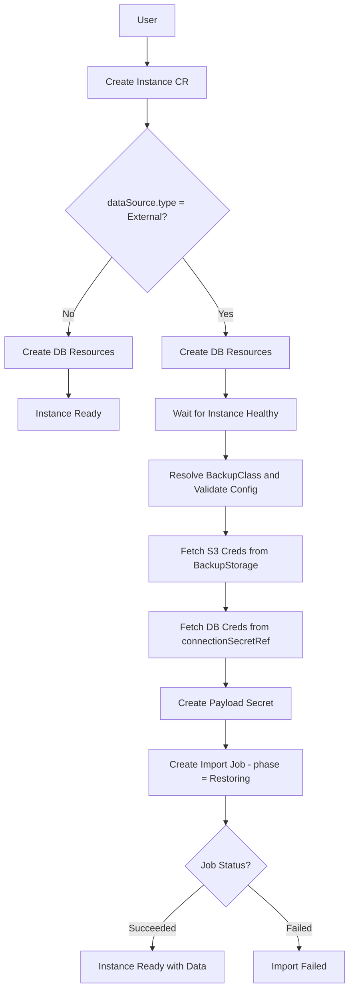

# Database Import via Instance Initialization

*   **Status:** Draft
*   **Authors:** @chilagrow
*   **Created:** 2026-06-26
*   **Last Updated:** 2026-06-30
*   **Related Issues:** https://github.com/openeverest/openeverest/issues/2471

---

## 1. Summary

Enable data import functionality in OpenEverest v2 by extending the Instance CR to support initial data population from external sources. Instead of creating separate DataImporter/DataImportJob CRs (as in v1), treat data imports as instance initialization operations — allowing users to create a new database Instance with pre-populated data by specifying an external data source during Instance creation.

## 2. Motivation

### Current State (v1 openeverest-operator)

The v1 operator implements data import through dedicated CRs:
- **DataImporter** (cluster-scoped): Defines an import method (image, command, config schema, RBAC)
- **DataImportJob** (namespaced): Represents an active import operation with inline S3 source details

This creates:
- **Duplicate infrastructure**: Job execution, RBAC management, payload contracts, and status tracking are reimplemented separately from backup/restore
- **API surface bloat**: Additional RBAC resources (`data-importers`, `data-import-jobs`) and distinct lifecycle management
- **Inconsistent UX**: Different concepts for "restore from backup" vs "import from external source" despite similar underlying operations

### Why Change?

A data import is conceptually an **instance initialization operation** where a new instance is created and populated with data from an external source. This is fundamentally different from a restore operation, which applies data to an existing instance. The v2 BackupClass architecture with `ExecutionMode=Job` already provides:
- Job execution with custom images/commands
- RBAC permission management
- Payload secret creation and mounting
- Status observation and lifecycle management
- OpenAPI schema validation for configuration

By extending the Instance CR to support initial data sources, we can reuse this infrastructure while maintaining the correct semantic: **creating a new instance with initial data**.

## 3. Goals & Non-Goals

**Goals:**
- Enable data import operations during Instance creation
- Support multiple import methods per provider (e.g., mongorestore, mongoimport, pg_restore, psql)
- Reuse BackupStorage CRs for S3 credentials and endpoint configuration
- Reuse BackupClass CR infrastructure for import job execution
- Eliminate the need for separate DataImporter/DataImportJob CRs

**Non-Goals:**
- Replacing existing ProviderManaged backup/restore functionality
- Supporting non-S3 storage types in the initial implementation (future: Azure, GCS)
- Automatic schema detection or data transformation during import
- Bi-directional sync or continuous data replication

## 4. Proposed Solution / Design

### 4.1 Architecture Overview



### 4.2 API Changes

#### 4.2.1 Extend DataSource with External Type and Use in Instance CR

**File:** `api/core/v1alpha1/instance_types.go`

The existing `InstanceSpec.DataSource` field references `backupv1alpha1.DataSource` which only supports `Backup` type. Instead, define all new types locally and change `InstanceSpec.DataSource` to use a new `InstanceDataSource` type:

```go
// InstanceDataSourceType identifies the kind of data source for instance seeding.
// +kubebuilder:validation:Enum=Backup;External
type InstanceDataSourceType string

const (
    InstanceDataSourceTypeBackup   InstanceDataSourceType = "Backup"
    InstanceDataSourceTypeExternal InstanceDataSourceType = "External"  // NEW
)

// InstanceDataSourceExternal references an external storage location for import.
type InstanceDataSourceExternal struct {
    // BackupClassName references the BackupClass that defines the import method
    BackupClassName string `json:"backupClassName"`

    // StorageName references a BackupStorage CR in the same namespace
    // that contains S3 credentials and endpoint configuration.
    StorageName string `json:"storageName"`

    // Path is the absolute file or directory path within the bucket.
    Path string `json:"path"`

    // Config contains import-specific configuration validated against
    // BackupClass.spec.importConfig.openAPIV3Schema
    Config *runtime.RawExtension `json:"config,omitempty"`
}

// InstanceDataSource defines the source for seeding a new Instance.
// Replaces the previous backupv1alpha1.DataSource reference on InstanceSpec.
type InstanceDataSource struct {
    Type     InstanceDataSourceType        `json:"type"`
    Backup   *InstanceDataSourceBackup     `json:"backup,omitempty"`
    External *InstanceDataSourceExternal   `json:"external,omitempty"`  // NEW
}
```

> **Note:** `InstanceDataSourceBackup` mirrors the existing `DataSourceBackup` from the backup package but is defined locally to keep all instance seeding types self-contained in `instance_types.go`.

The `InstanceSpec.DataSource` field type changes from `*backupv1alpha1.DataSource` to `*InstanceDataSource`:

```go
type InstanceSpec struct {
    // ... existing fields ...

    // DataSource specifies a data source to seed the Instance from on creation.
    // If set, the instance will be created and then populated with data before
    // being marked as Ready. Immutable once set.
    // +optional
    DataSource *InstanceDataSource `json:"dataSource,omitempty"`
}
```

**Status tracking** (also in `api/core/v1alpha1/instance_types.go`):

The existing `ConditionDataSourceReady` condition is reused for the import path. New reasons are added alongside the existing ones:

```go
const (
    // Existing reasons (unchanged) ...

    // ReasonDataSourceImporting indicates the import Job has been created and
    // is currently running. Used when dataSource.type=External.
    ReasonDataSourceImporting = "Importing"

    // ReasonDataSourceImportFailed indicates the import Job failed terminally.
    // Used when dataSource.type=External.
    ReasonDataSourceImportFailed = "ImportFailed"
)
```

One new field is added to `InstanceStatus` to record the import Job name for observability (not covered by conditions):

```go
type InstanceStatus struct {
    // ... existing fields (Phase, Version, ConnectionSecretRef, Components, Message, Conditions) ...

    // ImportJobName is the name of the Kubernetes Job created for the
    // External dataSource import. Set once the Job is created and cleared
    // when the import completes or fails. Observers can use this to fetch
    // Job logs directly.
    // +optional
    ImportJobName string `json:"importJobName,omitempty"`
}
```

Progress and failure messages are reported via the standard `Conditions` field using `ConditionDataSourceReady` with the appropriate reason and `Message` field. The `InstancePhase` is set to `InstancePhaseRestoring` while the import Job is running, consistent with how Backup-based seeding is reported.

#### 4.2.2 Extend BackupClass for Import Operations

**File:** `api/backup/v1alpha1/backupclass_types.go`

Add import-specific fields (this part remains the same):

```go
type BackupClassSpec struct {
    DisplayName         string                         `json:"displayName,omitempty"`
    Description         string                         `json:"description,omitempty"`
    SupportedProviders  ProviderNameList               `json:"supportedProviders,omitempty"`
    ExecutionMode       BackupExecutionMode            `json:"executionMode"`
    ProviderManaged     *ProviderManagedSpec           `json:"providerManaged,omitempty"`
    Config              BackupClassConfig              `json:"config,omitempty"`
    RestoreConfig       BackupClassConfig              `json:"restoreConfig,omitempty"`
    ImportConfig        BackupClassConfig              `json:"importConfig,omitempty"`  // NEW
    InstanceConstraints BackupClassInstanceConstraints `json:"instanceConstraints,omitempty"`
    UISchema            *runtime.RawExtension          `json:"uiSchema,omitempty"`
    Job                 *JobExecution                  `json:"job,omitempty"`
    RestoreJob          *JobExecution                  `json:"restoreJob,omitempty"`
    ImportJob           *JobExecution                  `json:"importJob,omitempty"`    // NEW
}
```

### 4.3 Example: Multiple Import Methods

Each import method gets its own BackupClass:

#### BackupClass 1: mongorestore (BSON dumps)

```yaml
apiVersion: backup.openeverest.io/v1alpha1
kind: BackupClass
metadata:
  name: psmdb-mongorestore-import
spec:
  displayName: "MongoDB Restore (mongorestore)"
  description: "Import BSON dumps created by mongodump"
  supportedProviders: [percona-server-mongodb]
  executionMode: Job
  
  importJob:
    jobSpec:
      image: percona/percona-server-mongodb:7.0
      command: ["/usr/bin/mongorestore"]
    permissions:
      - apiGroups: [""]
        resources: [secrets]
        verbs: [get]
  
  importConfig:
    openAPIV3Schema:
      type: object
      properties:
        database:
          type: string
          description: "Target database name"
        drop:
          type: boolean
          description: "Drop collections before import"
        numParallelCollections:
          type: integer
          description: "Number of parallel restore threads"
```

#### BackupClass 2: mongoimport (JSON/CSV files)

```yaml
apiVersion: backup.openeverest.io/v1alpha1
kind: BackupClass
metadata:
  name: psmdb-mongoimport-import
spec:
  displayName: "MongoDB Import (mongoimport)"
  description: "Import JSON, CSV, or TSV files"
  supportedProviders: [percona-server-mongodb]
  executionMode: Job
  
  importJob:
    jobSpec:
      image: percona/percona-server-mongodb:7.0
      command: ["/usr/bin/mongoimport"]
    permissions:
      - apiGroups: [""]
        resources: [secrets]
        verbs: [get]
  
  importConfig:
    openAPIV3Schema:
      type: object
      properties:
        collection:
          type: string
          description: "Target collection"
        database:
          type: string
          description: "Target database"
        file:
          type: string
          description: "File name in the source path"
        type:
          type: string
          enum: [json, csv, tsv]
          description: "Input file format"
        headerline:
          type: boolean
          description: "Use first line as field names (CSV/TSV)"
        drop:
          type: boolean
          description: "Drop collection before import"
```

### 4.4 Example: End-to-End Import Workflow

#### Step 1: Create BackupStorage (S3 credentials)

```yaml
apiVersion: backup.openeverest.io/v1alpha1
kind: BackupStorage
metadata:
  name: s3-external-data
  namespace: production
spec:
  type: s3
  s3:
    bucket: my-data-imports
    region: us-east-1
    endpointURL: https://s3.amazonaws.com
    credentialsSecretName: my-s3-creds  # user-created Secret with AWS_ACCESS_KEY_ID / AWS_SECRET_ACCESS_KEY
```

#### Step 2: Create Instance with DataSource

```yaml
apiVersion: instance.openeverest.io/v1alpha1
kind: Instance
metadata:
  name: my-mongo-cluster
  namespace: production
spec:
  provider: percona-server-mongodb
  topology: replica-set
  resources:
    cpu: "2"
    memory: 4Gi
  storage:
    size: 50Gi
    class: standard

  dataSource:
    type: External
    external:
      backupClassName: psmdb-mongoimport-import
      storageName: s3-external-data
      path: /imports/users.json
      config:
        collection: users
        database: production
        type: json
        drop: true
```

#### Step 3: Controller Creates Instance and Import Job

The Instance controller:
1. Creates the database instance as normal (StatefulSet, Services, etc.)
2. Waits for the instance to become healthy
3. Once healthy, resolves the `psmdb-mongoimport-import` BackupClass from `dataSource.external.backupClassName`
4. Validates `dataSource.external.config` against `BackupClass.spec.importConfig.openAPIV3Schema`
5. Fetches S3 credentials from the BackupStorage named by `dataSource.external.storageName`
6. Reads DB credentials (host, port, username, password) from the Secret named by `instance.status.connectionSecretRef` — populated by the provider once the instance is healthy
7. Creates a payload Secret containing S3 credentials, DB credentials, and user config.
8. Creates a Kubernetes Job using `BackupClass.spec.importJob.jobSpec`, with the payload Secret mounted as a volume
9. Sets Instance status

## 5. Definition of Done

- [ ] Controller supports initial data import workflow
- [ ] UI form supports creating Instances with initial data import
- [ ] Integration tests for Instance creation with initial data import

## 6. Alternatives Considered

### Alternative 1: Keep Separate DataImporter/DataImportJob CRs

**Decision:** Rejected. The duplication cost outweighs the semantic clarity benefit.

### Alternative 2: Extend Restore CR's DataSource with External Type

**Decision:** Rejected. Restore CR semantically implies restoring to an **existing** instance, but database import creates a **new** instance. Modifying `restore_types.go` to add `External` would couple the restore and import concerns. Instead, all new types are self-contained in `instance_types.go`.

### Alternative 3: Instance Controller Creates a Restore CR Internally

**Decision:** Rejected. While this avoids duplicating execution logic, it creates a Restore CR that the user never requested. This phantom CR:
- Appears in `kubectl get restores` and confuses operators
- Creates unclear ownership (can the user delete it? interact with it?)
- Splits failure diagnosis across two controllers and two status objects

Instead, execution logic is extracted into a shared `pkg/importer` package, keeping the Instance controller as the single owner of the import lifecycle with no hidden side effects.

### Alternative 4: Separate Import CR that creates an Instance

**Decision:** Rejected. Having two ways to create an instance (Instance CR vs Import CR) creates confusion. Better to have one way with optional initial data.

## 7. Open Questions

1. **Import failure behavior**: If the import Job fails, should the Instance be automatically deleted, or should it remain with `importPhase: "Failed"`?
   - **Recommendation**: Keep the Instance. Deletion is destructive and users may want to inspect logs or retry manually. The failed state provides transparency.

2. **Import retry mechanism**: Should there be a way to retry a failed import without recreating the entire Instance?
   - **Recommendation**: Not in v1. Users can delete and recreate. Future enhancement could add a retry annotation or status field.

3. **Import progress reporting**: Should we expose Job pod logs or progress metrics in Instance status?
   - **Recommendation**: Start with basic phase + message. Enhanced progress tracking can be added later.

## 8. References

- [v1 openeverest-operator DataImporter types](https://github.com/openeverest/openeverest-operator/blob/main/api/everest/v1alpha1/dataimporter_types.go)
- [v1 openeverest-operator DataImportJob types](https://github.com/openeverest/openeverest-operator/blob/main/api/everest/v1alpha1/dataimportjob_types.go)
