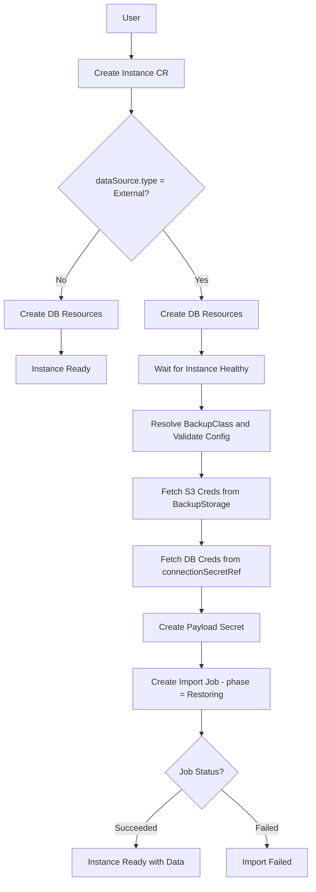

# Database Import

*   **Status:** Draft
*   **Authors:** @chilagrow
*   **Created:** 2026-06-26
*   **Last Updated:** 2026-07-14
*   **Related Issues:** https://github.com/openeverest/openeverest/issues/2471

---

## 1. Summary

Enable data import functionality in OpenEverest v2 by extending the Instance CR and BackupClass CR to support initial data population from external sources. Instead of creating separate DataImporter/DataImportJob CRs (as in v1), treat data imports as instance initialization operations — allowing users to create a new database Instance with pre-populated data by specifying an external data source during Instance creation.

## 2. Motivation

### Current State (v1 openeverest-operator)

The v1 operator implements data import through dedicated CRs:
- **DataImporter** (cluster-scoped): Defines an import method (image, command, config schema, RBAC)
- **DataImportJob** (namespaced): Represents an active import operation with inline S3 source details

This creates:
- **Duplicate infrastructure**: Job execution, RBAC management, payload contracts, and status tracking are reimplemented separately from backup/restore
- **API surface bloat**: Additional RBAC resources (`data-importers`, `data-import-jobs`) and distinct lifecycle management
- **Inconsistent UX**: Different concepts for "restore from backup" vs "import from external source" despite similar underlying operations

### Why Change?

A data import is conceptually an **instance initialization operation** where a new instance is created and populated with data from an external source. The v2 BackupClass architecture with `ExecutionMode=Job` already provides:
- Job execution with custom images/commands
- RBAC permission management
- Payload secret creation and mounting
- Status observation and lifecycle management
- OpenAPI schema validation for configuration

By extending the Instance CR and BackupClass CR to support initial data sources, we can reuse this infrastructure while maintaining the correct semantic: creating a new instance with initial data.

## 3. Goals & Non-Goals

**Goals:**
- Enable data import operations during Instance creation
- Support multiple import methods per provider (e.g., mongorestore, mongoimport, pg_restore, psql)
- Reuse BackupStorage CRs for S3 credentials and endpoint configuration
- Reuse BackupClass CR infrastructure for import job execution
- Eliminate the need for separate DataImporter/DataImportJob CRs

**Non-Goals:**
- Supporting non-S3 storage types in the initial implementation (future: Azure, GCS)
- Automatic schema detection or data transformation during import
- Bi-directional sync or continuous data replication

## 4. Proposed Solution / Design

### 4.1 Architecture Overview


```mermaid
graph TD
    User[User] --> Instance[Create Instance CR]
    Instance --> Check{dataSource.type = External?}
    Check -->|No| CreateDB[Create DB Resources]
    Check -->|Yes| CreateDBImport[Create DB Resources]
    CreateDB --> EmptyReady[Instance Ready]
    CreateDBImport --> WaitHealthy[Wait for Instance Healthy]
    WaitHealthy --> ResolveBC[Resolve BackupClass and Validate Config]
    ResolveBC --> FetchS3[Fetch S3 Creds from BackupStorage]
    FetchS3 --> FetchDB[Fetch DB Creds from connectionSecretRef]
    FetchDB --> PayloadSecret[Create Payload Secret]
    PayloadSecret --> CreateJob[Create Import Job - phase = Restoring]
    CreateJob --> JobDone{Job Status?}
    JobDone -->|Succeeded| DataReady[Instance Ready with Data]
    JobDone -->|Failed| ImportFailed[Import Failed]
```

### 4.2 API Changes

#### 4.2.1 Extend DataSource

**File:** `api/core/v1alpha1/instance_types.go`

For the instance initialization use case (creating an instance with pre-populated data), the Instance CR already uses `dataSource` field, where `*backupv1alpha1.DataSource` is defined in `restore_types.go`.

```go
type InstanceSpec struct {
	// DataSource allows creating a new Instance from an existing
	// Backup CR of another Instance.
	//
	// Only ProviderManaged BackupClasses are supported. The referenced Backup
	// must be in the same namespace, in Succeeded state, and its BackupClass
	// must list the Instance's provider in SupportedProviders. Instance must
	// also have backup enabled and include a storage entry that matches the
	// storage used by the source Backup so the provider can access the data.
	// +optional
    DataSource *backupv1alpha1.DataSource `json:"dataSource,omitempty"`

    // ... other fields ...
}
```

**File:** `api/backup/v1alpha1/restore_types.go`

The existing `RestoreSpec.DataSource` currently only supports `Backup` type via `DataSourceBackup`. Extend `DataSource` to support `External` type:

```go
// DataSourceType identifies the kind of data source for restore.
// +kubebuilder:validation:Enum=Backup;External
type DataSourceType string

const (
    DataSourceTypeBackup   DataSourceType = "Backup"
    DataSourceTypeExternal DataSourceType = "External"  // NEW
)

// DataSource defines the source for a Restore operation.
type DataSource struct {
    Type     DataSourceType        `json:"type"`
    Backup   *DataSourceBackup     `json:"backup,omitempty"`
    External *DataSourceExternal   `json:"external,omitempty"`  // NEW
}

// DataSourceExternal references an external storage location for import.
type DataSourceExternal struct {
    // BackupClassName references the BackupClass that defines the import method
    BackupClassName string `json:"backupClassName"`

    // StorageName references a BackupStorage CR in the same namespace
    // that contains S3 credentials and endpoint configuration.
    StorageName string `json:"storageName"`

    // Config contains all import configuration including:
    // - path: S3 file/directory path
    // - credentialsSecretName: Secret with database credentials
    // Validated against BackupClass.spec.importConfig.openAPIV3Schema
    // +kubebuilder:validation:Required
    Config *runtime.RawExtension `json:"config"`
}
```

#### 4.2.2 Extend BackupClass for Import Operations

**File:** `api/backup/v1alpha1/backupclass_types.go`

Add import-specific fields (this part remains the same):

```go
type BackupClassSpec struct {
    DisplayName         string                         `json:"displayName,omitempty"`
    Description         string                         `json:"description,omitempty"`
    SupportedProviders  ProviderNameList               `json:"supportedProviders,omitempty"`
    ExecutionMode       BackupExecutionMode            `json:"executionMode"`
    ProviderManaged     *ProviderManagedSpec           `json:"providerManaged,omitempty"`
    Config              BackupClassConfig              `json:"config,omitempty"`
    RestoreConfig       BackupClassConfig              `json:"restoreConfig,omitempty"`
    ImportConfig        BackupClassConfig              `json:"importConfig,omitempty"`  // NEW
    InstanceConstraints BackupClassInstanceConstraints `json:"instanceConstraints,omitempty"`
    UISchema            *runtime.RawExtension          `json:"uiSchema,omitempty"`
    Job                 *JobModeSpec                   `json:"job,omitempty"`
    // ImportJob describes the job spawned to perform an initial data import
    // when an Instance is created with spec.dataSource.type=External.
    //
    // ImportJob is intentionally a top-level sibling of Job rather than a
    // field on JobModeSpec: JobModeSpec.Backup is required, so a
    // BackupClass that exists purely as an import method (no backup/restore
    // capability.
    ImportJob            *JobExecution                  `json:"importJob,omitempty"`  // NEW
```

**Validation:** The existing CEL rules on `BackupClassSpec` (`spec.job` required/allowed only when `executionMode=Job`, etc.) need adjusting so that a class satisfies the "executionMode=Job requires an execution definition" rule via *either* `job` or `importJob`.

**How to Define Import UI Schema:**

The import form UI schema is defined in the BackupClass definition under `definition/backupclasses/<name>/`. This controls how the import config fields (path, credentialsSecretName, etc.) are rendered in the create instance wizard.

```
definition/
  backupclasses/
    data-import/
      class.yaml        # BackupClass metadata and config schema
      ui.yaml           # UI rendering hints for import form
      types.go          # Go types for importConfig schema
```

**ui.yaml:**

Below is an example, it may change.

```yaml
# definition/backupclasses/data-import/ui.yaml
import:
  sections:
    source:
      label: "Import information"
      components:
        storageName:
          uiType: select
          path: "dataSource.external.storageName"
          fieldParams:
            label: "Provide S3 details"
            helperText: "S3 storage containing the data to import"
          dataSource:
            provider: backupStorages
          validation:
            required: true
        path:
          uiType: text
          path: "dataSource.external.config.path"
          fieldParams:
            label: "File Directory"
            placeholder: "/backups/dump"
            helperText: "Path to the mongodump directory in the S3 bucket"
          validation:
            required: true
        credentials:
          label: "DB credentials"
          components:
            credentialsSecretName:
              uiType: secret
              path: "dataSource.external.config.credentialsSecretName"
              fieldParams:
                label: "Credentials Secret"
                secretDefinition: data-import-credentials  # References definition/secrets/data-import-credentials/
                createLabel: "+ Create New Credentials"
                helperText: "Secret containing MongoDB user credentials for the import"
              dataSource:
                provider: secrets
                category: data-import-credentials
              validation:
                required: true
```

**Fetching import UI schema:**

The import UI schema is fetched from the BackupClass:

`GET /clusters/{cluster}/backup-classes/{backupClass}`

```json
{
  "metadata": {
    "name": "psmdb-mongorestore-import"
  },
  "spec": {
    "displayName": "Import information",
    "importConfig": {
      "openAPIV3Schema": { ... }
    },
    "importJob": { ... },
    "uiSchema": {
      "import": {
        "sections": {
          "source": {
            "label": "Provide S3 details",
            "components": {
              "path": { ... }
            }
          },
          "credentials": {
            "label": "DB credentials",
            "components": {
              "credentialsSecretName": {
                "uiType": "secret",
                "path": "dataSource.external.config.credentialsSecretName",
                "fieldParams": {
                  "label": "Credentials Secret",
                  "secretDefinition": "data-import-credentials",
                  "createLabel": "+ Create New Credentials",
                  "helperText": "Secret containing MongoDB user credentials for the import"
                },
                "dataSource": {
                  "provider": "secrets",
                  "category": "data-import-credentials"
                },
                "validation": {
                  "required": true
                }
              }
            }
          }
        }
      }
    }
  }
}
```

The UI uses `uiSchema.import` to render the import form, and `fieldParams.secretDefinition` in the `credentialsSecretName` determines which secret UI schema to use for the "Create New" modal.

**How to Define Import Secret Schema:**

Import credentials are defined using the **Secret Management** infrastructure (see Secret Management spec). The provider declares a secret definition under `definition/secrets/<secret>/`:

```
definition/
  secrets/
    data-import-credentials/
      secret.yaml      # Metadata and schema reference
      ui.yaml          # UI rendering hints
      types.go         # Go types for schema validation
```

**secret.yaml:**
```yaml
# definition/secrets/data-import-credentials/secret.yaml
displayName: "Database Import Credentials"
description: "Credentials for importing data into a new database instance"
category: data-import-credentials
shared: false

config:
  openAPIV3Schema: PSMDBImportCredentials
```

**types.go:**
```go
// definition/secrets/data-import-credentials/types.go
package dataimportcredentials

// PSMDBImportCredentials defines the required Secret keys for PSMDB import operations.
// The provider-sdk generate command extracts this as an OpenAPI schema.
type PSMDBImportCredentials struct {
    // MONGODB_BACKUP_USER is the MongoDB backup user
    // +kubebuilder:validation:Required
    MONGODB_BACKUP_USER string `json:"MONGODB_BACKUP_USER"`

    // MONGODB_BACKUP_PASSWORD is the MongoDB backup user password
    // +kubebuilder:validation:Required
    // +kubebuilder:validation:Format=password
    MONGODB_BACKUP_PASSWORD string `json:"MONGODB_BACKUP_PASSWORD"`

    // MONGODB_CLUSTER_ADMIN_USER is the MongoDB cluster admin user
    // +kubebuilder:validation:Required
    MONGODB_CLUSTER_ADMIN_USER string `json:"MONGODB_CLUSTER_ADMIN_USER"`

    // MONGODB_CLUSTER_ADMIN_PASSWORD is the MongoDB cluster admin password
    // +kubebuilder:validation:Required
    // +kubebuilder:validation:Format=password
    MONGODB_CLUSTER_ADMIN_PASSWORD string `json:"MONGODB_CLUSTER_ADMIN_PASSWORD"`

    // MONGODB_CLUSTER_MONITOR_USER is the MongoDB cluster monitor user
    // +kubebuilder:validation:Required
    MONGODB_CLUSTER_MONITOR_USER string `json:"MONGODB_CLUSTER_MONITOR_USER"`

    // MONGODB_CLUSTER_MONITOR_PASSWORD is the MongoDB cluster monitor password
    // +kubebuilder:validation:Required
    // +kubebuilder:validation:Format=password
    MONGODB_CLUSTER_MONITOR_PASSWORD string `json:"MONGODB_CLUSTER_MONITOR_PASSWORD"`

    // MONGODB_DATABASE_ADMIN_USER is the MongoDB database admin user
    // +kubebuilder:validation:Required
    MONGODB_DATABASE_ADMIN_USER string `json:"MONGODB_DATABASE_ADMIN_USER"`

    // MONGODB_DATABASE_ADMIN_PASSWORD is the MongoDB database admin password
    // +kubebuilder:validation:Required
    // +kubebuilder:validation:Format=password
    MONGODB_DATABASE_ADMIN_PASSWORD string `json:"MONGODB_DATABASE_ADMIN_PASSWORD"`

    // MONGODB_USER_ADMIN_PASSWORD is the MongoDB user admin password
    // +kubebuilder:validation:Required
    // +kubebuilder:validation:Format=password
    MONGODB_USER_ADMIN_PASSWORD string `json:"MONGODB_USER_ADMIN_PASSWORD"`
}
```

**ui.yaml:**
```yaml
# definition/secrets/data-import-credentials/ui.yaml
sections:
  mongodb:
    label: "MongoDB Credentials"
    components:
      backupUser:
        uiType: text
        path: "stringData.MONGODB_BACKUP_USER"
        fieldParams:
          label: "Backup User"
        validation:
          required: true
      backupPassword:
        uiType: password
        path: "stringData.MONGODB_BACKUP_PASSWORD"
        fieldParams:
          label: "Backup Password"
        validation:
          required: true
      # ... additional credential fields
```

The `provider-sdk generate` command converts the Go type to an OpenAPI v3 schema embedded in the Provider CR's `spec.secrets` section.

Secrets created via the Secret Management API with label `openeverest.io/category: data-import-credentials` are valid for use as import credentials. The controller validates the secret's data against the schema.

**Fetching secret schema**

The secret UI schema defined in `ui.yaml` are set in provider spec.

`GET /clusters/{cluster}/providers/{name}`

```json
{
  "metadata": {
    "name": "percona-server-mongodb",
  },
  "spec": {
    "componentTypes": { ... },
    "components": { ... },
    "topologies": { ... },
    "versions": [ ... ],
    "uiSchema": {
      "replicaSet": { ... },
      "sharded": { ... },
    },
    "secrets":{
      "data-import-credentials": {
        "uiSchema": {
          // UI schema for data import credentials
        }
      }
    }
  }
}
```

### 4.3 Example: Import Methods

Each import method gets its own BackupClass.

The default `importer` binary will be shipped inside the `provider-percona-server-mongodb` provider image,
as it was in v1.
It reads the mounted `request.json` payload, creates a `PerconaServerMongoDBRestore` CR against the Kubernetes API, and waits for the restore to reach a terminal state before exiting.
See https://github.com/openeverest/openeverest-operator/blob/main/internal/data-importer/cmd/psmdb/import.go.

#### BackupClass:

```yaml
apiVersion: backup.openeverest.io/v1alpha1
kind: BackupClass
metadata:
  name: psmdb-mongorestore-import
spec:
  displayName: "MongoDB Import"
  description: "Import BSON dumps created by mongodump"
  supportedProviders: [percona-server-mongodb]
  executionMode: Job

  importConfig:
    openAPIV3Schema:
      type: object
      required:
        - path
        - credentialsSecretName
      properties:
        path:
          type: string
          description: "S3 path to import file/directory. For mongorestore, point to a directory containing BSON dump files. For mongoimport, point to a single JSON/CSV/TSV file."
        credentialsSecretName:
          type: string
          description: "Name of a managed Secret containing database credentials."

  importJob:
    jobSpec:
      image: percona/provider-percona-server-mongodb:0.1.0
      command: ["/importer", "psmdb"]
    permissions:
      - apiGroups: [""]
        resources: [secrets]
        verbs: [get, create, update, delete]
      - apiGroups: ["psmdb.percona.com"]
        resources: [perconaservermongodbrestores]
        verbs: [get, create, update]
```

### 4.4 Example: End-to-End Import Workflow

#### Step 1: Create BackupStorage (S3 credentials)

```yaml
apiVersion: backup.openeverest.io/v1alpha1
kind: BackupStorage
metadata:
  name: s3-external-data
  namespace: production
spec:
  type: s3
  s3:
    bucket: my-data-imports
    region: us-east-1
    endpointURL: https://s3.amazonaws.com
    credentialsSecretName: my-s3-creds  # user-created Secret with AWS_ACCESS_KEY_ID / AWS_SECRET_ACCESS_KEY
```

#### Step 2: Create Database Credentials Secret

The import job requires database credentials to connect to the Instance. Users create a Secret via the **Secret Management API** with proper labels:

```
POST /clusters/{cluster}/namespaces/production/secrets
```

```json
{
  "apiVersion": "v1",
  "kind": "Secret",
  "metadata": {
    "name": "my-mongo-cluster-import-creds",
    "namespace": "production",
    "labels": {
      "openeverest.io/provider": "percona-server-mongodb",
      "openeverest.io/category": "data-import-credentials"
    }
  },
  "type": "Opaque",
  "stringData": {
    "MONGODB_BACKUP_USER": "backup",
    "MONGODB_BACKUP_PASSWORD": "<secure-password>",
    "MONGODB_CLUSTER_ADMIN_USER": "clusterAdmin",
    "MONGODB_CLUSTER_ADMIN_PASSWORD": "<secure-password>",
    "MONGODB_CLUSTER_MONITOR_USER": "clusterMonitor",
    "MONGODB_CLUSTER_MONITOR_PASSWORD": "<secure-password>",
    "MONGODB_DATABASE_ADMIN_USER": "databaseAdmin",
    "MONGODB_DATABASE_ADMIN_PASSWORD": "<secure-password>",
    "MONGODB_USER_ADMIN_PASSWORD": "<secure-password>"
  }
}
```

The API server adds the `openeverest.io/managed: "true"` label automatically.

> **Note:** The required credential keys are defined by the provider's secret definition at `definition/secrets/data-import-credentials/`. The UI renders a creation form based on the `ui.yaml` in that directory. The schema in `types.go` is used for validation.

#### Step 3: Create Instance with DataSource

```yaml
apiVersion: instance.openeverest.io/v1alpha1
kind: Instance
metadata:
  name: my-mongo-cluster
  namespace: production
spec:
  provider: percona-server-mongodb
  topology: replica-set
  resources:
    cpu: "2"
    memory: 4Gi
  storage:
    size: 50Gi
    class: standard

  dataSource:
    type: External
    external:
      backupClassName: psmdb-mongoimport-import
      storageName: s3-external-data
      config:
        path: /imports/users.json
        credentialsSecretName: my-mongo-cluster-import-creds
```

#### Step 4: Controller Creates Instance and Import Job

The Instance controller:
1. Creates the database instance as normal (StatefulSet, Services, etc.)
2. Waits for the instance to become healthy
3. Once healthy, resolves the `psmdb-mongoimport-import` BackupClass from `dataSource.external.backupClassName`
4. Validates `dataSource.external.config` against `BackupClass.spec.importConfig.openAPIV3Schema`
5. Extracts `dataSource.external.config.path` and `dataSource.external.config.credentialsSecretName`
6. Validates that the Secret named by `dataSource.external.config.credentialsSecretName`:
   - Has label `openeverest.io/managed: "true"`
   - Has label `openeverest.io/category` (e.g., `data-import-credentials`)
   - Validates the secret's data against the schema in `definition/secret/data-import-credentials/types.go`
7. Fetches S3 credentials from the BackupStorage named by `dataSource.external.storageName`
8. Reads DB connection info (host, port) from `instance.status` — populated by the provider once the instance is healthy
9. Reads DB credentials from the user-provided Secret named by `dataSource.external.config.credentialsSecretName`
10. Creates a payload Secret with key `request.json` containing the normalized import contract (matching the `dataimporterspec.Spec` shape from v1):

```json
{
  "source": {
    "s3": {
      "bucket": "my-data-imports",
      "region": "us-east-1",
      "endpointURL": "https://s3.amazonaws.com",
      "accessKeyID": "***",
      "secretKey": "***",
      "verifyTLS": true,
      "forcePathStyle": false
    },
    "path": "/imports/users.json"
  },
  "target": {
    "databaseClusterRef": {"name": "my-mongo-cluster", "namespace": "production"},
    "host": "my-mongo-cluster.svc",
    "port": "27017",
    "user": "databaseAdmin",
    "password": "***",
    "type": "mongodb"
  }
}
```

> **Note:** The `user` and `password` in the payload are extracted from the user-provided Secret referenced in `config.credentialsSecretName`. For PSMDB, `MONGODB_DATABASE_ADMIN_USER` and `MONGODB_DATABASE_ADMIN_PASSWORD` are used.

11. Creates a Kubernetes Job using `BackupClass.spec.importJob.jobSpec`, with the payload Secret mounted as a volume at `/payload/request.json`
12. Sets `status.importJobName`, `ConditionDataSourceReady=False`, reason=`Importing`, phase=`Restoring`
13. Observes Job until terminal:
    - **Succeeded**: sets `ConditionDataSourceReady=True`, reason=`Succeeded`, phase=`Ready`, clears `importJobName`
    - **Failed**: sets `ConditionDataSourceReady=False`, reason=`ImportFailed`, message=job error, phase=`Failed`

### 4.5 UI Support

The import feature integrates into the existing **create instance wizard** as an optional section.

#### Create Instance Wizard: Data Import Section

A new collapsible optional "Data Import" section is added as a step of the create instance wizard.

1. **Import Method** — a `select` dropdown populated by:
   ```
   GET /clusters/{cluster}/backup-classes
   ```
   Filtered client-side to only show BackupClasses where:
   - `spec.importJob` is set
   - `spec.supportedProviders` includes the selected instance provider

2. **Import Form Fields** — rendered from `BackupClass.spec.uiSchema.import`:
   - Fetch the BackupClass to get the import UI schema:
     ```
     GET /clusters/{cluster}/backup-classes/{backupClass}
     ```
   - The UI renders form fields based on `spec.uiSchema` (path, credentials, etc.)
   - Field types, labels, validation rules, and layout are all driven by the UI schema

**On submit**, the wizard:

1. If user created a new secret (via inline creation), it was already created via the Secret Management API.

   Example secret creation request:
   ```
   POST /clusters/{cluster}/namespaces/{namespace}/secrets
   ```
   With body:
   ```json
   {
     "apiVersion": "v1",
     "kind": "Secret",
     "metadata": {
       "name": "{instance-name}-import-creds",
       "labels": {
         "openeverest.io/provider": "percona-server-mongodb",
         "openeverest.io/category": "data-import-credentials"
       }
     },
     "type": "Opaque",
     "stringData": {
       "MONGODB_BACKUP_USER": "...",
       "MONGODB_BACKUP_PASSWORD": "...",
       "MONGODB_CLUSTER_ADMIN_USER": "...",
       "MONGODB_CLUSTER_ADMIN_PASSWORD": "...",
       "MONGODB_CLUSTER_MONITOR_USER": "...",
       "MONGODB_CLUSTER_MONITOR_PASSWORD": "...",
       "MONGODB_DATABASE_ADMIN_USER": "...",
       "MONGODB_DATABASE_ADMIN_PASSWORD": "...",
       "MONGODB_USER_ADMIN_PASSWORD": "..."
     }
   }
   ```

2. Creates the Instance with the `dataSource` block:
   ```
   POST /clusters/{cluster}/namespaces/{namespace}/instances
   ```
   With body:
   ```json
   {
     "spec": {
       ...
       "dataSource": {
         "type": "External",
         "external": {
           "backupClassName": "psmdb-mongorestore-import",
           "storageName": "s3-external-data",
           "config": {
             "path": "/imports/dump",
             "credentialsSecretName": "{instance-name}-import-creds",
             ...
           }
         }
       }
     }
   }
   ```

#### Instance Detail Page: Import Status

While `instance.status.phase == "Restoring"` and `ConditionDataSourceReady` is present with `status=False`, the instance detail page shows an import progress banner with:
- The reason and message from `ConditionDataSourceReady`
- A link to Job logs using `status.importJobName` (same pattern as restore job log links)

Once the import completes, the condition flips to `status=True` and the banner is dismissed.

## 5. Definition of Done

- [ ] Controller supports initial data import workflow
- [ ] UI form supports creating Instances with initial data import
- [ ] Integration tests for Instance creation with initial data import

## 6. Alternatives Considered

### Alternative 1: Keep Separate DataImporter/DataImportJob CRs

**Decision:** Rejected. The duplication cost outweighs the semantic clarity benefit.

### Alternative 2: Extend Restore CR's DataSource with External Type

**Decision:** Rejected. Restore CR semantically implies restoring to an **existing** instance, but database import creates a **new** instance. Modifying `restore_types.go` to add `External` would couple the restore and import concerns. Instead, all new types are self-contained in `instance_types.go`.

### Alternative 3: Instance Controller Creates a Restore CR Internally

**Decision:** Rejected. While this avoids duplicating execution logic, it creates a Restore CR that the user never requested. This phantom CR:
- Appears in `kubectl get restores` and confuses operators
- Creates unclear ownership (can the user delete it? interact with it?)
- Splits failure diagnosis across two controllers and two status objects

Instead, execution logic is extracted into a shared `pkg/importer` package, keeping the Instance controller as the single owner of the import lifecycle with no hidden side effects.

### Alternative 4: Separate Import CR that creates an Instance

**Decision:** Rejected. Having two ways to create an instance (Instance CR vs Import CR) creates confusion. Better to have one way with optional initial data.

## 7. Open Questions

1. **Import retry mechanism**: Should there be a way to retry a failed import without recreating the entire Instance?

2. **Import progress reporting**: Should we expose Job pod logs or progress metrics in Instance status?

3. **Secret created but instance was not created**: Should we automatically cleanup secret that is not owned by an Instance?

## 8. References

- [v1 openeverest-operator DataImporter types](https://github.com/openeverest/openeverest-operator/blob/main/api/everest/v1alpha1/dataimporter_types.go)
- [v1 openeverest-operator DataImportJob types](https://github.com/openeverest/openeverest-operator/blob/main/api/everest/v1alpha1/dataimportjob_types.go)
- [v1 default importer](https://github.com/openeverest/openeverest-operator/blob/main/internal/data-importer/cmd/psmdb/import.go)
- Secret Management Spec (for managed secrets with labels and Secret Management API)
