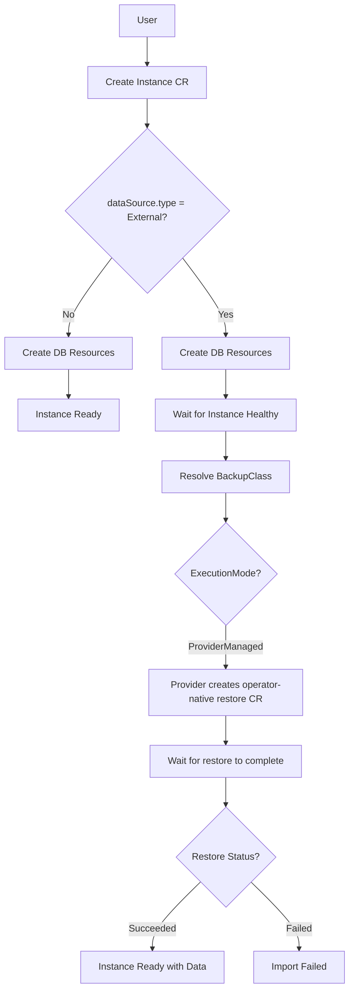
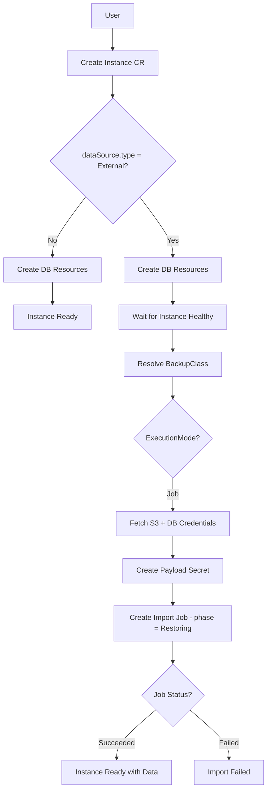

# Database Import

*   **Status:** Draft
*   **Authors:** @chilagrow
*   **Created:** 2026-06-26
*   **Last Updated:** 2026-07-17
*   **Related Issues:** https://github.com/openeverest/openeverest/issues/2471

---

## 1. Summary

Enable data import functionality in OpenEverest v2 by extending the Instance CR and BackupClass CR to support initial data population from external sources. Instead of creating separate DataImporter/DataImportJob CRs (as in v1), treat data imports as instance initialization operations — allowing users to create a new database Instance with pre-populated data by specifying an external data source during Instance creation.

Data import supports two execution modes:
- **ProviderManaged**: The provider creates operator-native restore CRs (e.g., `PerconaServerMongoDBRestore`) that leverage the in-cluster backup agent (PBM, pgBackRest). This is the recommended approach when the provider's backup agent already supports the import format.
- **Job**: An external Kubernetes Job connects directly to the database and imports data using tools like `mongorestore`, `pg_restore`, or `mysql`. This is useful for formats not supported by the provider's backup agent.

## 2. Motivation

### Current State (v1 openeverest-operator)

The v1 operator implements data import through dedicated CRs:
- **DataImporter** (cluster-scoped): Defines an import method (image, command, config schema, RBAC)
- **DataImportJob** (namespaced): Represents an active import operation with inline S3 source details

This creates:
- **Duplicate infrastructure**: Job execution, RBAC management, payload contracts, and status tracking are reimplemented separately from backup/restore
- **API surface bloat**: Additional RBAC resources (`data-importers`, `data-import-jobs`) and distinct lifecycle management
- **Inconsistent UX**: Different concepts for "restore from backup" vs "import from external source" despite similar underlying operations

Additionally, the v1 implementation uses a "Job-wrapped ProviderManaged" pattern where the Job merely creates a `PerconaServerMongoDBRestore` CR and waits for it. The Job is not performing the actual import; it's delegating to the operator's restore mechanism.

### Why Change?

A data import is conceptually an **instance initialization operation** where a new instance is created and populated with data from an external source.

The v2 design recognizes that there are two distinct implementation strategies:

1. **ProviderManaged Import**: When the provider's backup agent (PBM, pgBackRest, Barman) can already restore from the external format, the provider should directly create the operator-native restore CR. No Job wrapper is needed. This is cleaner, more efficient, and correctly represents what's happening.

2. **Job Import**: When an external tool is needed to connect to the database and import data directly (e.g., `mongoimport` for JSON files, `psql` for SQL dumps), a Kubernetes Job is appropriate. The Job genuinely performs the work.

By supporting both modes explicitly, we:
- Avoid the confusion of a "Job" that just creates another CR
- Enable true Job-based imports for formats not supported by backup agents
- Reuse the BackupClass infrastructure for configuration and validation

## 3. Goals & Non-Goals

**Goals:**
- Enable data import operations during Instance creation
- Support both ProviderManaged and Job execution modes for imports
- Support multiple import methods per provider (e.g., mongorestore via PBM, mongoimport via Job)
- Reuse BackupStorage CRs for S3 credentials and endpoint configuration
- Reuse BackupClass CR infrastructure for import configuration and validation
- Eliminate the need for separate DataImporter/DataImportJob CRs

**Non-Goals:**
- Supporting non-S3 storage types in the initial implementation (future: Azure, GCS)
- Automatic schema detection or data transformation during import
- Bi-directional sync or continuous data replication

## 4. Proposed Solution / Design

### 4.1 Architecture Overview

#### 4.1.1 ProviderManaged Import Flow

When `BackupClass.spec.executionMode=ProviderManaged` and `spec.providerManaged.supportsImport=true`:


```mermaid
graph TD
    User[User] --> Instance[Create Instance CR]
    Instance --> Check{dataSource.type = External?}
    Check -->|No| CreateDB[Create DB Resources]
    Check -->|Yes| CreateDBImport[Create DB Resources]
    CreateDB --> EmptyReady[Instance Ready]
    CreateDBImport --> WaitHealthy[Wait for Instance Healthy]
    WaitHealthy --> ResolveBC[Resolve BackupClass]
    ResolveBC --> CheckMode{ExecutionMode?}
    CheckMode -->|ProviderManaged| CreateRestore[Provider creates operator-native restore CR]
    CreateRestore --> WaitRestore[Wait for restore to complete]
    WaitRestore --> RestoreDone{Restore Status?}
    RestoreDone -->|Succeeded| DataReady[Instance Ready with Data]
    RestoreDone -->|Failed| ImportFailed[Import Failed]
```

#### 4.1.2 Job Import Flow

When `BackupClass.spec.executionMode=Job` and `spec.importJob` is set:


```mermaid
graph TD
    User[User] --> Instance[Create Instance CR]
    Instance --> Check{dataSource.type = External?}
    Check -->|No| CreateDB[Create DB Resources]
    Check -->|Yes| CreateDBImport[Create DB Resources]
    CreateDB --> EmptyReady[Instance Ready]
    CreateDBImport --> WaitHealthy[Wait for Instance Healthy]
    WaitHealthy --> ResolveBC[Resolve BackupClass]
    ResolveBC --> CheckMode{ExecutionMode?}
    CheckMode -->|Job| FetchCreds[Fetch S3 + DB Credentials]
    FetchCreds --> PayloadSecret[Create Payload Secret]
    PayloadSecret --> CreateJob[Create Import Job - phase = Restoring]
    CreateJob --> JobDone{Job Status?}
    JobDone -->|Succeeded| DataReady[Instance Ready with Data]
    JobDone -->|Failed| ImportFailed[Import Failed]
```

### 4.2 API Changes

#### 4.2.1 Extend DataSource

**File:** `api/core/v1alpha1/instance_types.go`

For the instance initialization use case (creating an instance with pre-populated data), the Instance CR already uses `dataSource` field, where `*backupv1alpha1.DataSource` is defined in `restore_types.go`.

```go
type InstanceSpec struct {
	// DataSource allows creating a new Instance from an existing
	// Backup CR of another Instance.
	//
	// Only ProviderManaged BackupClasses are supported. The referenced Backup
	// must be in the same namespace, in Succeeded state, and its BackupClass
	// must list the Instance's provider in SupportedProviders. Instance must
	// also have backup enabled and include a storage entry that matches the
	// storage used by the source Backup so the provider can access the data.
	// +optional
    DataSource *backupv1alpha1.DataSource `json:"dataSource,omitempty"`

    // ... other fields ...
}
```

**File:** `api/backup/v1alpha1/restore_types.go`

The existing `RestoreSpec.DataSource` currently only supports `Backup` type via `DataSourceBackup`. Extend `DataSource` to support `External` type:

```go
// DataSourceType identifies the kind of data source for restore.
// +kubebuilder:validation:Enum=Backup;External
type DataSourceType string

const (
    DataSourceTypeBackup   DataSourceType = "Backup"
    DataSourceTypeExternal DataSourceType = "External"  // NEW
)

// DataSource defines the source for a Restore operation.
type DataSource struct {
    Type     DataSourceType        `json:"type"`
    Backup   *DataSourceBackup     `json:"backup,omitempty"`
    External *DataSourceExternal   `json:"external,omitempty"`  // NEW
}

// DataSourceExternal references an external storage location for import.
type DataSourceExternal struct {
    // BackupClassName references the BackupClass that defines the import method
    BackupClassName string `json:"backupClassName"`

    // StorageName references a BackupStorage CR in the same namespace
    // that contains S3 credentials and endpoint configuration.
    StorageName string `json:"storageName"`

    // Config contains all import configuration including:
    // - path: S3 file/directory path
    // - credentialsSecretName: Secret with database credentials
    // Validated against BackupClass.spec.importConfig.openAPIV3Schema
    // +kubebuilder:validation:Required
    Config *runtime.RawExtension `json:"config"`
}
```

#### 4.2.2 Extend BackupClass for Import Operations

**File:** `api/backup/v1alpha1/backupclass_types.go`

BackupClass supports import through both execution modes:

```go
type BackupClassSpec struct {
    DisplayName         string                         `json:"displayName,omitempty"`
    Description         string                         `json:"description,omitempty"`
    SupportedProviders  ProviderNameList               `json:"supportedProviders,omitempty"`
    ExecutionMode       BackupExecutionMode            `json:"executionMode"`
    ProviderManaged     *ProviderManagedSpec           `json:"providerManaged,omitempty"`
    Config              BackupClassConfig              `json:"config,omitempty"`
    RestoreConfig       BackupClassConfig              `json:"restoreConfig,omitempty"`
    ImportConfig        BackupClassConfig              `json:"importConfig,omitempty"`  // NEW - used by both modes
    InstanceConstraints BackupClassInstanceConstraints `json:"instanceConstraints,omitempty"`
    UISchema            *runtime.RawExtension          `json:"uiSchema,omitempty"`
    Job                 *JobModeSpec                   `json:"job,omitempty"`
    // ImportJob describes the job spawned to perform an initial data import
    // when an Instance is created with spec.dataSource.type=External.
    // Only used when executionMode=Job.
    ImportJob           *JobExecution                  `json:"importJob,omitempty"`
}

// ProviderManagedSpec carries configuration for ExecutionMode="ProviderManaged".
type ProviderManagedSpec struct {
    SupportsPITR bool `json:"supportsPITR,omitempty"`
    Limits       *BackupClassLimits `json:"limits,omitempty"`
    PITRConfigSchema *runtime.RawExtension `json:"pitrConfigSchema,omitempty"`

    // SupportsImport indicates whether this ProviderManaged class supports
    // importing from external data sources. When true, the provider handles
    // Instance.spec.dataSource.type=External by creating operator-native
    // restore resources (e.g., PerconaServerMongoDBRestore). The import
    // configuration is validated against ImportConfig.openAPIV3Schema.
    // +optional
    SupportsImport bool `json:"supportsImport,omitempty"`  // NEW
}
```

**Validation Rules:**

- When `executionMode=ProviderManaged` and `providerManaged.supportsImport=true`:
  - `importConfig` should be set to define the import configuration schema
  - Provider handles import by creating operator-native restore CRs

- When `executionMode=Job` and `importJob` is set:
  - `importConfig` should be set to define the import configuration schema
  - Runtime spawns the specified Job to perform the import

- A BackupClass can support backup/restore AND import, or just one of them:
  - ProviderManaged class with `supportsImport=true` can do both backup and import
  - Job class with only `importJob` (no `job.backup`) is import-only

**How to Define Import UI Schema:**

The import form UI schema is defined in the BackupClass definition under `definition/backupclasses/<name>/`.
For the default `percona-backup-mongodb` class, the import UI is simple since PBM handles most details.

**ui.yaml (for ProviderManaged import):**

```yaml
# definition/backupclasses/percona-backup-mongodb/ui.yaml (import section)
import:
  sections:
    source:
      label: "Import Source"
      components:
        storageName:
          uiType: select
          path: "dataSource.external.storageName"
          fieldParams:
            label: "S3 Storage"
            helperText: "S3 storage containing the PBM/mongodump backup"
          dataSource:
            provider: backupStorages
          validation:
            required: true
        path:
          uiType: text
          path: "dataSource.external.config.path"
          fieldParams:
            label: "Backup Path"
            placeholder: "backups/2026-07-15/my-cluster"
            helperText: "Path to the backup directory in the S3 bucket"
          validation:
            required: true
    credentials:
      label: "Source Database Credentials"
      description: "PBM backups embed credential hashes. You must provide the credentials from the source database."
      components:
        credentialsSecretName:
          uiType: secret
          path: "dataSource.external.config.credentialsSecretName"
          fieldParams:
            label: "Credentials Secret"
            secretDefinition: psmdb-users
            createLabel: "+ Create New Credentials"
            helperText: "Secret containing MongoDB credentials from the source database"
          dataSource:
            provider: secrets
            category: psmdb-users
          validation:
            required: true
```

**Why are credentials required for ProviderManaged import?**

PBM backups embed credential hashes. When restored, the target database must have matching
credentials or authentication will fail. The provider copies the user-provided credentials
to the target Instance's users secret before starting the restore.

**ui.yaml (for Job-mode import - e.g., mongoimport):**

Job-mode imports also require database credentials since the Job connects directly:

```yaml
# definition/backupclasses/data-importer/ui.yaml
import:
  sections:
    source:
      label: "Import Source"
      components:
        storageName:
          uiType: select
          path: "dataSource.external.storageName"
          fieldParams:
            label: "S3 Storage"
            helperText: "S3 storage containing the JSON/CSV file"
          dataSource:
            provider: backupStorages
          validation:
            required: true
        path:
          uiType: text
          path: "dataSource.external.config.path"
          fieldParams:
            label: "File Path"
            placeholder: "imports/data.json"
            helperText: "Path to the JSON/CSV file in the S3 bucket"
          validation:
            required: true
    target:
      label: "Import Target"
      components:
        collection:
          uiType: text
          path: "dataSource.external.config.collection"
          fieldParams:
            label: "Collection Name"
            helperText: "Target MongoDB collection"
          validation:
            required: true
        database:
          uiType: text
          path: "dataSource.external.config.database"
          fieldParams:
            label: "Database Name"
            placeholder: "admin"
            helperText: "Target database (defaults to admin)"
    credentials:
      label: "DB Credentials"
      components:
        credentialsSecretName:
          uiType: secret
          path: "dataSource.external.config.credentialsSecretName"
          fieldParams:
            label: "Credentials Secret"
            secretDefinition: data-import-credentials
            createLabel: "+ Create New Credentials"
            helperText: "Secret containing MongoDB credentials for direct connection"
          dataSource:
            provider: secrets
            category: data-import-credentials
          validation:
            required: true
```

**Fetching import UI schema:**

The import UI schema is fetched from the BackupClass:

`GET /clusters/{cluster}/backup-classes/{backupClass}`

```json
{
  "metadata": {
    "name": "percona-backup-mongodb"
  },
  "spec": {
    "displayName": "Percona Backup for MongoDB",
    "executionMode": "ProviderManaged",
    "providerManaged": {
      "supportsPITR": true,
      "supportsImport": true
    },
    "importConfig": {
      "openAPIV3Schema": {
        "type": "object",
        "required": ["path"],
        "properties": {
          "path": {"type": "string"}
        }
      }
    },
    "uiSchema": {
      "import": {
        "sections": {
          "source": {
            "label": "Import Source",
            "components": {
              "storageName": { ... },
              "path": { ... }
            }
          }
        }
      }
    }
  }
}
```

The UI uses `uiSchema.import` to render the import form. For Job-mode classes that require credentials,
`fieldParams.secretDefinition` determines which secret UI schema to use for the "Create New" modal.

**How to Define Import Secret Schema (Job-mode only):**

Job-mode imports require database credentials since the Job connects directly. These credentials are
defined using the **Secret Management** infrastructure. The provider declares a secret definition
under `definition/secrets/<secret>/`:

```
definition/
  secrets/
    data-import-credentials/
      secret.yaml      # Metadata and schema reference
      ui.yaml          # UI rendering hints
      types.go         # Go types for schema validation
```

Note: ProviderManaged imports do NOT require a separate credentials secret because PBM runs
inside the cluster with access to the database.

**secret.yaml:**
```yaml
# definition/secrets/data-import-credentials/secret.yaml
displayName: "Database Import Credentials"
description: "Credentials for importing data into a new database instance"
category: data-import-credentials
shared: false

config:
  openAPIV3Schema: PSMDBImportCredentials
```

**types.go:**
```go
// definition/secrets/data-import-credentials/types.go
package dataimportcredentials

// PSMDBImportCredentials defines the required Secret keys for PSMDB import operations.
// The provider-sdk generate command extracts this as an OpenAPI schema.
type PSMDBImportCredentials struct {
    // MONGODB_BACKUP_USER is the MongoDB backup user
    // +kubebuilder:validation:Required
    MONGODB_BACKUP_USER string `json:"MONGODB_BACKUP_USER"`

    // MONGODB_BACKUP_PASSWORD is the MongoDB backup user password
    // +kubebuilder:validation:Required
    // +kubebuilder:validation:Format=password
    MONGODB_BACKUP_PASSWORD string `json:"MONGODB_BACKUP_PASSWORD"`

    // MONGODB_CLUSTER_ADMIN_USER is the MongoDB cluster admin user
    // +kubebuilder:validation:Required
    MONGODB_CLUSTER_ADMIN_USER string `json:"MONGODB_CLUSTER_ADMIN_USER"`

    // MONGODB_CLUSTER_ADMIN_PASSWORD is the MongoDB cluster admin password
    // +kubebuilder:validation:Required
    // +kubebuilder:validation:Format=password
    MONGODB_CLUSTER_ADMIN_PASSWORD string `json:"MONGODB_CLUSTER_ADMIN_PASSWORD"`

    // MONGODB_CLUSTER_MONITOR_USER is the MongoDB cluster monitor user
    // +kubebuilder:validation:Required
    MONGODB_CLUSTER_MONITOR_USER string `json:"MONGODB_CLUSTER_MONITOR_USER"`

    // MONGODB_CLUSTER_MONITOR_PASSWORD is the MongoDB cluster monitor password
    // +kubebuilder:validation:Required
    // +kubebuilder:validation:Format=password
    MONGODB_CLUSTER_MONITOR_PASSWORD string `json:"MONGODB_CLUSTER_MONITOR_PASSWORD"`

    // MONGODB_DATABASE_ADMIN_USER is the MongoDB database admin user
    // +kubebuilder:validation:Required
    MONGODB_DATABASE_ADMIN_USER string `json:"MONGODB_DATABASE_ADMIN_USER"`

    // MONGODB_DATABASE_ADMIN_PASSWORD is the MongoDB database admin password
    // +kubebuilder:validation:Required
    // +kubebuilder:validation:Format=password
    MONGODB_DATABASE_ADMIN_PASSWORD string `json:"MONGODB_DATABASE_ADMIN_PASSWORD"`

    // MONGODB_USER_ADMIN_PASSWORD is the MongoDB user admin password
    // +kubebuilder:validation:Required
    // +kubebuilder:validation:Format=password
    MONGODB_USER_ADMIN_PASSWORD string `json:"MONGODB_USER_ADMIN_PASSWORD"`
}
```

**ui.yaml:**
```yaml
# definition/secrets/data-import-credentials/ui.yaml
sections:
  mongodb:
    label: "MongoDB Credentials"
    components:
      backupUser:
        uiType: text
        path: "stringData.MONGODB_BACKUP_USER"
        fieldParams:
          label: "Backup User"
        validation:
          required: true
      backupPassword:
        uiType: password
        path: "stringData.MONGODB_BACKUP_PASSWORD"
        fieldParams:
          label: "Backup Password"
        validation:
          required: true
      # ... additional credential fields
```

The `provider-sdk generate` command converts the Go type to an OpenAPI v3 schema embedded in the Provider CR's `spec.secrets` section.

Secrets created via the Secret Management API with label `openeverest.io/category: data-import-credentials` are valid for use as import credentials. The controller validates the secret's data against the schema.

**Fetching secret schema**

The secret UI schema defined in `ui.yaml` are set in provider spec.

`GET /clusters/{cluster}/providers/{name}`

```json
{
  "metadata": {
    "name": "percona-server-mongodb",
  },
  "spec": {
    "componentTypes": { ... },
    "components": { ... },
    "topologies": { ... },
    "versions": [ ... ],
    "uiSchema": {
      "replicaSet": { ... },
      "sharded": { ... },
    },
    "secrets":{
      "data-import-credentials": {
        "uiSchema": {
          // UI schema for data import credentials
        }
      }
    }
  }
}
```

### 4.3 Example: Import Methods

ProviderManaged import capability is added to the **default backup class** shipped with the provider,
rather than creating a separate import-only class. This provides a simpler mental model: one class
does backup, restore, AND import using the same underlying tool (PBM).

Job-mode import (e.g., mongoimport for JSON/CSV) would be in a **separate class** because it uses
different tooling with different configuration requirements.

#### 4.3.1 Default BackupClass with ProviderManaged Import (Recommended)

The default `percona-backup-mongodb` BackupClass is extended to support import:

**BackupClass (definition/backupclasses/percona-backup-mongodb/class.yaml):**

```yaml
displayName: "Percona Backup for MongoDB"
description: |
  BackupClass for the Percona Server MongoDB provider. Backups, restores,
  and external data imports are managed natively by Percona Backup for
  MongoDB (PBM) embedded in the PSMDB operator; OpenEverest does not run
  any side-car Job for this class.
supportedProviders:
  - percona-server-mongodb
executionMode: ProviderManaged

providerManaged:
  supportsPITR: true
  supportsImport: true  # This class supports external data import
  limits:
    maxPITREnabledStorages: 1
    maxStorages: 1
  pitrConfigSchema: PerconaPITRConfig

config:
  openAPIV3Schema: PerconaBackupConfig

restoreConfig:
  openAPIV3Schema: PerconaRestoreConfig

# Import config - requires credentials because PBM backups embed password hashes
importConfig:
  openAPIV3Schema: PerconaImportConfig
```

**Import Config Type (definition/backupclasses/percona-backup-mongodb/types.go):**

```go
// PerconaImportConfig describes the configuration accepted when an Instance
// is created with spec.dataSource.type=External referencing this BackupClass.
//
// IMPORTANT: PBM/mongodump backups embed credential hashes. When restoring,
// the target cluster's users secret MUST contain the same credentials as the
// source cluster that created the backup. Mismatched credentials render the
// restored data inaccessible because MongoDB will reject authentication
// attempts with the wrong password hashes.
type PerconaImportConfig struct {
    // Path is the S3 path (prefix) where the PBM/mongodump backup data resides.
    // +kubebuilder:validation:Required
    Path string `json:"path"`

    // CredentialsSecretName is the name of a Secret containing the MongoDB
    // credentials from the source database. REQUIRED because PBM backups
    // embed password hashes - the target Instance must use the same
    // credentials to access the restored data.
    //
    // The Secret must contain the standard PSMDB users secret keys:
    //   - MONGODB_BACKUP_USER / MONGODB_BACKUP_PASSWORD
    //   - MONGODB_CLUSTER_ADMIN_USER / MONGODB_CLUSTER_ADMIN_PASSWORD
    //   - MONGODB_DATABASE_ADMIN_USER / MONGODB_DATABASE_ADMIN_PASSWORD
    //   - etc.
    // +kubebuilder:validation:Required
    CredentialsSecretName string `json:"credentialsSecretName"`
}
```

**Why are credentials required for ProviderManaged import?**

PBM (Percona Backup for MongoDB) backups embed credential hashes. When MongoDB restores from
such a backup, it replaces the current user data with the backup's user data - including the
password hashes. If the target Instance was initialized with different credentials, those
credentials become invalid after the restore completes.

The provider handles this by:
1. Reading the user-provided credentials secret
2. Copying it to the target Instance's users secret BEFORE creating the PSMDB CR
3. This ensures the operator never initializes the secret with random passwords

**Why same class?**
- PBM handles backup, restore, AND import from PBM-compatible sources
- Simpler mental model: one class for all PBM operations
- No config duplication (S3 storage config, supported providers, constraints)
- Natural extension: BackupClass already has Config, RestoreConfig → adding ImportConfig fits

**How the provider handles this:**

The provider's `SyncPSMDB` function detects `Instance.spec.dataSource.type=External`, checks that
the BackupClass has `providerManaged.supportsImport=true`, copies credentials, and creates a
`PerconaServerMongoDBRestore` CR:

```go
// In provider/import.go - reconcileProviderManagedImport
func reconcileProviderManagedImport(c *controller.Context, ext *DataSourceExternal, importCfg ImportConfig) error {
    // CRITICAL: Copy source database credentials to the target Instance's users
    // secret BEFORE creating the PSMDB CR. PBM backups embed credential hashes;
    // mismatched secrets render the restored data inaccessible.
    usersSecretName := c.Name() + "-users"
    if err := ensureImportCredentials(c, usersSecretName, importCfg.CredentialsSecretName); err != nil {
        return err
    }

    storage, _ := c.BackupStorage(ext.StorageName)

    // Create PerconaServerMongoDBRestore CR directly (no Job wrapper)
    psmdbRestore := &psmdbv1.PerconaServerMongoDBRestore{
        ObjectMeta: metav1.ObjectMeta{
            Name:      c.Name() + "-import",
            Namespace: c.Namespace(),
        },
        Spec: psmdbv1.PerconaServerMongoDBRestoreSpec{
            ClusterName: c.Name(),
            BackupSource: &psmdbv1.PerconaServerMongoDBBackupStatus{
                Type:        pbmdefs.LogicalBackup,
                Destination: fmt.Sprintf("s3://%s/%s", storage.Spec.S3.Bucket, importCfg.Path),
                S3: &psmdbv1.BackupStorageS3Spec{...},
            },
        },
    }
    return c.Client().Create(c.Context(), psmdbRestore)
}
```

#### 4.3.2 Separate Job-mode BackupClass (For formats not supported by PBM)

When an external tool must connect to the database directly (e.g., `mongoimport` for JSON/CSV),
a **separate BackupClass** is created with `executionMode=Job`. The Job genuinely performs the
import work.

**Why separate class?**
- Different execution mode (Job vs ProviderManaged)
- Different config requirements (needs collection name, database, file format)
- Different capabilities (import-only, no backup/restore)
- Uses different tooling (mongoimport vs PBM)

**BackupClass (definition/backupclasses/data-importer/class.yaml):**

```yaml
displayName: "MongoDB JSON/CSV Import"
description: |
  BackupClass for importing JSON or CSV files into a Percona Server for MongoDB
  instance using mongoimport. Use this when the source data is NOT a PBM/mongodump
  backup.
supportedProviders:
  - percona-server-mongodb
executionMode: Job

importConfig:
  openAPIV3Schema: MongoimportConfig

# NOTE: importJob implementation is TODO
# importJob:
#   jobSpec:
#     image: "percona/everest-mongoimport:latest"
#     command: ["/mongoimport-wrapper", "/payload/request.json"]
```

**Import Config Type (definition/backupclasses/data-importer/types.go):**

```go
// MongoimportConfig describes the configuration for mongoimport-based imports.
type MongoimportConfig struct {
    // Path is the S3 path to the JSON or CSV file to import.
    // +kubebuilder:validation:Required
    Path string `json:"path"`

    // CredentialsSecretName is required because mongoimport connects directly.
    // +kubebuilder:validation:Required
    CredentialsSecretName string `json:"credentialsSecretName"`

    // Collection is the target MongoDB collection name.
    // +kubebuilder:validation:Required
    Collection string `json:"collection"`

    // Database is the target database name. Defaults to "admin".
    // +optional
    Database string `json:"database,omitempty"`

    // Type specifies the input file format.
    // +kubebuilder:validation:Enum=json;csv;tsv
    // +kubebuilder:default=json
    Type string `json:"type,omitempty"`
}
```

### 4.4 Example: End-to-End Import Workflow (ProviderManaged)

This example shows importing a PBM/mongodump backup using the default ProviderManaged BackupClass.

#### Step 1: Create BackupStorage (S3 credentials)

```yaml
apiVersion: backup.openeverest.io/v1alpha1
kind: BackupStorage
metadata:
  name: s3-external-data
  namespace: production
spec:
  type: s3
  s3:
    bucket: my-data-imports
    region: us-east-1
    endpointURL: https://s3.amazonaws.com
    credentialsSecretName: my-s3-creds  # user-created Secret with AWS_ACCESS_KEY_ID / AWS_SECRET_ACCESS_KEY
```

#### Step 2: Create Database Credentials Secret

For ProviderManaged import (PBM/mongodump), you MUST provide the **same MongoDB credentials**
as the source database. This is critical because PBM backups embed credential hashes in the
restored data—if the target cluster has different credentials, the restored authentication
data will be inconsistent and users won't be able to authenticate.

```yaml
apiVersion: v1
kind: Secret
metadata:
  name: source-db-credentials
  namespace: production
type: Opaque
stringData:
  # These must match the source database credentials EXACTLY
  MONGODB_BACKUP_USER: pbmuser
  MONGODB_BACKUP_PASSWORD: <source-backup-password>
  MONGODB_CLUSTER_ADMIN_USER: clusterAdmin
  MONGODB_CLUSTER_ADMIN_PASSWORD: <source-admin-password>
  MONGODB_CLUSTER_MONITOR_USER: clusterMonitor
  MONGODB_CLUSTER_MONITOR_PASSWORD: <source-monitor-password>
  MONGODB_USER_ADMIN_USER: userAdmin
  MONGODB_USER_ADMIN_PASSWORD: <source-useradmin-password>
```

#### Step 3: Create Instance with DataSource

```yaml
apiVersion: core.openeverest.io/v1alpha1
kind: Instance
metadata:
  name: my-mongo-cluster
  namespace: production
spec:
  provider: percona-server-mongodb
  topology: replica-set
  components:
    engine:
      replicas: 3
  resources:
    cpu: "2"
    memory: 4Gi
  storage:
    size: 50Gi
    class: standard

  # Use the default PBM BackupClass for ProviderManaged import
  dataSource:
    type: External
    external:
      backupClassName: percona-backup-mongodb  # Default BackupClass with supportsImport=true
      storageName: s3-external-data
      config:
        path: backups/2026-07-15/source-cluster   # Path to PBM/mongodump backup in S3
        credentialsSecretName: source-db-credentials  # REQUIRED: source database credentials
```

#### Step 4: Controller Creates Instance and Handles Import

The Instance controller (ProviderManaged flow):

1. Creates the database instance as normal (StatefulSet, Services, etc.)
2. Waits for the instance to become healthy AND BackupVersion to be published
3. Once ready, resolves the `percona-backup-mongodb` BackupClass from `dataSource.external.backupClassName`
4. Validates the BackupClass has `providerManaged.supportsImport=true`
5. Validates `dataSource.external.config` against `BackupClass.spec.importConfig.openAPIV3Schema`
6. **Copies credentials from the user-provided secret to the Instance's users secret**:
   - The provider reads the secret named by `config.credentialsSecretName`
   - Copies credential keys to the Instance's internal users secret (e.g., `my-mongo-cluster-mongodb-users`)
   - This ensures the PSMDB CR uses the source database credentials
7. Fetches S3 credentials from the BackupStorage named by `dataSource.external.storageName`
8. Creates a `PerconaServerMongoDBRestore` CR directly (no Job wrapper):

```yaml
apiVersion: psmdb.percona.com/v1
kind: PerconaServerMongoDBRestore
metadata:
  name: my-mongo-cluster-import
  namespace: production
  annotations:
    openeverest.io/managed-by-data-import: "true"
  ownerReferences:
    - apiVersion: core.openeverest.io/v1alpha1
      kind: Instance
      name: my-mongo-cluster
spec:
  clusterName: my-mongo-cluster
  backupSource:
    type: logical
    destination: s3://my-data-imports/backups/2026-07-15/source-cluster
    s3:
      bucket: my-data-imports
      region: us-east-1
      endpointURL: https://s3.amazonaws.com
      credentialsSecret: my-mongo-cluster-import-s3-creds
      prefix: backups/2026-07-15
```

9. Sets `ConditionDataSourceReady=False`, reason=`Restoring`, phase=`Restoring`
10. Observes `PerconaServerMongoDBRestore` status until terminal:
    - **Ready**: sets `ConditionDataSourceReady=True`, reason=`Succeeded`, phase=`Ready`, cleans up temp secrets
    - **Error**: sets `ConditionDataSourceReady=False`, reason=`ImportFailed`, message=restore error, phase=`Failed`

### 4.5 UI Support

The import feature integrates into the existing **create instance wizard** as an optional section.

#### Create Instance Wizard: Data Import Section

A new collapsible optional "Data Import" section is added as a step of the create instance wizard.

1. **Import Method** — a `select` dropdown populated by:
   ```
   GET /clusters/{cluster}/backup-classes
   ```
   Filtered client-side to only show BackupClasses where:
   - `spec.importJob` is set
   - `spec.supportedProviders` includes the selected instance provider

2. **Import Form Fields** — rendered from `BackupClass.spec.uiSchema.import`:
   - Fetch the BackupClass to get the import UI schema:
     ```
     GET /clusters/{cluster}/backup-classes/{backupClass}
     ```
   - The UI renders form fields based on `spec.uiSchema` (path, credentials, etc.)
   - Field types, labels, validation rules, and layout are all driven by the UI schema

**On submit**, the wizard:

1. If user created a new secret (via inline creation), it was already created via the Secret Management API.

   Example secret creation request:
   ```
   POST /clusters/{cluster}/namespaces/{namespace}/secrets
   ```
   With body:
   ```json
   {
     "apiVersion": "v1",
     "kind": "Secret",
     "metadata": {
       "name": "{instance-name}-import-creds",
       "labels": {
         "openeverest.io/provider": "percona-server-mongodb",
         "openeverest.io/category": "data-import-credentials"
       }
     },
     "type": "Opaque",
     "stringData": {
       "MONGODB_BACKUP_USER": "...",
       "MONGODB_BACKUP_PASSWORD": "...",
       "MONGODB_CLUSTER_ADMIN_USER": "...",
       "MONGODB_CLUSTER_ADMIN_PASSWORD": "...",
       "MONGODB_CLUSTER_MONITOR_USER": "...",
       "MONGODB_CLUSTER_MONITOR_PASSWORD": "...",
       "MONGODB_DATABASE_ADMIN_USER": "...",
       "MONGODB_DATABASE_ADMIN_PASSWORD": "...",
       "MONGODB_USER_ADMIN_PASSWORD": "..."
     }
   }
   ```

2. Creates the Instance with the `dataSource` block:
   ```
   POST /clusters/{cluster}/namespaces/{namespace}/instances
   ```
   With body:
   ```json
   {
     "spec": {
       ...
       "dataSource": {
         "type": "External",
         "external": {
           "backupClassName": "psmdb-mongorestore-import",
           "storageName": "s3-external-data",
           "config": {
             "path": "/imports/dump",
             "credentialsSecretName": "{instance-name}-import-creds",
             ...
           }
         }
       }
     }
   }
   ```

#### Instance Detail Page: Import Status

While `instance.status.phase == "Restoring"` and `ConditionDataSourceReady` is present with `status=False`, the instance detail page shows an import progress banner with:
- The reason and message from `ConditionDataSourceReady`
- A link to Job logs using `status.importJobName` (same pattern as restore job log links)

Once the import completes, the condition flips to `status=True` and the banner is dismissed.

## 5. Definition of Done

- [ ] Controller supports initial data import workflow
- [ ] UI form supports creating Instances with initial data import
- [ ] Integration tests for Instance creation with initial data import

## 6. Alternatives Considered

### Alternative 1: Keep Separate DataImporter/DataImportJob CRs

**Decision:** Rejected. The duplication cost outweighs the semantic clarity benefit.

### Alternative 2: Extend Restore CR's DataSource with External Type

**Decision:** Rejected. Restore CR semantically implies restoring to an **existing** instance, but database import creates a **new** instance. Modifying `restore_types.go` to add `External` would couple the restore and import concerns. Instead, all new types are self-contained in `instance_types.go`.

### Alternative 3: Instance Controller Creates a Restore CR Internally

**Decision:** Rejected. While this avoids duplicating execution logic, it creates a Restore CR that the user never requested. This phantom CR:
- Appears in `kubectl get restores` and confuses operators
- Creates unclear ownership (can the user delete it? interact with it?)
- Splits failure diagnosis across two controllers and two status objects

Instead, execution logic is extracted into a shared `pkg/importer` package, keeping the Instance controller as the single owner of the import lifecycle with no hidden side effects.

### Alternative 4: Separate Import CR that creates an Instance

**Decision:** Rejected. Having two ways to create an instance (Instance CR vs Import CR) creates confusion. Better to have one way with optional initial data.

## 7. Open Questions

1. **Import retry mechanism**: Should there be a way to retry a failed import without recreating the entire Instance?

2. **Import progress reporting**: Should we expose Job pod logs or progress metrics in Instance status?

3. **Secret created but instance was not created**: Should we automatically cleanup secret that is not owned by an Instance?

## 8. References

- [v1 openeverest-operator DataImporter types](https://github.com/openeverest/openeverest-operator/blob/main/api/everest/v1alpha1/dataimporter_types.go)
- [v1 openeverest-operator DataImportJob types](https://github.com/openeverest/openeverest-operator/blob/main/api/everest/v1alpha1/dataimportjob_types.go)
- [v1 default importer](https://github.com/openeverest/openeverest-operator/blob/main/internal/data-importer/cmd/psmdb/import.go)
- Secret Management Spec (for managed secrets with labels and Secret Management API)
