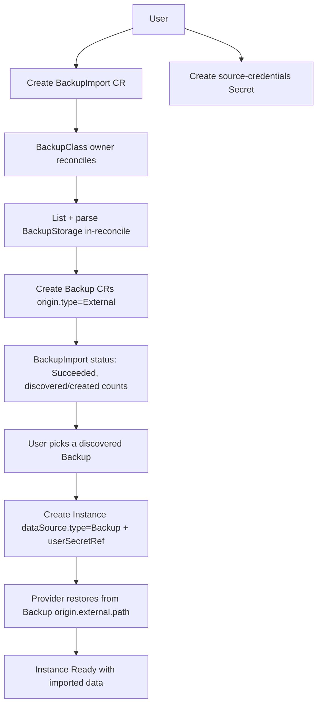

# Database Import

*   **Status:** Draft
*   **Authors:** @chilagrow
*   **Created:** 2026-06-26
*   **Last Updated:** 2026-09-30
*   **Related Issues:** https://github.com/openeverest/openeverest/issues/2471

---

## 1. Summary

Enable data import functionality in OpenEverest v2 by composing existing backup/restore building blocks instead of introducing dedicated DataImporter/DataImportJob CRs (as in v1). Import is *discover Backup from storage → create Backup → seed Instance from Backup*, reusing the backup/restore machinery unchanged.

## 2. Motivation

### Current State (v1 openeverest-operator)

The v1 operator implements data import through dedicated CRs:
- **DataImporter** (cluster-scoped): Defines an import method (image, command, config schema, RBAC)
- **DataImportJob** (namespaced): Represents an active import operation with inline S3 source details

This creates:
- **Duplicate infrastructure**: Job execution, RBAC management, payload contracts, and status tracking are reimplemented separately from backup/restore
- **API surface bloat**: Additional RBAC resources (`data-importers`, `data-import-jobs`) and distinct lifecycle management
- **Inconsistent UX**: Different concepts for "restore from backup" vs "import from external source" despite similar underlying operations

Additionally, the v1 implementation uses a "Job-wrapped ProviderManaged" pattern where the Job merely creates a `PerconaServerMongoDBRestore` CR and waits for it. The Job is not performing the actual import; it's delegating to the operator's restore mechanism.

### Why Change?

A data import is conceptually a **restore from data that already sits in object storage but has no live source Instance**. OpenEverest already models "restore into a new Instance". The missing piece is turning the objects in a `BackupStorage` into `Backup` CRs — which is exactly what a `BackupImport` CR does.

So rather than inventing a parallel import execution path with its own execution modes, schemas, and credential plumbing, v2 imports are expressed entirely with the backup/restore CRDs:

- **No new execution engine.** Discovery is a short, read-only, in-reconcile listing that creates `Backup` CRs. Seeding an Instance from a discovered `Backup` reuses the ordinary restore path.
- **One "restore" concept.** "Restore from backup" and "import from external source" are the same operation.
- **Ownership follows the format, not a mode flag.** Whoever owns the `BackupClass` (a provider for single-owner formats like PBM; a generic plugin for shared formats like `mongodump`) reconciles the `BackupImport` and knows how to parse the storage.

## 3. Goals & Non-Goals

**Goals:**
- Let a user discover restorable backups already sitting in a `BackupStorage` and seed a new Instance from one of them.
- Model discovery as a `BackupImport` CR that creates `Backup` CRs (`origin.type=External`).
- Reuse `Instance.spec.dataSource.type=Backup` for seeding — no new data-source type.
- Reuse `BackupStorage` CRs for S3 credentials and endpoint configuration, read-only.
- Reuse the existing `percona-backup-mongodb` `BackupClass` unchanged — no import-specific schema or execution mode on `BackupClass`.
- Supply source-database credentials through `Instance.spec.userSecretRef` so the seeded Instance can authenticate against imported data.

**Non-Goals:**
- Supporting non-S3 storage types in the initial implementation (future: Azure, GCS)
- Automatic schema detection or data transformation during import
- Bi-directional sync or continuous data replication

## 4. Proposed Solution / Design

### 4.1 Architecture Overview

Import composes three resources:

1. **`BackupImport` CR** — a namespaced trigger that points at a `BackupClass` (`classRef`) and a `BackupStorage` (`storageRef`). Its reconciler (the owner of the referenced `BackupClass`) lists and parses the storage and **creates one `Backup` CR per restorable backup it discovers**, marking each as imported via `spec.origin.type=External`.
2. **`Backup` CR (`origin.type=External`)** — an imported backup record that restores directly from `storageRef` + `origin.external.path`, with no live source Instance and no operator-native backup object.
3. **`Instance` CR** — a new Instance seeded from one of the discovered external `Backup` CRs. Source-database credentials that the backup embeds are supplied through `spec.userSecretRef`.

Discovery and seeding are decoupled: the user (or UI) first triggers discovery, then picks a discovered `Backup` to seed a new Instance.


```mermaid
graph TD
    User[User] --> Imp[Create BackupImport CR]
    Imp --> Owner[BackupClass owner reconciles]
    Owner --> ListParse[List + parse BackupStorage in-reconcile]
    ListParse --> CreateBackups[Create Backup CRs origin.type=External]
    CreateBackups --> ImpStatus[BackupImport status: Succeeded, discovered/created counts]

    User --> Creds[Create source-credentials Secret]
    ImpStatus --> Pick[User picks a discovered Backup]
    Pick --> Inst[Create Instance dataSource.type=Backup + userSecretRef]
    Inst --> Seed[Provider restores from Backup origin.external.path]
    Seed --> Ready[Instance Ready with imported data]
```

Key properties:

- **Discovery is read-only and in-process.** The `BackupImport` reconciler lists and parses the `BackupStorage`, then creates `Backup` CRs. It does not spawn a Job and does not touch any live Instance.
- **External `Backup` CRs restore with no live source.** A `Backup` with `spec.origin.type=External` carries `origin.external.path`; the restoring provider builds the engine restore from `storageRef` + `path` directly.
- **Seeding reuses the ordinary restore path.** `Instance.spec.dataSource.type=Backup` referencing a discovered `Backup` is the same mechanism used to restore from any backup.

### 4.2 API Changes

The import journey requires **no import-specific fields** on `Instance` or `BackupClass`. It uses:

- the new `BackupImport` CR,
- the change in `Backup` CR; `origin.type=External` variant on `Backup`,
- the existing `Instance.spec.dataSource` (`type=Backup`) and `Instance.spec.userSecretRef`.

#### 4.2.1 `BackupImport` CR

**File:** `api/backup/v1alpha1/backupimport_types.go`

```go
type BackupImportSpec struct {
    ClassRef common.ObjectRef `json:"classRef"`

    StorageRef common.ObjectRef `json:"storageRef"`
}

type BackupImportStatus struct {
    DiscoveredCount int32 `json:"discoveredCount"`
    CreatedCount int32 `json:"createdCount"`
    // State is Succeeded | Failed | Error.
    State   BackupImportState  `json:"state,omitempty"`
    Message string             `json:"message,omitempty"`
    Conditions []metav1.Condition `json:"conditions,omitempty"`
}
```

`BackupImport` is namespaced (it reads a namespaced `BackupStorage` and its credentials secret). Its `spec` is immutable — re-running discovery means creating a new `BackupImport`, and creation is idempotent because `Backup` CRs are deduped on `(storageRef, path)`.

#### 4.2.2 `Backup` CR — External origin

**File:** `api/backup/v1alpha1/backup_types.go`

A discovered backup is represented as a `Backup` whose `origin` marks it as imported:

```go
type BackupOriginType string

type BackupOrigin struct {
    Type BackupOriginType `json:"type"`

    InstanceRef *common.ObjectRef `json:"instanceRef,omitempty"`

    External *BackupOriginExternal `json:"external,omitempty"`
}

type BackupOriginExternal struct {
    Path        string      `json:"path"`
    StartedAt   metav1.Time `json:"startedAt"`
    CompletedAt metav1.Time `json:"completedAt"`
}
```

External backups also default `spec.deletionPolicy` to `Retain` semantics in practice (a CEL rule forbids `Delete` for external origin: deleting an imported record must not purge data the platform never produced).

#### 4.2.3 Credentials via `Instance.spec.userSecretRef`

PBM/`mongodump` backups embed credential hashes: the seeded Instance must be created with the **same system-user credentials** as the source backup, or authentication against the restored data fails. This is supplied at Instance creation through the immutable `userSecretRef` field — no import-specific credentials schema or secret category is required:

```go
// UserSecretRef optionally seeds the engine's initial (bootstrap)
// credentials from a Secret in the same namespace. Immutable once set.
// +optional
UserSecretRef *common.SecretRef `json:"userSecretRef,omitempty"`
```

The referenced Secret carries the provider's standard system-user keys (for PSMDB: `MONGODB_BACKUP_USER/PASSWORD`, `MONGODB_CLUSTER_ADMIN_USER/PASSWORD`, `MONGODB_DATABASE_ADMIN_USER/PASSWORD`, etc.). Because `userSecretRef` is the ordinary bootstrap-credentials mechanism, the provider seeds the engine with these credentials before the restore runs.

#### 4.2.4 HTTP API

`BackupImport` is exposed through the OpenEverest HTTP API . Discovery is create-then-watch: the client `POST`s a `BackupImport`, then polls its `status` (`state`, `discoveredCount`, `createdCount`). The `spec` is immutable, so there is no `PUT`/`PATCH` — re-running discovery means creating a new `BackupImport`.

* `POST /clusters/{cluster}/namespaces/{namespace}/backup-imports`
* `GET /clusters/{cluster}/namespaces/{namespace}/backup-imports`
* `GET /clusters/{cluster}/namespaces/{namespace}/backup-imports/{name}`
* `DELETE /clusters/{cluster}/namespaces/{namespace}/backup-imports/{name}`

All bodies use the generated `BackupImport` / `BackupImportList` schemas (`crds.gen.yaml`). `x-everest-resource-name: backup-imports` drives RBAC.

Example `POST` request and response body:

**Request**

```yaml
apiVersion: backup.openeverest.io/v1alpha1
kind: BackupImport
metadata:
  name: import-my-s3-bucket
  namespace: my-special-place
spec:
  classRef:
    name: percona-backup-mongodb   # PSMDB provider owns discovery for PBM
  storageRef:
    name: bs-msp-1
```

**Response**

```yaml
apiVersion: backup.openeverest.io/v1alpha1
kind: BackupImport
metadata:
  name: import-my-s3-bucket
  namespace: my-special-place
spec:
  classRef:
    name: percona-backup-mongodb
  storageRef:
    name: bs-msp-1
```

Example `GET` response after discovery completes:

```yaml
apiVersion: backup.openeverest.io/v1alpha1
kind: BackupImport
metadata:
  name: import-my-s3-bucket
  namespace: my-special-place
spec:
  classRef:
    name: percona-backup-mongodb
  storageRef:
    name: bs-msp-1
status:
  state: Succeeded
  discoveredCount: 3
  createdCount: 3
```

### 4.3 Discovery ownership

The reconciler of a `BackupImport` is **whoever owns the referenced `BackupClass`** — resolved exactly like a `Backup`: read `classRef`, require `executionMode=ProviderManaged`, and match on `supportedProviders`:

- **Single-owner format (PBM `.pbm.json`)** → the **PSMDB provider** reconciles discovery directly. `supportedProviders: [percona-server-mongodb]`. This is the first delivery.
- **Shared format (`mongodump`)** → a **generic plugin** declares the `BackupClass` and reconciles discovery once, with every restoring provider listed in `supportedProviders`.

### 4.4 Example: End-to-End Import Workflow

This shows importing a PBM backup that already sits in an S3 bucket into a brand-new Instance, using the default `percona-backup-mongodb` BackupClass unchanged.

#### Step 1: Register the BackupStorage (S3)

```yaml
apiVersion: backup.openeverest.io/v1alpha1
kind: BackupStorage
metadata:
  name: bs-msp-1
  namespace: my-special-place
spec:
  type: s3
  s3:
    bucket: my-data-imports
    region: us-east-1
    endpointURL: https://s3.amazonaws.com
    credentialsSecretName: my-s3-creds  # AWS_ACCESS_KEY_ID / AWS_SECRET_ACCESS_KEY
```

#### Step 2: Trigger discovery with a BackupImport

```yaml
apiVersion: backup.openeverest.io/v1alpha1
kind: BackupImport
metadata:
  name: import-my-s3-bucket
  namespace: my-special-place
spec:
  classRef:
    name: percona-backup-mongodb   # PSMDB provider owns discovery for PBM
  storageRef:
    name: bs-msp-1
```

The PSMDB provider reconciles this, lists the bucket, parses each `*.pbm.json`, and creates one external `Backup` per discovered backup. `BackupImport.status` reports the run:

```yaml
status:
  state: Succeeded
  discoveredCount: 3
  createdCount: 3
```

Each created `Backup` looks like:

```yaml
apiVersion: backup.openeverest.io/v1alpha1
kind: Backup
metadata:
  name: import-c80c9bb440f822f9      # deterministic name, deduped on (storageRef, path)
  namespace: my-special-place
spec:
  classRef:
    name: percona-backup-mongodb
  storageRef:
    name: bs-msp-1
  deletionPolicy: Retain              # imported records never purge external data
  origin:
    type: External
    external:
      path: 2026-09-01T05:55:39Z      # path within the BackupStorage
      startedAt: "2026-09-01T05:55:39Z"
      completedAt: "2026-09-01T05:56:19Z"
```

#### Step 3: Provide the source-database credentials

PBM backups embed credential hashes, so the seeded Instance must bootstrap with the **same system-user credentials** as the source backup. Create a users Secret (or reuse the source's):

```yaml
apiVersion: v1
kind: Secret
metadata:
  name: everest-secrets-psmdb-dest
  namespace: my-special-place
type: Opaque
stringData:
  # Must match the source database credentials EXACTLY
  MONGODB_BACKUP_USER: backup
  MONGODB_BACKUP_PASSWORD: <source-backup-password>
  MONGODB_CLUSTER_ADMIN_USER: clusterAdmin
  MONGODB_CLUSTER_ADMIN_PASSWORD: <source-admin-password>
  MONGODB_CLUSTER_MONITOR_USER: clusterMonitor
  MONGODB_CLUSTER_MONITOR_PASSWORD: <source-monitor-password>
  MONGODB_DATABASE_ADMIN_USER: databaseAdmin
  MONGODB_DATABASE_ADMIN_PASSWORD: <source-dbadmin-password>
  MONGODB_USER_ADMIN_USER: userAdmin
  MONGODB_USER_ADMIN_PASSWORD: <source-useradmin-password>
```

#### Step 4: Create the Instance seeded from the discovered Backup

```yaml
apiVersion: core.openeverest.io/v1alpha1
kind: Instance
metadata:
  name: psmdb-dest
  namespace: my-special-place
spec:
  providerRef:
    name: percona-server-mongodb
  topology:
    type: replicaset
  components:
    engine:
      type: mongod
      replicas: 3
      storage:
        size: 50Gi

  # Backup must be enabled and register the same storage so the provider can read the data
  backup:
    enabled: true
    classRef:
      name: percona-backup-mongodb
    storages:
      - storageRef:
          name: bs-msp-1

  # Seed from the discovered external Backup — ordinary dataSource.type=Backup
  dataSource:
    type: Backup
    backup:
      backupRef:
        name: import-c80c9bb440f822f9

  # Source credentials so the seeded engine can authenticate against imported data
  userSecretRef:
    name: everest-secrets-psmdb-dest
```

The provider seeds the engine with the credentials from `userSecretRef`, then drives the restore from `origin.external.path` (no live operator backup object). When the restore completes the Instance becomes `Ready` with the imported data.

### 4.5 UI Support

The import journey is a discovery-then-seed flow surfaced in the UI:

1. **Storage picker + discovery.** The user selects a `BackupStorage` and a compatible `BackupClass` (filtered to those whose `supportedProviders` includes the target provider). The UI creates a `BackupImport` and watches its `status` (`state`, `discoveredCount`, `createdCount`).

2. **Pick a discovered backup.** From external `Backup` CRs, the UI lists them for selection.

3. **Collect user credentials.** For engines whose backups embed credential hashes (PSMDB/PXC), the UI collects the user credentials and writes them to a Secret.

4. **Create the Instance.** The UI creates the Instance with `spec.dataSource.type=Backup` referencing the chosen `Backup`, `spec.backup` registering the same storage, and `spec.userSecretRef` set. Restore progress is shown using the same restore-status surface as any other seed-from-backup.

5. **User credentials out live instance.** Upon deleting the Instance, user credentials Secret remains.

## 5. Definition of Done

- [ ] `BackupImport` CR reconciled by the PSMDB provider creates external `Backup` CRs for PBM backups discovered in a `BackupStorage`.
- [ ] A new Instance can be seeded from a discovered external `Backup` via `spec.dataSource.type=Backup`, with source credentials supplied through `spec.userSecretRef`.
- [ ] UI supports the discovery → pick → seed flow (create `BackupImport`, list external `Backup` CRs, create Instance).

## 6. Alternatives Considered

### Alternative 1: Keep Separate DataImporter/DataImportJob CRs

**Decision:** Rejected. The duplication cost outweighs the semantic clarity benefit. Discovery + external `Backup` + `dataSource.type=Backup` reuses the backup/restore machinery instead of reimplementing Job execution, RBAC, and status tracking.

### Alternative 2: Add an `Import` data-source type on Instance / `BackupClass`

**Decision:** Rejected (this was an earlier draft of this spec). It introduced a parallel import execution path — `DataSourceImport`, `ImportParametersSchema`, `providerManaged.supportsImport`, `job.import`, an import UI schema, and a dedicated `data-import-credentials` secret category. All of it collapses into the existing `Backup`/`Restore`/`Instance` resources once discovery is modeled as a `BackupImport` that produces external `Backup` CRs. Imports are just restores from a backup that has no live source, so they should reuse `dataSource.type=Backup`.

## 7. Open Questions

* **Orphaned external Backups**: Should there be lifecycle/GC for external `Backup` CRs whose `BackupStorage` no longer contains the referenced `path`?

## 8. References

- [v1 openeverest-operator DataImporter types](https://github.com/openeverest/openeverest-operator/blob/main/api/everest/v1alpha1/dataimporter_types.go)
