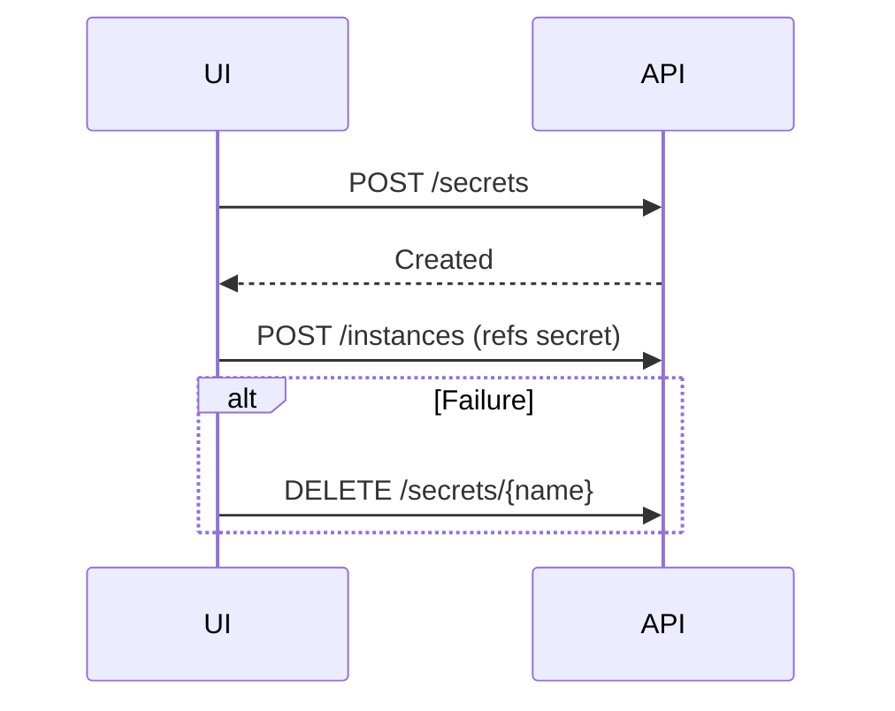

# Secret and ConfigMap Management

*   **Status:** Draft
*   **Authors:** @chilagrow
*   **Created:** 2026-06-30
*   **Last Updated:** 2026-06-30
*   **Related Issues:** [Link to relevant GitHub issue]

---

## 1. Summary

This specification introduces namespace-scoped API endpoints for managing Secrets and ConfigMaps used by Instances and its components. Secrets and ConfigMaps created through these endpoints are labeled for identification. Providers customize the creation form fields using UI schema definitions.

## 2. Motivation

Currently, users must create Secrets and ConfigMaps using `kubectl`, breaking the unified management experience. This spec provides:

1. **API endpoints** for Create, Get, Delete operations
2. **Lifecycle management** via labels and owner references
3. **Provider-customizable UI** using the same schema mechanism as Instance creation

## 3. Goals & Non-Goals

**Goals:**
- Provide namespace-scoped API endpoints for Secrets and ConfigMaps
- Support inline creation during Instance creation
- Allow providers to define UI schema for Secrets and ConfigMaps creation forms

**Non-Goals:**
- Cross-namespace Secrets and ConfigMaps sharing
- Secret versioning or audit trails

## 4. Proposed Solution / Design

### 4.1. Managed Secrets and ConfigMaps Labels

Secrets and ConfigMaps created are identified by labels:

```yaml
apiVersion: v1
kind: Secret  # or ConfigMap
metadata:
  name: my-splithorizon-cert
  namespace: default
  labels:
    openeverest.io/managed: "true"                             # Created via OpenEverest API
    openeverest.io/provider: "provider-percona-server-mongodb" # Provider name
    openeverest.io/category: "component-splithorizon"          # Resource category for filtering
```

**Label meanings:**
- `openeverest.io/managed: "true"` — Secrets and ConfigMaps are managed by OpenEverest
- `openeverest.io/provider` — Provider that uses Secrets and ConfigMaps type
- `openeverest.io/category` — Secrets and ConfigMaps category for filtering (e.g., `component-splithorizon`, `component-engine`, `datasource-import`)

Some Secrets and ConfigMaps are used by many instances, such example is SplitHorizon certificates.
It should not be deleted after the instance is deleted.
Other Secrets such as database user credentials used for a specific instance should be deleted with instance.
Provider decides which Secrets and ConfigMaps to set owner reference to an instance.
New settings is introduced in OpenEverest UI settings to delete ConfigMaps and Settings no longer necessary.

### 4.2. API Endpoints

#### Secrets

| Method | Endpoint | Description |
|--------|----------|-------------|
| POST | `/v1/namespaces/{ns}/secrets` | Create secret |
| GET | `/v1/namespaces/{ns}/secrets` | List secrets (only metadata without content) |
| DELETE | `/v1/namespaces/{ns}/secrets/{name}` | Delete secret |

#### ConfigMaps

| Method | Endpoint | Description |
|--------|----------|-------------|
| POST | `/v1/namespaces/{ns}/configmaps` | Create configmap |
| GET | `/v1/namespaces/{ns}/configmaps` | List configmaps |
| GET | `/v1/namespaces/{ns}/configmaps/{name}` | Get configmap (includes data) |
| DELETE | `/v1/namespaces/{ns}/configmaps/{name}` | Delete configmap |

#### Create Request

The request body follows Kubernetes Secret/ConfigMap format with OpenEverest-specific labels:

```json
{
  "apiVersion": "v1",
  "kind": "Secret",
  "metadata": {
    "name": "my-splithorizon-cert",
    "namespace": "default",
    "labels": {
      "openeverest.io/managed": "true",
      "openeverest.io/provider": "provider-percona-server-mongodb",
      "openeverest.io/category": "component-splithorizon"
    }
  },
  "type": "Opaque",
  "data": {
    "tls.crt": "<base64-encoded>",
    "tls.key": "<base64-encoded>"
  }
}
```

**For ConfigMaps:**
```json
{
  "apiVersion": "v1",
  "kind": "ConfigMap",
  "metadata": {
    "name": "my-dns-config",
    "namespace": "default",
    "labels": {
      "openeverest.io/managed": "true",
      "openeverest.io/provider": "provider-percona-server-mongodb",
      "openeverest.io/category": "component-splithorizon"
    }
  },
  "data": {
    "zones.yaml": "zone1: example.com\nzone2: example.net"
  }
}
```

**Label examples:**
- Component secret: `"openeverest.io/category": "component-splithorizon"`
- Import credential: `"openeverest.io/category": "datasource-import"`

#### Query Parameters (List)

- `provider` — Filter by provider name
- `category` — Filter by category

### 4.3. Instance Creation Flow

When configuring a component that requires a Secret or ConfigMap, the UI displays a dropdown populated by calling:

```
GET /v1/namespaces/{ns}/secrets?provider={provider}&category={category}
```

**Examples:**
- Split horizon: `GET /v1/namespaces/{ns}/secrets?provider={provider}&category=component-splithorizon`
- Import datasource: `GET /v1/namespaces/{ns}/secrets?provider={provider}&category=datasource-import`

The dropdown shows:
- Existing managed secrets matching the provider and category
- Option to "Create New" which opens the creation form

**Inline Creation Flow:**



**Lifecycle:**
1. UI creates Secret via POST
2. UI creates Instance via POST
3. On failure: UI deletes Secret

### 4.4. Provider Secret/ConfigMap Definitions

Providers define Secret and ConfigMap types in separate definition files, similar to BackupClass definitions:

#### Definition Structure

```
definition/
  secrets/
    splithorizon-tls/
      secret.yaml      # Metadata and schema reference
      ui.yaml          # UI rendering hints
      types.go         # Go types for schema validation
  configmaps/
    custom-mongod/
      configmap.yaml   # Metadata and schema reference
      ui.yaml          # UI rendering hints
      types.go         # Go types for schema validation
```

#### Secret Definition Example

**secret.yaml:**
```yaml
# definition/secrets/splithorizon-tls/secret.yaml
displayName: "TLS Certificate"
description: "TLS certificate for split horizon DNS"
category: component-splithorizon

config:
  openAPIV3Schema: SplitHorizonTLSConfig
```

**ui.yaml:**
```yaml
# definition/secrets/splithorizon-tls/ui.yaml
sections:
  certificate:
    label: "TLS Certificate"
    components:
      tlsCrt:
        uiType: file # Not supported yet
        path: "data.tls\\.crt" # path within Secret
        fieldParams:
          label: "Certificate"
          accept: ".crt,.pem" # Optinal not supported yet
        validation:
          required: true
      tlsKey:
        uiType: file # Not supported yet
        path: "data.tls\\.key"
        fieldParams:
          label: "Private Key" # path within Secret
          accept: ".key,.pem" # Optinal not supported yet
        validation:
          required: true
```

**types.go:**
```go
// definition/secrets/splithorizon-tls/types.go
package splithorizontls

type SplitHorizonTLSConfig struct {
    TLSCrt string `json:"tls.crt"`
    TLSKey string `json:"tls.key"`
}
```

#### Component UI Schema Reference

Components reference secret definitions.
Below is an example, but final UI schema components will change as it may be more practical to have additional UI rather than expand select UI type.

```yaml
# definition/components/splithorizon/component.yaml
ui:
  sections:
    configuration:
      label: "Split Horizon Configuration"
      components:
        tlsSecret:
          uiType: select
          path: spec.components.splithorizon.config.secretRef.name
          fieldParams:
            label: "TLS Certificate"
            secretDefinition: splithorizon-tls  # New: References definition/secrets/splithorizon-tls
            createLabel: "+ Add New Certificate" # New
          dataSource:
            provider: secret # Fetch from `GET /v1/namespaces/{ns}/secrets?provider={provider}&category=datasource-import`
            category: component-splithorizon # New
          validation:
            required: true
```

**How it works:**
1. Dropdown populated via `GET /secrets?provider={provider}&category=component-splithorizon`
2. Shows existing secrets matching the category
3. "Add New" button opens creation modal rendered from `definition/secrets/splithorizon-tls/ui.yaml`
4. Schema validation uses `definition/secrets/splithorizon-tls/secret.yaml` config

### 4.5. Settings

Under Settings, a dedicated management page allows users to view and manage Secrets and ConfigMaps:

**Location:** Settings → Secrets and Settings → ConfigMaps

**Layout:**
- **Tabs**: resources are grouped by:
  1. **Provider** (e.g., "provider-percona-server-mongodb")
  2. **Category** within each provider (e.g., "component-splithorizon", "datasource-import")

**List View (per tab):**
- Columns:
  - Name
  - Provider
  - Category
  - Created Date
- **Expandable Groups**: Click provider to expand/collapse its categories
- **Actions** (per resource):
  - **View Metadata**: GET metadata (Secret data is not shown for security)
  - **Create**: Optional: POST create secrets or configmaps
  - **Delete**: DELETE resource with validation

**Delete Validation:**
- Reject deletion if resource is referenced by any existing Instance
- User must remove Instance references first or delete the Instance

### 4.6. RBAC

Access to Secret and ConfigMap management endpoints uses Casbin RBAC for authorization:

#### Casbin Policy Model

OpenEverest uses Casbin's RBAC with resource-based access control:

#### Casbin Policies

**Actions:**
- `create` - Create new Secret/ConfigMap
- `read` - List and view metadata
- `delete` - Delete Secret/ConfigMap

**Policy Examples:**
- `p, role:test, secrets, read, prod/*/*` - All secrets in a namespace
- `p, role:test, secrets, read, prod/ns1/*`  - Secrets in specific namespace
- `p, role:test, secrets, read, prod/ns1/secret1`  - Specific secret in specific namespace
- `p, role:test, configmaps, read, prod/*/*` - All configmaps in a namespace

## 5. Definition of Done

- [ ] API endpoints implemented for Secrets (Create, List, Update, Delete)
- [ ] API endpoints implemented for ConfigMaps (Create, List, Get, Update, Delete)
- [ ] Labels applied correctly on Secrets and ConfigMaps creation
- [ ] Management UI in Settings for viewing, updating, and deleting Secrets/ConfigMaps
- [ ] Delete validation prevents deletion of in-use resources
- [ ] RBAC roles and permissions configured for Secrets and ConfigMaps
- [ ] UI renders forms from provider UI schema
- [ ] PSMDB provider defines resource types for splithorizon component
- [ ] Integration tests for API and RBAC

## 6. Alternatives Considered

| Alternative | Decision | Reason |
|-------------|----------|--------|
| Embed config in Instance spec | Rejected | No reuse across Instances; large specs |

## 7. Open Questions

1. **Secret data in GET:** Should GET return secret data?
   - No, only metadata (use kubectl for data)
2. **Creation of Secrets and ConfigMaps:** Should we allow creation of ConfigMap and Secret in Settings?
   - No for now, this may be requested later.

## 8. References

- [Kubernetes Secrets](https://kubernetes.io/docs/concepts/configuration/secret/)
- [Kubernetes ConfigMaps](https://kubernetes.io/docs/concepts/configuration/configmap/)
