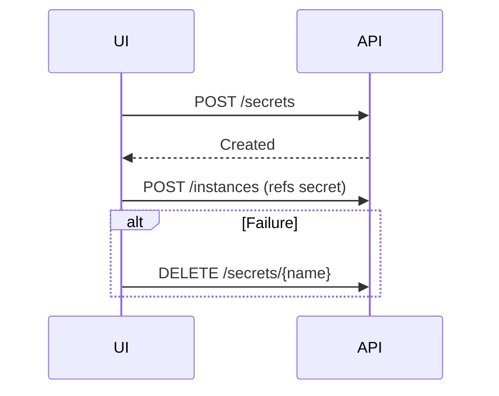

# Secret and ConfigMap Management

*   **Status:** Draft
*   **Authors:** @chilagrow
*   **Created:** 2026-06-30
*   **Last Updated:** 2026-06-30
*   **Related Issues:** [Link to relevant GitHub issue]

---

## 1. Summary

This specification introduces namespace-scoped API endpoints for managing Secrets and ConfigMaps used by Instance components. Resources created through these endpoints are labeled for identification. Providers customize the creation form fields using UI schema definitions.

## 2. Motivation

Currently, users must create Secrets and ConfigMaps using `kubectl`, breaking the unified management experience. This spec provides:

1. **API endpoints** for Create, Get, Delete operations
2. **Lifecycle management** via labels and owner references
3. **Provider-customizable UI** using the same schema mechanism as Instance creation

## 3. Goals & Non-Goals

**Goals:**
- Provide namespace-scoped API endpoints for Secrets and ConfigMaps
- Support inline creation during Instance creation
- Allow providers to define UI schema for resource creation forms

**Non-Goals:**
- Cross-namespace resource sharing
- Secret versioning or audit trails

## 4. Proposed Solution / Design

### 4.1. Managed Resource Labels

Resources created via these endpoints are identified by labels:

```yaml
apiVersion: v1
kind: Secret  # or ConfigMap
metadata:
  name: my-splithorizon-cert
  namespace: default
  labels:
    openeverest.io/managed: "true"                             # Created via OpenEverest API
    openeverest.io/provider: "provider-percona-server-mongodb" # Provider name
    openeverest.io/component: "splithorizon"                   # Optional: maps to Instance component
```

**Label meanings:**
- `openeverest.io/managed: "true"` — Resource is managed by OpenEverest
- `openeverest.io/provider` — Provider that defines this resource type
- `openeverest.io/component` — Maps to Instance's component (e.g., `splithorizon`, `engine`, `monitoring`)

### 4.2. API Endpoints

#### Secrets

| Method | Endpoint | Description |
|--------|----------|-------------|
| POST | `/v1/namespaces/{ns}/secrets` | Create secret |
| GET | `/v1/namespaces/{ns}/secrets` | List secrets (without content) |
| DELETE | `/v1/namespaces/{ns}/secrets/{name}` | Delete secret |

#### ConfigMaps

| Method | Endpoint | Description |
|--------|----------|-------------|
| POST | `/v1/namespaces/{ns}/configmaps` | Create configmap |
| GET | `/v1/namespaces/{ns}/configmaps` | List configmaps |
| GET | `/v1/namespaces/{ns}/configmaps/{name}` | Get configmap (includes data) |
| DELETE | `/v1/namespaces/{ns}/configmaps/{name}` | Delete configmap |

#### Create Request

```json
{
  "name": "my-splithorizon-cert",
  "provider": "psmdb",
  "component": "splithorizon",
  "data": {
    "tls.crt": "<base64-or-string>",
    "tls.key": "<base64-or-string>"
  }
}
```

#### Query Parameters (List)

- `provider` — Filter by provider name
- `component` — Filter by component

### 4.3. Instance Creation Flow

When configuring a component that requires a Secret or ConfigMap, the UI displays a dropdown populated by calling:

```
GET /v1/namespaces/{ns}/secrets?provider={provider}&component={component}
```

The dropdown shows:
- Existing managed secrets matching the provider and component
- Option to "Create New" which opens the creation form

**Inline Creation Flow:**



**Lifecycle:**
1. UI creates resource via POST
2. UI creates Instance referencing the resource
3. On failure: UI deletes the resource
4. Garbage collect on resources that are not owner referenced to an Instance with TTL

### 4.4. Provider UI Schema Definition

Providers define UI schema for components that reference Secrets/ConfigMaps. The schema includes both:
1. **Dropdown selector** for choosing existing resources
2. **"Add New" button** that opens the creation form

#### Component UI Schema with Selector

```yaml
# definition/components/splithorizon/component.yaml
ui:
  sections:
    configuration:
      label: "Split Horizon Configuration"
      components:
        tlsSecret:
          uiType: secretSelector
          path: spec.components.splithorizon.config.secretRef.name
          fieldParams:
            label: "TLS Certificate"
            resourceType: tls  # Links to resourceDefinitions.secrets[name=tls]
            createLabel: "+ Add New Certificate"
            placeholder: "Select existing certificate..."
          validation:
            required: true
```

**Selector behavior:**
- Dropdown is populated via `GET /secrets?provider={provider}&component=splithorizon`
- Shows existing secrets with `resourceType: tls`
- "Add New" button opens creation modal defined in `resourceDefinitions.secrets[name=tls]`

#### Resource Creation Schema

```yaml
# definition/components/splithorizon/component.yaml
resourceDefinitions:
  secrets:
    - name: tls  # Referenced by resourceType in selector
      description: "TLS certificate for split horizon DNS"
      ui:
        sections:
          certificate:
            label: "TLS Certificate"
            components:
              tlsCrt:
                uiType: file
                path: "data.tls\\.crt"
                fieldParams:
                  label: "Certificate"
                  accept: ".crt,.pem"
                validation:
                  required: true
              tlsKey:
                uiType: file
                path: "data.tls\\.key"
                fieldParams:
                  label: "Private Key"
                  accept: ".key,.pem"
                validation:
                  required: true

  configmaps:
    - name: dnsConfig
      description: "DNS configuration for split horizon"
      ui:
        sections:
          config:
            label: "DNS Configuration"
            components:
              zones:
                uiType: text
                path: "data.zones\\.yaml"
                fieldParams:
                  label: "Zone Configuration"
                  multiline: true
                  minRows: 5
                validation:
                  required: true
```

The `resourceType` field in the selector maps to the `name` field in `resourceDefinitions` to determine which creation form to display.

### 4.5. Delete Validation

- Reject deletion if resource is referenced by an existing Instance
- User must remove Instance reference first

## 5. Definition of Done

- [ ] API endpoints implemented for Secrets (Create, List, Delete)
- [ ] API endpoints implemented for ConfigMaps (Create, List, Get, Delete)
- [ ] Labels applied correctly on resource creation
- [ ] Provider resource definitions schema in provider-sdk
- [ ] UI renders forms from provider UI schema
- [ ] PSMDB provider defines resource types for splithorizon component
- [ ] Integration tests for API

## 6. Alternatives Considered

| Alternative | Decision | Reason |
|-------------|----------|--------|
| Embed config in Instance spec | Rejected | No reuse across Instances; large specs |

## 7. Open Questions

1. **Secret data in GET:** Should GET return secret data?
   - Recommendation: No, only metadata (use kubectl for data)

## 8. References

- [Kubernetes Secrets](https://kubernetes.io/docs/concepts/configuration/secret/)
- [Kubernetes ConfigMaps](https://kubernetes.io/docs/concepts/configuration/configmap/)
