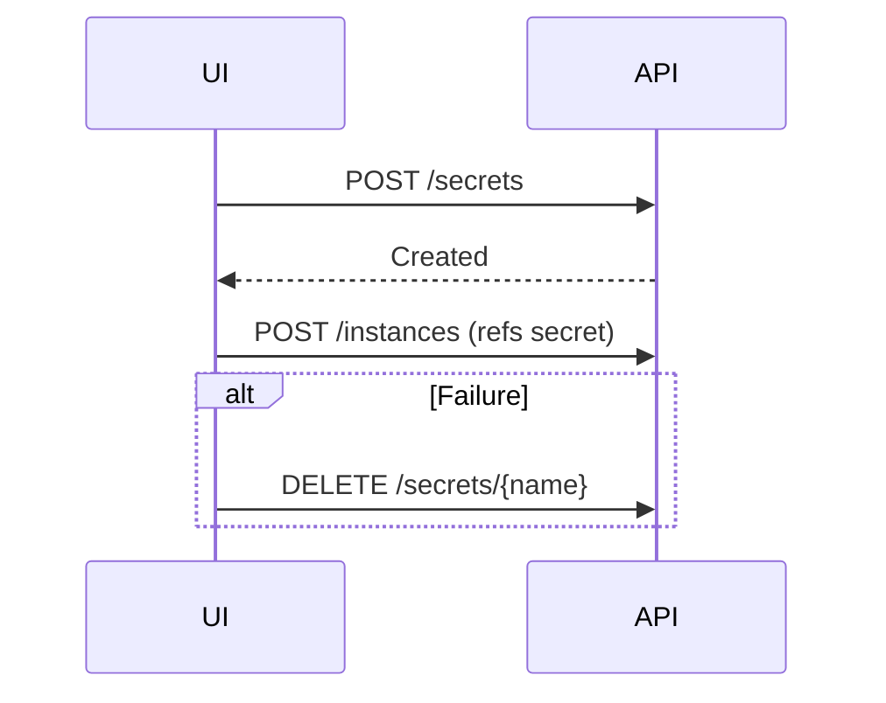

# Secret and ConfigMap Management

*   **Status:** Draft
*   **Authors:** @chilagrow
*   **Created:** 2026-06-30
*   **Last Updated:** 2026-07-13
*   **Related Issues:** https://github.com/openeverest/openeverest/issues/1798, https://github.com/openeverest/openeverest/issues/2471


---

## 1. Summary

This specification introduces namespace-scoped API endpoints for managing Secrets and ConfigMaps used by Instances and its components. Secrets and ConfigMaps created through these endpoints are labeled for identification. Providers customize the creation form fields using UI schema definitions.

## 2. Motivation

Currently, users must create Secrets and ConfigMaps using `kubectl`, breaking the unified management experience. This spec provides:

1. **API endpoints** for Create, Get, Delete operations
2. **Lifecycle management** via labels and owner references
3. **Provider-customizable UI** using the same schema mechanism as Instance creation

## 3. Goals & Non-Goals

**Goals:**
- Provide namespace-scoped API endpoints for Secrets and ConfigMaps
- Support inline creation during Instance creation
- Allow providers to define UI schema for Secrets and ConfigMaps creation forms

**Non-Goals:**
- Cross-namespace Secrets and ConfigMaps sharing
- Secret versioning or audit trails

## 4. Proposed Solution / Design

### 4.1. Managed Secrets and ConfigMaps Labels

Secrets and ConfigMaps created are identified by labels:

```yaml
apiVersion: v1
kind: Secret  # or ConfigMap
metadata:
  name: my-splithorizon-cert
  namespace: default
  labels:
    openeverest.io/managed: "true"                             # Created via OpenEverest API
    openeverest.io/provider: "provider-percona-server-mongodb" # Provider name (same as spec.provider in Instance CR)
    openeverest.io/definition: "splithorizon-tls"                # Resource definition for filtering
```

**Label meanings:**
- `openeverest.io/managed: "true"` — Secrets and ConfigMaps created by OpenEverest API
- `openeverest.io/provider` — Provider that uses Secrets and ConfigMaps type (empty for Secrets or ConfigMaps shared across providers)
- `openeverest.io/definition` — Secrets and ConfigMaps definition for filtering (e.g., `splithorizon-tls`, `data-import-credentials`)

### 4.2. API Endpoints

#### Secrets

| Method | Endpoint | Description |
|--------|----------|-------------|
| POST | `/clusters/{cluster}/namespaces/{ns}/secrets` | Create secret |
| GET | `/clusters/{cluster}/namespaces/{ns}/secrets` | List secrets (only metadata without content) |
| GET | `/clusters/{cluster}/namespaces/{ns}/secrets/{name}` | Get secret (only metadata data) |
| DELETE | `/clusters/{cluster}/namespaces/{ns}/secrets/{name}` | Delete secret |
| GET | `/clusters/{cluster}/providers/{name}` | Get secret UI schema definitions |

#### ConfigMaps

| Method | Endpoint | Description |
|--------|----------|-------------|
| POST | `/clusters/{cluster}/namespaces/{ns}/config-maps` | Create configmap |
| GET | `/clusters/{cluster}/namespaces/{ns}/config-maps` | List configmaps |
| GET | `/clusters/{cluster}/namespaces/{ns}/config-maps/{name}` | Get configmap (includes data) |
| DELETE | `/clusters/{cluster}/namespaces/{ns}/config-maps/{name}` | Delete configmap |
| GET | `/clusters/{cluster}/providers/{name}` | Get configmap UI schema definitions |

#### `POST /clusters/{cluster}/namespaces/{ns}/secrets`

The request body follows Kubernetes Secret/ConfigMap format with OpenEverest-specific labels.
The label `openeverest.io/definition` is required.

For creating base64 encoded request:

```json
{
  "apiVersion": "v1",
  "kind": "Secret",
  "metadata": {
    "name": "my-splithorizon-cert",
    "namespace": "default",
    "labels": {
      "openeverest.io/provider": "provider-percona-server-mongodb",
      "openeverest.io/definition": "splithorizon-tls"
    }
  },
  "type": "Opaque",
  "data": {
    "tls.crt": "<base64-encoded>",
    "tls.key": "<base64-encoded>"
  }
}
```

For plaintext request:

```json
{
  "apiVersion": "v1",
  "kind": "Secret",
  "metadata": {
    "name": "my-splithorizon-cert",
    "namespace": "default",
    "labels": {
      "openeverest.io/provider": "provider-percona-server-mongodb",
      "openeverest.io/definition": "splithorizon-tls"
    }
  },
  "type": "Opaque",
  "stringData": {
    "tls.crt": "<plaintext>",
    "tls.key": "<plaintext>"
  }
}
```

**Conflict Handling:**

If a secret with the same name already exists, the API server applies the following logic:

**Check owner reference**: If the existing secret has an owner reference set:
- Return `409 CONFLICT` with message: "Secret is owned by another resource"
- User must choose a different name or delete the owning Instance first

**Orphaned secret**: If no owner reference and not in use:
- Delete the existing orphaned secret
- Create the new secret with the provided configuration
- Return `201 CREATED`

This prevents race conditions and ensures secrets are not accidentally overwritten while in use.

Response strips `data` and `stringData`:
```json
{
  "apiVersion": "v1",
  "kind": "Secret",
  "metadata": {
    "name": "my-splithorizon-cert",
    "namespace": "default",
    "labels": {
      "openeverest.io/managed": "true", // Added by API server
      "openeverest.io/provider": "provider-percona-server-mongodb",
      "openeverest.io/definition": "splithorizon-tls"
    }
  },
  "type": "Opaque",
  // no data or stringData
}
```

#### `GET /clusters/{cluster}/namespaces/{ns}/secrets`

Response strips `data` and `stringData`:

```json
[{
  "apiVersion": "v1",
  "kind": "Secret",
  "metadata": {
    "name": "my-splithorizon-cert",
    "namespace": "default",
    "labels": {
      "openeverest.io/managed": "true",
      "openeverest.io/provider": "provider-percona-server-mongodb",
      "openeverest.io/definition": "splithorizon-tls"
    }
  },
  "type": "Opaque",
  // no data or stringData
}]
```

The response list contains secrets with `"openeverest.io/managed": "true"` label. Also filters the secrets based on the user's `read` RBAC permission on `secrets`.

#### `GET /clusters/{cluster}/namespaces/{ns}/secrets/{name}`

The response is the same as an item of list:

```json
{
  "apiVersion": "v1",
  "kind": "Secret",
  "metadata": {
    "name": "my-splithorizon-cert",
    "namespace": "default",
    "labels": {
      "openeverest.io/managed": "true",
      "openeverest.io/provider": "provider-percona-server-mongodb",
      "openeverest.io/definition": "splithorizon-tls"
    }
  },
  "type": "Opaque",
  // no data or stringData
}
```

If the secret was found, but does not contain the label `"openeverest.io/managed": "true"`, server returns 404.

#### `DELETE /clusters/{cluster}/namespaces/{ns}/secrets/{name}`

On success, returns 204 with no body.

If the secret has owner reference, it returns CONFLICT 409.

If the secret was found, but does not contain the label `"openeverest.io/managed": "true"`, it returns 404.

#### `GET /clusters/{cluster}/providers/{name}`

```json
{
  "metadata": {
    "name": "percona-server-mongodb",
  },
  "spec": {
    "componentTypes": { ... },
    "components": { ... },
    "topologies": { ... },
    "versions": [ ... ],
    "uiSchema": {
      "replicaSet": { ... },
      "sharded": { ... },
    },
    "secrets":{
      "splithorizon-tls": { // Use this for definition
        "uiSchema": { 
          // UI schema for split horizon
          "sections": {
            "certificate": {
              "label": "TLS Certificate",
              "components": {}
           }
          }
        },
        "openAPIV3Schema": {
          "properties": {
            "tls.crt": "string",
            "tls.key": "string"
          },
          "type": "object"
        },
      },
      "data-importer-credentials": {
        "uiSchema": {
          // UI schema for data importer credentials
        },
        "openAPIV3Schema": {
        }
      },
      "cross-provider-secret": {
        "uiSchema": {
          // UI schema used by multiple providers
        },
        "openAPIV3Schema": {
        },
        "shared": true,
      }
    }
  }
}
```

**Label examples:**
- Component secret: `"openeverest.io/definition": "splithorizon-tls"`
- Import credential: `"openeverest.io/definition": "data-import-credentials"`

#### Query Parameters (List)

**Filtering:**
- `provider` — Filter by provider name (e.g., `provider=percona-server-mongodb`)
  - Empty or omitted: returns resources from all providers
  - Special value `""` (empty string): returns only shared resources (no provider label)
- `definition` — Filter by definition (e.g., `definition=splithorizon-tls`)
  - Can be combined with provider filter

**Examples:**
- `/secrets` — All managed secrets
- `/secrets?provider=percona-server-mongodb` — Provider-specific secrets
- `/secrets?provider=percona-server-mongodb&definition=splithorizon-tls` — Definition within provider
- `/secrets?definition=splithorizon-tls` — Definition across all providers
- `/secrets?provider=` — Only shared secrets (no provider label)

### 4.3. Instance Creation Flow

When configuring a component that requires a Secret or ConfigMap, the UI displays a dropdown and/or add secret option decided by provider developer.

Note that provider filter is optional, some secrets may be shared by multiple providers.

**Examples:**
- Split horizon: `GET /clusters/{cluster}/namespaces/{ns}/secrets?provider={provider}&definition=splithorizon-tls`
- Import credentials: Show add secret option

The UI shows:
- Existing managed secrets matching the provider and definition (optional)
- Option to "Create New" which opens the creation form

**Inline Creation Flow:**


```mermaid
sequenceDiagram
    participant UI
    participant API

    UI->>API: POST /secrets
    API-->>UI: Created
    UI->>API: POST /instances (refs secret)
    alt Failure
        UI->>API: DELETE /secrets/{name}
    end
```

#### Split Horizon Example

For split horizon, the component will require secret such as `my-splithorizon`.

```
apiVersion: instance.openeverest.io/v1alpha1
kind: Instance
metadata:
  name: my-mongo-cluster
  namespace: production
spec:
  provider: percona-server-mongodb
  components:
    engine:
      ...
    splithorizon:
      config:
        secretRef:
          name: my-splithorizon
```

Below is the content of an example of the secret:

```
apiVersion: v1
kind: Secret
metadata:
  name: my-splithorizon
  namespace: production
  labels:
    openeverest.io/provider: percona-server-mongodb
    openeverest.io/definition: splithorizon-tls
type: Opaque
data:
  tls.crt: "<secure-crt>"
  tls.key: "<secure-key>"
```

#### Data Importer Example

For data importer, instance creation flow (or separate flow as currently done in OpenEverest v1) require additional steps to populate necessary secrets.
The example secret `my-mongo-cluster-import-creds` is used only by this instance.

```
apiVersion: instance.openeverest.io/v1alpha1
kind: Instance
metadata:
  name: my-mongo-cluster
  namespace: production
spec:
  provider: percona-server-mongodb
  topology: replica-set
  components:
    ...

  dataSource:
    type: External # NEW
    external: # NEW
      backupClassName: psmdb-mongoimport-import
      storageName: s3-external-data
      config:
        path: /imports/users.json
        credentialsSecretName: my-mongo-cluster-import-creds
```

Below is the content of an example of the secret:

```
apiVersion: v1
kind: Secret
metadata:
  name: my-mongo-cluster-import-creds
  namespace: production
  labels:
    openeverest.io/provider: percona-server-mongodb
    openeverest.io/definition: data-import-credentials
type: Opaque
data:
  MONGODB_BACKUP_USER: "backup"
  MONGODB_BACKUP_PASSWORD: "<secure-password>"
  MONGODB_CLUSTER_ADMIN_USER: "clusterAdmin"
  MONGODB_CLUSTER_ADMIN_PASSWORD: "<secure-password>"
  MONGODB_CLUSTER_MONITOR_USER: "clusterMonitor"
  MONGODB_CLUSTER_MONITOR_PASSWORD: "<secure-password>"
  MONGODB_DATABASE_ADMIN_USER: "databaseAdmin"
  MONGODB_DATABASE_ADMIN_PASSWORD: "<secure-password>"
  MONGODB_USER_ADMIN_PASSWORD: "<secure-password>"
```

### 4.4. Provider Secret/ConfigMap Definitions

Providers define Secret and ConfigMap types in separate definition files, similar to BackupClass definitions:

#### Definition Structure

```
definition/
  secrets/
    splithorizon-tls/
      secret.yaml      # Metadata and schema reference
      ui.yaml          # UI rendering hints
      types.go         # Go types for schema validation
  config-maps/
    custom-mongod/
      config-map.yaml   # Metadata and schema reference
      ui.yaml          # UI rendering hints
      types.go         # Go types for schema validation
```

#### Secret Definition

**secret.yaml:**
```yaml
# definition/secrets/splithorizon-tls/secret.yaml
displayName: "TLS Certificate"
description: "TLS certificate for split horizon DNS"
definition: splithorizon-tls
shared: false # set true if secrets are shared by multiple providers

config:
  openAPIV3Schema: SplitHorizonTLSConfig
```

Sharing secret between multiple providers is exceptional use case.
If each provider declares `shared: true` in their secret definition, the secret can be used by multiple providers.
Each provider still explicitly declares its secret schema, making it fragile if schema is declared differently by different providers. This may cause OpenEverest secret management UI to behave unexpectedly.

**ui.yaml:**
```yaml
# definition/secrets/splithorizon-tls/ui.yaml
sections:
  certificate:
    label: "TLS Certificate"
    components:
      tlsCrt:
        uiType: file # Not supported yet
        path: "data.tls\\.crt" # path within Secret
        fieldParams:
          label: "Certificate"
          accept: ".crt,.pem" # Optinal not supported yet
        validation:
          required: true
      tlsKey:
        uiType: file # Not supported yet
        path: "data.tls\\.key"
        fieldParams:
          label: "Private Key" # path within Secret
          accept: ".key,.pem" # Optinal not supported yet
        validation:
          required: true
```

**types.go:**
```go
// definition/secrets/splithorizon-tls/types.go
package splithorizontls

type SplitHorizonTLSConfig struct {
    TLSCrt string `json:"tls.crt"`
    TLSKey string `json:"tls.key"`
}
```

#### Component UI Schema Reference

Components reference secret definitions.
Below is an example, but final UI schema components will change.

```yaml
# definition/topologies/<topology>/topology.yaml
ui:
  sections:
    configuration:
      label: "Split Horizon Configuration"
      components:
        tlsSecret:
          uiType: secret # New - may change
          path: spec.components.splithorizon.config.secretRef.name
          fieldParams:
            label: "TLS Certificate"
            secretDefinition: splithorizon-tls  # New: References definition/secrets/splithorizon-tls
            createLabel: "+ Add New Certificate" # New - may change
          dataSource: # Fetch from `GET /secrets?provider=provider-percona-server-mongodb&definition=splithorizon-tls`
            provider: secret # New - may change
            definition: splithorizon-tls # New - may change
            instance-provider: provider-percona-server-mongodb # New - may change
          validation:
            required: true
```

**How it works:**
1. Dropdown populated via `GET /secrets?provider=provider-percona-server-mongodb&definition=splithorizon-tls`
2. Shows existing secrets matching the definition
3. "Add New" button opens creation modal rendered from `definition/secrets/splithorizon-tls/ui.yaml`
4. Schema validation uses `definition/secrets/splithorizon-tls/secret.yaml` config

### 4.5. Settings

**Lifecycle Management:**

Some Secrets and ConfigMaps are shared across multiple Instances (e.g., SplitHorizon TLS certificates) and should persist after individual Instances are deleted.
Others are Instance-specific (e.g., database user credentials) and should be deleted when their owning Instance is removed.
Providers control lifecycle behavior by configuring whether to set owner references on Secrets and ConfigMaps.
Either owner reference to Instance or finalizers are set by the providers.
Resources with owner references are automatically garbage-collected when the owning Instance is deleted.

A Settings page is provided in the OpenEverest UI to manage Secrets and ConfigMaps that are no longer needed.
It allows viewing and deleting Secrets and ConfigMaps shared by multiple Instances.

Under Settings, a dedicated management page allows users to view and manage Secrets and ConfigMaps:

**Location:**
- Settings → Secrets
- Settings → ConfigMaps

**Layout:**
- **Tabs**: resources are grouped by:
  1. **Provider** (e.g., "provider-percona-server-mongodb")
  2. **Definition** within each provider (e.g., "splithorizon-tls", "data-import-credentials")

The list view displays each item and following actions: 
- **View**: GET (Secret data is not shown for security)
- **Delete**: DELETE with validation

### 4.6. RBAC

Access to Secret and ConfigMap management endpoints uses Casbin RBAC for authorization:

#### Casbin Policy Model

OpenEverest uses Casbin's RBAC with resource-based access control:
- `secrets` RBAC resource name for Secrets
- `config-maps` RBAC resource name for ConfigMaps

#### Casbin Policies

**Actions:**
- `create` - Create new Secret/ConfigMap
- `read` - List and view metadata
- `delete` - Delete Secret/ConfigMap

**Resource Pattern Format:**
```
{cluster}/{namespace}/{name}
```

**Wildcard Rules:**
- `*` matches any value at that level
- `**` not supported (use explicit wildcards at each level)

**Policy Examples:**
- `p, role:test, secrets, read, prod/*/*` - All secrets in a namespace
- `p, role:test, secrets, read, prod/ns1/*`  - Secrets in specific namespace
- `p, role:test, secrets, read, prod/ns1/secret1`  - Specific secret in specific namespace
- `p, role:test, config-maps, read, prod/*/*` - All ConfigMaps in a namespace

## 5. Definition of Done

- [ ] API endpoints implemented for Secrets (Create, List, Update, Delete)
- [ ] API endpoints implemented for ConfigMaps (Create, List, Get, Delete)
- [ ] Labels applied correctly on Secrets and ConfigMaps creation
- [ ] Management UI in Settings for viewing, updating, and deleting Secrets/ConfigMaps
- [ ] Delete prevents deletion of in-use resources
- [ ] RBAC roles and permissions configured for Secrets and ConfigMaps
- [ ] UI renders forms from provider UI schema
- [ ] PSMDB provider defines resource types for splithorizon component
- [ ] Integration tests for API and RBAC

## 6. Alternatives Considered

| Alternative | Decision | Reason |
|-------------|----------|--------|
| Embed secret config in Instance spec | Rejected | No reuse across Instances; large specs |

## 7. Open Questions

1. **Secret data in GET:** Should GET return secret data?
   - No, only metadata (use kubectl for data)
2. **Creation of Secrets and ConfigMaps:** Should we allow creation of ConfigMap and Secret in Settings?
   - No for now, this may be requested later.

## 8. References

- https://github.com/openeverest/openeverest/issues/1798
- https://github.com/openeverest/openeverest/issues/2471
