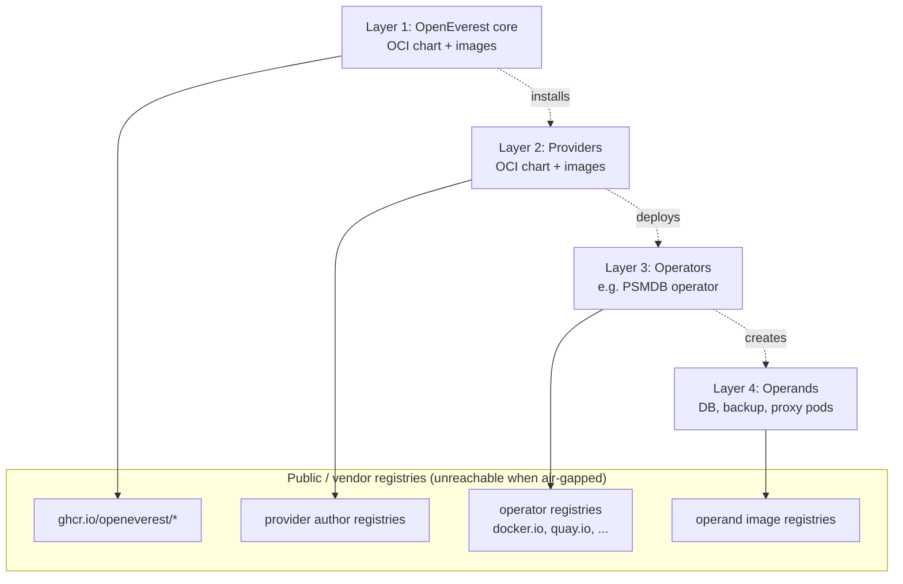

# Air-Gapped Environments

*   **Status:** Draft
*   **Authors:** @spron-in
*   **Created:** 2026-09-02
*   **Last Updated:** 2026-09-02
*   **Related Issues:** openeverest/roadmap#1

---

## 1. Summary

OpenEverest is assembled from multiple, independently-published layers — the core platform, providers, the operators each provider deploys, and finally the database/proxy workloads those operators create. Every layer pulls its own OCI artifacts (charts) and container images from registries scattered across the internet (GHCR, Docker Hub, quay.io, vendor registries, …). In an air-gapped (offline / disconnected) environment none of those registries are reachable, and today the only path to run OpenEverest is to manually mirror every image at every layer and thread `imagePullSecrets` and image-override values through each of them by hand. This spec **frames the problem** across all four layers and **surveys candidate solutions** — from documented manual mirroring, through an image-catalog/manifest-driven mirroring tool, to shipping an embedded registry (e.g. Harbor/Zot) that prefetches and serves the full image set. It intentionally does **not** pick a winner yet; the goal is to enumerate the problem space and trade-offs to drive discussion.

## 2. Motivation

Air-gapped and network-restricted deployments are a hard requirement for a large share of OpenEverest's target audience: regulated industries (finance, healthcare, government), on-prem enterprises, and edge/sovereign-cloud installations. These users cannot pull from public registries, either at all or without routing everything through an approved internal mirror/proxy.

The difficulty is that OpenEverest is not a single artifact — it is a **layered supply chain**, and each layer introduces its own images and its own credentials problem:

1. **OpenEverest core** — installed from an OCI Helm chart and running its own container images in GHCR (`ghcr.io/openeverest/*`).
2. **Providers** — each provider (spec 001) is itself an OCI chart plus container images, hosted in the provider author's registry of choice.
3. **Operators** — each provider deploys one or more upstream operators (e.g. the Percona Server for MongoDB operator) whose images live in yet another registry outside OpenEverest's control.
4. **Operand workloads** — each operator in turn creates the actual database, backup agents, and proxy pods, each referencing its own images (often enumerated in the `Provider` CRD's `componentTypes[].versions[].image`, but also including images the operator hardcodes).

For an offline install this means:

- **Image discovery is unsolved.** There is no single, authoritative list of *every* image OpenEverest and its installed extensions will ever try to pull. Layers 3 and 4 in particular hide images inside operator logic and CRD data that only surface at runtime — a user cannot know what to mirror until something fails to pull.
- **Pull-secret propagation is manual and error-prone.** Credentials for the internal mirror must be injected at every layer: core chart values, each provider chart's values, each operator's `imagePullSecrets`, and the operand pods' service accounts. Miss one and reconciliation silently stalls.
- **Image references must be rewritten at every layer.** Pointing at an internal mirror means overriding registry prefixes in the core chart, every provider chart, every operator deployment, and inside `Provider` CRDs — with no unified override mechanism today.
- **Digests vs. tags.** Robust mirroring wants digest-pinned references (per spec 007) so a known-good set can be copied with `crane`/`skopeo`/`oras`, but not all layers expose digests.
- **Upgrades multiply the problem.** Every provider/operator upgrade (spec 009) introduces a new image set that must be re-mirrored and re-approved before the upgrade can proceed offline.

The current state — "read every chart and CRD, build your own mirror list, and manually wire secrets and overrides through four layers" — is impractical for most operators and a significant adoption blocker. We need a strategy that makes offline install a supported, repeatable path rather than a bespoke integration project.

## 3. Goals & Non-Goals

**Goals:**

* Clearly articulate the multi-layer air-gap problem so contributors share a common model of where images and credentials originate.
* Enumerate candidate solution shapes for **image discovery/cataloging**, **image mirroring**, and **credential/reference propagation**, with trade-offs.
* Identify the seams in the existing architecture (Provider CRD, Extension Hub formulas, provider/operator charts) that any solution must plug into.
* Establish evaluation criteria (operator effort, maintenance burden, supply-chain integrity, upgrade story, footprint) for comparing options.
* Surface the open questions that must be answered before a design can be committed.

**Non-Goals:**

* Prescribing a single chosen solution or committing to an implementation — this spec is a problem statement and options survey.
* Defining the concrete schema/CLI/UX of any tool (that belongs to a follow-up design spec once a direction is picked).
* Solving air-gap for arbitrary third-party operators OpenEverest does not know about (best-effort discovery only).
* Re-specifying the Extension Hub (spec 007), provider upgrades (spec 009), or secret management (spec 011); this spec references and builds on them.
* Network-level concerns (proxies, TLS interception, DNS) beyond how they affect image pulls.

## 4. Problem Analysis

### 4.1 The four layers of image supply

Each arrow to a registry is a pull that must succeed offline. Each layer transition is also a place where `imagePullSecrets` and image-registry overrides must be configured.

### 4.2 Where image references live today

| Layer | Chart/CRD | Where images are declared | Digest available? |
|-------|-----------|---------------------------|-------------------|
| 1 Core | `openeverest` OCI chart | chart `values.yaml` image fields | via Hub formula (spec 007) |
| 2 Provider | provider OCI chart | chart `values.yaml` image fields | via Hub formula (spec 007) |
| 3 Operator | provider chart / operator chart | operator Deployment image | sometimes |
| 4 Operand | `Provider` CRD `componentTypes[].versions[].image`; operator-internal defaults | partly in CRD, partly hardcoded in operator | rarely |

Layer 4 is the crux: some operand images are enumerated in the `Provider` CRD (good — machine-readable), but operators frequently hardcode auxiliary images (init containers, sidecars, backup tooling) that are invisible until a pod is scheduled.

### 4.3 Credential propagation

Even with all images mirrored, each layer must be told (a) the new registry location and (b) the pull secret. Today this is N independent manual configurations with no single source of truth. A partial answer already exists for Kubernetes (`imagePullSecrets` on service accounts, or a global default via kubelet config), but OpenEverest provides no unified way to fan this out across provider/operator/operand service accounts.

## 5. Candidate Solutions (Options Survey)

The options below are **not mutually exclusive** — a realistic answer likely combines a discovery mechanism (Option A/B) with a distribution mechanism (Option C, D, or E) and a propagation mechanism (Option F/G).

### Option A — Documented manual mirroring (baseline)

Publish per-release documentation and a static image list; users mirror with `crane`/`skopeo`/`oras` and set overrides themselves.

- **Pros:** zero new code; works with existing tooling; no footprint.
- **Cons:** does not solve layer-4 discovery; error-prone; heavy per-upgrade toil; poor UX. Effectively the status quo.

### Option B — Image catalog / manifest (machine-readable "bill of materials")

Every layer publishes a signed **image manifest** enumerating all images (digest-pinned) it and its children require. The Extension Hub formula (spec 007) is the natural home for provider/core manifests; providers extend it to declare their operator + operand images. An aggregator command walks core → installed providers → their declared operand images and emits one consolidated list.

- **Pros:** turns discovery into a solved, automatable problem; reuses Hub infra; enables any downstream mirroring tool; digest-pinned aligns with spec 007.
- **Cons:** requires every provider/operator to accurately declare *all* images including operator-hardcoded ones (hard to enforce); stale manifests cause offline pull failures; needs a validation/CI story to keep manifests honest.

### Option C — `everestctl mirror` (mirroring tool driven by the catalog)

A CLI subcommand consumes the Option B catalog and copies the full set into a user-provided internal registry, then emits the values/overrides needed for install. (Spec 007 explicitly defers this "offline bundle generator / `everestctl mirror`" to a follow-up — this is that follow-up's territory.)

- **Pros:** repeatable, scriptable; keeps the registry choice with the user (fits existing enterprise Harbor/Artifactory/Nexus); good upgrade story (re-run per release).
- **Cons:** depends on Option B accuracy; still requires the user to operate a registry; override-injection across four layers must be generated correctly.

### Option D — Offline bundle (single portable artifact)

Produce a self-contained bundle (e.g. an OCI archive / tarball, à la `oras` or the Carvel `imgpkg`/`kbld` model) containing every image + charts for a pinned release set, transferable via physical media into the enclave and `oras`-pushed to the internal registry on the other side.

- **Pros:** clean "sneakernet" story; atomic, versioned, verifiable; well-trodden pattern (imgpkg, Zarf).
- **Cons:** large artifacts; still needs an internal registry on the far side; bundle composition must solve the same layer-4 discovery problem as Option B.

### Option E — Ship an embedded registry (Harbor / Zot) that prefetches images

OpenEverest bundles or optionally deploys a lightweight in-cluster registry (Zot for a minimal footprint, Harbor for a full-featured mirror/proxy) that acts as the single pull source for all four layers. It could operate in two modes: **proxy-cache** (pull-through, useful in *restricted* rather than fully-disconnected setups) or **prefetch** (populated from an Option D bundle for true air-gap). All layers are configured once to pull from this registry.

- **Pros:** single pull source and single pull-secret to propagate (big simplification of §4.3); optional prefetch gives a "catalog" of what's available; proxy-cache mode eases semi-connected environments; can enforce signing/scanning (Harbor).
- **Cons:** significant operational surface (HA, storage, GC, TLS, upgrades of the registry itself); Harbor is heavy; bootstrapping (chicken-and-egg: the registry image itself must be mirrored first); overlaps with registries enterprises already run — risk of duplicating/fighting existing infra; still needs Option B to know what to prefetch.

### Option F — Unified registry-override mechanism

Independent of *how* images arrive, provide a single OpenEverest-level setting (global registry prefix + credentials) that fans out to core, provider charts, operators, and operand `Provider` CRDs, rewriting registry references consistently (cf. the `global.imageRegistry` pattern in many Helm charts, and operator `imageRegistry`/mirror settings).

- **Pros:** collapses N manual overrides into one; complements any of C/D/E; big UX win.
- **Cons:** requires every provider/operator to honor the override (contract + conformance test); operand images inside CRDs and operator-hardcoded images must all route through it; digest vs. tag rewriting subtleties.

### Option G — Unified pull-secret propagation

A single place to register mirror credentials that OpenEverest propagates to the relevant service accounts across core/provider/operator/operand namespaces (building on spec 011 secret/configmap management).

- **Pros:** eliminates the "missed one secret" failure mode; centralizes rotation.
- **Cons:** cross-namespace secret distribution has security/RBAC implications; must respect namespace isolation and least privilege.

### 5.1 Rough comparison

| Option | Solves discovery | Solves distribution | Solves propagation | Operator effort | New footprint | Maintenance |
|--------|:---------------:|:-------------------:|:------------------:|:--------------:|:-------------:|:-----------:|
| A Manual docs | ✗ | ✗ | ✗ | high | none | low (docs) |
| B Catalog/manifest | ✓ | ✗ | ✗ | low | none | med (keep honest) |
| C `everestctl mirror` | (uses B) | ✓ | partial | low | none | med |
| D Offline bundle | (uses B) | ✓ | partial | low | large artifact | med |
| E Embedded registry | partial | ✓ | improves | med | high (registry) | high |
| F Registry override | ✗ | ✗ | ✓ (refs) | low | none | med (conformance) |
| G Secret propagation | ✗ | ✗ | ✓ (creds) | low | none | med |

A plausible combined direction: **B (catalog) + C or D (mirror/bundle) + F + G**, with **E** offered as an *optional convenience* for users who don't already run an internal registry — not as a mandatory component.

## 6. Definition of Done

This spec is "done" (as a problem statement) when:

* The four-layer model and the discovery/propagation problems are reviewed and agreed as accurate by provider and core maintainers.
* Each candidate option has been discussed and either advanced, merged, or rejected with rationale recorded in §7 / a follow-up.
* A recommended direction (single option or combination) is selected, and follow-up design spec(s) are opened for the chosen mechanisms (e.g. "Image catalog schema", "`everestctl mirror` design", "Unified registry override contract").
* Evaluation criteria in §3 are used to justify the selection.

## 7. Open Questions

* **Layer-4 discovery honesty:** how do we guarantee a provider's declared image set is complete, given operators hardcode auxiliary images? Do we need a runtime "observed images" collector to reconcile against declared manifests?
* **Catalog ownership:** does the image manifest live in the Extension Hub formula (spec 007), in the `Provider` CRD, or both? How do they stay in sync?
* **Digest coverage:** can we require digest-pinned references at all four layers, or only where the author controls the image?
* **Embedded registry scope:** if we ship Zot/Harbor, is it mandatory, optional, or merely documented as a recommended pattern? Who owns its lifecycle/HA/upgrades?
* **Bootstrapping:** how does the very first artifact (the mirror tool / bundle / registry image) get into the enclave?
* **Override contract & conformance:** what must a provider/operator implement to be "air-gap certified," and how do we test it in CI?
* **Upgrade flow:** how does the mirroring/prefetch step integrate with provider upgrades (spec 009) so an upgrade is blocked until its images are mirrored?
* **Restricted vs. fully-disconnected:** do we treat "proxy/pull-through" (semi-connected) and "true air-gap" as one solution or two?
* **Credential propagation blast radius:** how do we distribute pull secrets across namespaces without violating least-privilege (spec 011)?

## 8. References

* Spec 001 — Modular core for plugin architecture (`Provider` / `Instance` CRDs, `componentTypes[].versions[].image`).
* Spec 007 — OpenEverest Extension Hub (digest-pinned OCI references; explicitly defers `everestctl mirror` / offline bundle generator).
* Spec 009 — Provider upgrades (re-mirroring per upgrade).
* Spec 011 — Secret & ConfigMap management (credential propagation).
* Prior art: [Zarf](https://zarf.dev/) (air-gap package/bundle model), Carvel [`imgpkg`](https://carvel.dev/imgpkg/) / [`kbld`](https://carvel.dev/kbld/) (image bundles + reference rewriting), [Harbor](https://goharbor.io/) and [Zot](https://zotregistry.dev/) (registries / proxy-cache), `oras` / `crane` / `skopeo` (image copy tooling), Helm `global.imageRegistry` convention.
